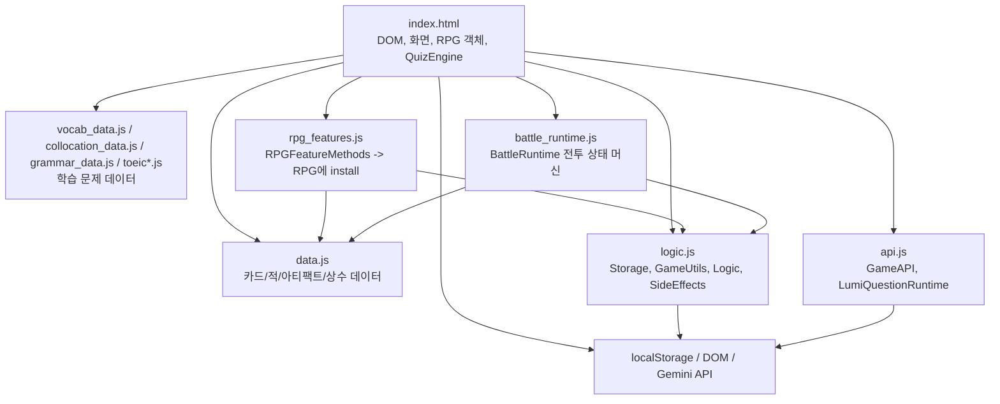
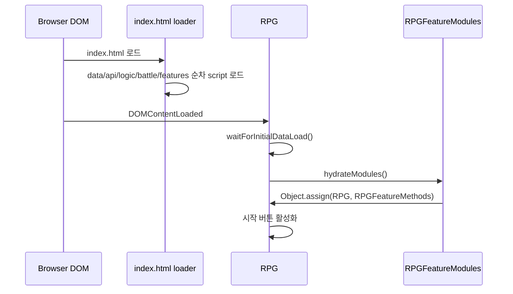
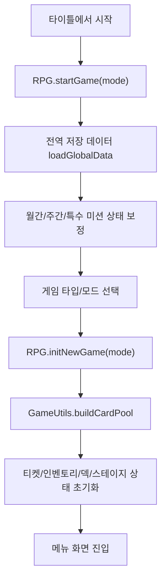
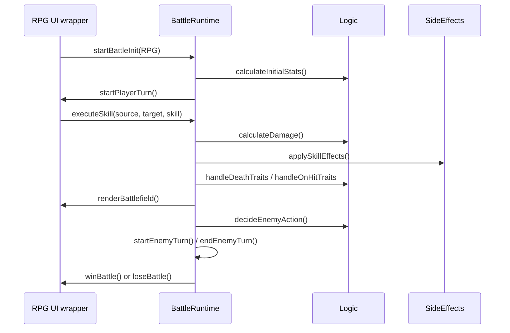
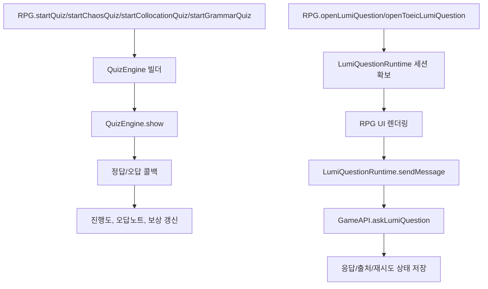

# Card Game Structure Map

이 문서는 `card/` 브라우저 게임의 현재 구조를 빠르게 파악하기 위한 구조 지도입니다.
현재 소스는 ES `class` 중심이 아니라, 브라우저 전역 객체와 모듈형 싱글턴 객체를 조합하는 방식입니다. 따라서 아래의 "클래스/모듈"은 실제 유지보수 시 추적해야 하는 주요 객체 단위를 의미합니다.

시각 자료는 [card_game_structure_visual.html](./card_game_structure_visual.html)에서 볼 수 있습니다.

## 한눈에 보는 의존 관계

## 로딩 순서

`index.html`은 모바일 `file://` 환경을 고려해 `<script>`를 순차 로딩합니다.

1. `data.js`
2. `vocab_data.js`
3. `collocation_data.js`
4. `grammar_data.js`
5. `toeic.js`
6. `toeic_explanations.js`
7. `api.js`
8. `logic.js`
9. `battle_runtime.js`
10. `rpg_features.js`
11. `DOMContentLoaded` 후 `RPG.waitForInitialDataLoad()`

핵심은 `index.html` 안의 `RPG`가 최종 조립점이라는 점입니다. `RPG.hydrateModules()`가 `RPGFeatureModules.install(this)`를 호출하면 `rpg_features.js`의 메소드들이 `RPG` 객체에 섞입니다.

## 주요 클래스/모듈 역할

| 모듈 | 위치 | 역할 | 주요 메소드/처리 |
|---|---|---|---|
| `RPG` | `card/index.html` | 게임의 중심 객체. 전역/세션/전투 상태, 화면 전환, UI 이벤트, 전투 UI, 가챠/덱/퀴즈/TOEIC/Lumi UI 진입점을 보유합니다. | `hydrateModules`, `waitForInitialDataLoad`, `startGame`, `initNewGame`, `runGacha`, `openDeck`, `startBattleInit`, `setupControls`, `renderBattlefield`, `winBattle`, `loseBattle`, `openLumiQuestion`, `startToeicPractice` |
| `QuizEngine` | `card/index.html` | 단어/숙어/문법/튜터링 퀴즈를 같은 UI 렌더러로 처리합니다. | `show`, `buildVocabQuiz`, `buildChaosQuiz`, `buildCollocationQuiz`, `buildGrammarQuiz`, `buildTutoringQuiz` |
| `Storage` | `card/logic.js` | `localStorage` 저장/로드와 백업/회귀 방지 검사를 담당합니다. | `load`, `loadDetailed`, `save`, `saveBackup`, `remove`, `getRaw`, `setRaw` |
| `GameUtils` | `card/logic.js` | 데이터 조회, 카드 풀 생성, 가챠 등급 계산, 덱 컨텍스트, 셔플 같은 순수 유틸에 가깝습니다. | `getAllCards`, `getCardById`, `buildCardPool`, `buildDeckContext`, `drawWeightedCards`, `resolveGachaGrade`, `getInitialTickets`, `getArtifactSelectionPool` |
| `Logic` | `card/logic.js` | 전투 계산의 핵심 규칙 집합입니다. UI 없이 스탯, 회피, 데미지, 초기 스탯, 적 행동, 사망/피격 특성을 계산합니다. | `calculateStats`, `checkEvasion`, `calculateDamage`, `calculateInitialStats`, `decideEnemyAction`, `handleDeathTraits`, `handleOnHitTraits`, `getElementalMultiplier` |
| `SideEffects` | `card/logic.js` | 스킬 효과를 타입별 핸들러로 분배합니다. 즉시 데미지가 아닌 버프, 디버프, 필드 버프, 지연 효과 등을 처리합니다. | `handlers`, `apply` |
| `BattleRuntime` | `card/battle_runtime.js` | 비시각 전투 상태 머신입니다. `RPG` 상태를 인자로 받아 플레이어 턴/적 턴/스킬 실행/버프 만료를 진행합니다. | `startBattleInit`, `startPlayerTurn`, `endPlayerTurn`, `startEnemyTurn`, `endEnemyTurn`, `executeSkill`, `calcDamage`, `applySkillEffects`, `expireFieldBuffs`, `applyFieldBuff` |
| `RPGFeatureModules` | `card/rpg_features.js` | 큰 기능 묶음을 `RPG`에 주입하는 확장 모듈입니다. 세이브, 미션, 보너스 카드, 특수 카드, 드래프트, 승패 처리, TOEIC 보조 기능 등이 여기에 있습니다. | `install`, `loadGlobalData`, `saveGlobalData`, `startGame`, `initNewGame`, `saveGame`, `applyChaosBlessing`, `startDraft`, `winBattle`, `loseBattle`, `getEffectiveStats` |
| `GameAPI` | `card/api.js` | Gemini API 호출부입니다. 튜터링, Lumi 질문, 데이트 이벤트 등 외부 모델 응답이 필요한 기능을 처리합니다. | `getTutoringContent`, `askLumiQuestion`, date/tutoring API 호출 |
| `LumiQuestionRuntime` | `card/api.js` | Lumi 채팅 세션 상태와 모델 선택, 검색 토글, 요청 취소/재시도, TOEIC 리뷰용 컨텍스트 구성을 담당합니다. | `ensureGeneralSession`, `ensureToeicReviewSession`, `getActiveSession`, `setSelectedModel`, `cycleSelectedModel`, `cancelPending`, `sendMessage` |
| 데이터 상수 | `card/data.js`, `card/*_data.js` | 카드, 보너스 카드, 적, 아티팩트, 학습 데이터, 설명 데이터의 원천입니다. 대부분 전역 상수로 제공됩니다. | `CHARACTERS`, `BONUS_CARDS`, `TRANSCENDENCE_CARDS`, `ENEMIES`, `ARTIFACTS`, `VOCAB_DATA`, `COLLOCATION_DATA`, `GRAMMAR_DATA`, `TOEIC_SETS` |

## 주요 처리 흐름

### 1. 앱 시작

### 2. 새 게임 시작

### 3. 전투 진행

`index.html`의 `RPG`에도 `executeSkill`, `calcDamage`, `applySkillEffects` 같은 같은 이름의 래퍼가 있습니다. 실제 처리는 `BattleRuntime`으로 위임하고, 기존 DOM 진입점과 버튼 이벤트 이름을 유지하기 위한 호환 레이어입니다.

### 4. 학습/퀴즈/Lumi 흐름

## 처리 방식 요약

| 영역 | 처리 방식 |
|---|---|
| 상태 | `RPG.global`, `RPG.state`, `RPG.battle` 세 덩어리로 나뉩니다. 전역 해금/미션은 `global`, 런 단위 진행은 `state`, 현재 전투만 필요한 값은 `battle`에 둡니다. |
| 저장 | `Storage`가 `localStorage`를 감싸고, `rpg_features.js`의 `saveGlobalData`, `saveGame`, `loadGlobalData`가 게임 의미에 맞게 사용합니다. |
| 전투 계산 | `BattleRuntime`이 턴을 진행하고, 스탯/데미지/특성 계산은 `Logic`, 버프/디버프 부가 효과는 `SideEffects`가 담당합니다. |
| UI | 대부분 `index.html`의 `RPG` 메소드가 DOM을 직접 조작합니다. 모달, 메뉴, 전투 화면, TOEIC 화면, Lumi 채팅 UI가 같은 객체에 들어 있습니다. |
| 확장 기능 | `rpg_features.js`가 `Object.assign`으로 `RPG`에 메소드를 주입합니다. 기능은 분리되어 있지만 런타임에서는 하나의 큰 `RPG` 객체가 됩니다. |
| API | `GameAPI`가 외부 호출, `LumiQuestionRuntime`이 세션과 모델 선택/취소/재시도를 관리합니다. |

## 장기 유지보수 관점의 문제점

1. `RPG`가 너무 많은 책임을 가집니다. 화면 전환, DOM 렌더링, 저장, 게임 진행, 전투 래퍼, TOEIC, Lumi UI까지 한 객체에 몰려 있어 작은 수정도 영향 범위를 예측하기 어렵습니다.
2. `Object.assign` 기반 기능 주입은 편하지만, 어떤 메소드가 원래 `RPG`에 있었고 어떤 메소드가 `rpg_features.js`에서 들어왔는지 실행 전에는 한눈에 보이지 않습니다. 이름 충돌도 정적 검출이 어렵습니다.
3. `LumiQuestionRuntime` 안에는 같은 이름의 메소드가 중복 정의되어 있습니다. JavaScript 객체 리터럴에서는 뒤쪽 정의가 앞쪽 정의를 덮어쓰므로, 앞쪽 로직은 사실상 죽은 코드가 됩니다.
4. 전역 상수와 로딩 순서에 강하게 의존합니다. `data.js`, `logic.js`, `battle_runtime.js`, `rpg_features.js` 순서가 깨지면 런타임에서 바로 실패할 수 있지만, 모듈 import/export로 보호되지 않습니다.
5. UI 문자열, DOM 조작, 게임 규칙, API 프롬프트가 한 파일 또는 인접 객체에 섞여 있습니다. 밸런스 패치, 번역, UI 개선, 전투 규칙 변경이 서로 충돌하기 쉽습니다.
6. 전투 규칙 일부는 `Logic`, 일부는 `BattleRuntime`, 일부는 `RPGFeatureMethods`에 흩어져 있습니다. 새 카드 특성이나 버프를 추가할 때 수정 지점을 놓치기 쉽습니다.

## 유지보수자가 먼저 보면 좋은 파일 순서

1. `card/index.html`: 화면 구조, `RPG` 객체, 이벤트 진입점 확인
2. `card/rpg_features.js`: 실제 게임 시작/저장/보상/모드별 기능 확인
3. `card/battle_runtime.js`: 전투 턴 진행과 스킬 실행 확인
4. `card/logic.js`: 스탯/데미지/특성/카드 풀 계산 확인
5. `card/data.js`: 카드/적/아티팩트 데이터 확인
6. `card/api.js`: Lumi/API 관련 문제일 때 확인
