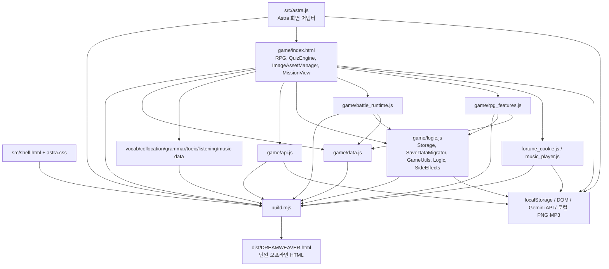
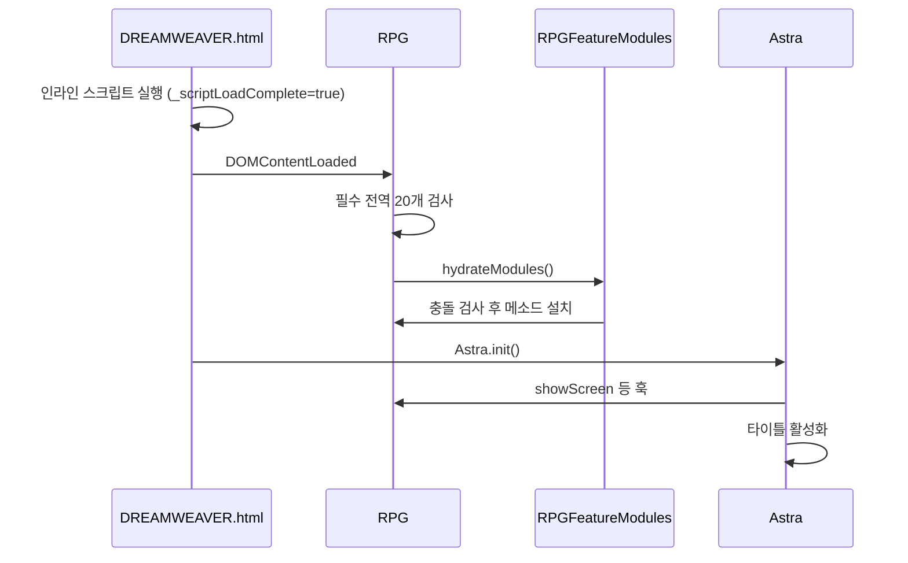

# Card Game Structure Map

활성 Card는 DREAMWEAVER입니다. 규칙은 `card/game/`에 두고, 세로 모바일 화면은 `card/src/`가 `RPG`를 훅합니다. `card_legacy/`는 승격 시점 스냅샷이며 실행·수정 대상이 아닙니다.

시각 자료는 [card_game_structure_visual.html](./card_game_structure_visual.html)입니다.

## 한눈에 보는 의존 관계

```mermaid
flowchart TD
    Dist["dist/DREAMWEAVER.html\n단일 오프라인 HTML"]
    Build["build.mjs"]
    Shell["src/shell.html + astra.css"]
    Astra["src/astra.js\nAstra 화면 어댑터"]
    HTML["game/index.html\nRPG, QuizEngine, ImageAssetManager, MissionView"]
    Data["game/data.js"]
    StudyData["vocab/collocation/grammar/toeic/listening/music data"]
    Logic["game/logic.js\nStorage, SaveDataMigrator, GameUtils, Logic, SideEffects"]
    Battle["game/battle_runtime.js"]
    Features["game/rpg_features.js"]
    API["game/api.js"]
    Extra["fortune_cookie.js / music_player.js"]
    Browser["localStorage / DOM / Gemini API / 로컬 PNG·MP3"]

    Build --> Dist
    Shell --> Build
    Astra --> Build
    HTML --> Build
    Data --> Build
    StudyData --> Build
    Logic --> Build
    Battle --> Build
    Features --> Build
    API --> Build
    Extra --> Build

    Astra --> HTML
    HTML --> Data
    HTML --> StudyData
    HTML --> API
    HTML --> Logic
    HTML --> Battle
    HTML --> Features
    HTML --> Extra
    Features --> Logic
    Features --> Data
    Battle --> Logic
    Battle --> Data
    HTML --> Browser
    Astra --> Browser
    Logic --> Browser
    API --> Browser
    Extra --> Browser
```

## 두 층

| 층 | 위치 | 하는 일 | 하지 않는 일 |
|---|---|---|---|
| 규칙 | `card/game/` | 카드/적, 전투 공식, 저장, 미션, 학습 데이터, 레거시 DOM ID | DREAMWEAVER 레이아웃, 단일 HTML 번들 정책 |
| 화면 | `card/src/` | 타이틀/로비/편성/도감/학습/전투 셸, 초상화 경로, 기록 백업, 포커스 트랩 | 새 대미지식, 카드 수치, 저장 스키마 변경 |
| 조립 | `card/build.mjs` | 14개 게임 스크립트 + RPG + Astra를 인라인 | 런타임 fetch/CDN/ES module |

`game/index.html`은 여전히 모바일 `file://` 순차 로더를 가지고 있고, `scripts/verify_card_mobile.js`가 이 원본을 검사합니다. 플레이어 배포본은 로더를 실행하지 않고 `_scriptLoadComplete=true`로 인라인합니다.

## 로딩 순서

개발용 `game/index.html` 순차 로더(14개):

1. `data.js`
2. `vocab_data.js`
3. `collocation_data.js`
4. `grammar_data.js`
5. `toeic.js`
6. `toeic_explanations.js`
7. `api.js`
8. `logic.js`
9. `battle_runtime.js`
10. `rpg_features.js`
11. `listening_data.js`
12. `fortune_cookie.js`
13. `music_data.js`
14. `music_player.js`

이후 인라인 `RPG`가 필수 전역 20개(기존 19 + `MusicPlayer`)를 검사하고 `RPGFeatureModules.install(this)`를 호출합니다.

배포 `build.mjs`는 같은 14파일을 인라인한 뒤 RPG와 `src/astra.js`를 붙입니다. `Astra.init()`은 `RPG._featuresInstalled`가 없으면 실패합니다.

빌드 계약이 깨지면 `build.mjs`가 명시적으로 throw합니다.

- `game/index.html`에 `const RPG =`가 있는 두 번째 `<script>`
- `screen-factory-draft` ~ `screen-collection`, `screen-chaos-roulette` ~ `screen-battle` 구간
- 모달 구간과 `{{STYLES}}`/`{{SCRIPTS}}` 플레이스홀더

검증은 배포 HTML이 원본의 모든 DOM `id`를 포함하는지 확인합니다.

## 주요 모듈

| 모듈 | 위치 | 역할 |
|---|---|---|
| `Astra` | `card/src/astra.js` | 화면 훅, 로비/도감/편성 렌더, 초상화 폴더, `astra-progress` 백업, 다이얼로그 포커스 |
| `RPG` | `card/game/index.html` | 조립점. 전역/런/전투 상태, 화면 전환, 퀴즈/TOEIC/가챠 진입점 |
| `QuizEngine` | `card/game/index.html` | 단어/숙어/문법/튜터링 퀴즈 |
| `ImageAssetManager` | `card/game/index.html` | 파일명·로드. Astra가 `ImageAssets.load`를 감싸 경로/폴백을 덮음 |
| `MissionView` | `card/game/index.html` | 미션 DOM만 그림 |
| `Storage` / `SaveDataMigrator` | `card/game/logic.js` | localStorage와 런 저장 정규화 |
| `GameUtils` | `card/game/logic.js` | 카드 풀, 가챠, 덱 컨텍스트 |
| `Logic` / `SideEffects` | `card/game/logic.js` | 스탯·대미지·특성, 버프 핸들러 |
| `BattleRuntime` | `card/game/battle_runtime.js` | 전투 상태 머신 |
| `RPGFeatureModules` | `card/game/rpg_features.js` | 세이브, 미션, 모드, 승패. 설치 시 동명 충돌 검사 |
| `GameAPI` / `LumiQuestionRuntime` | `card/game/api.js` | Gemini 호출과 루미 세션 |
| `MusicPlayer` | `card/game/music_player.js` | 플레이리스트 UI |
| `FortuneCookie` | `card/game/fortune_cookie.js` | 일일 리스닝 운세 |

## 화면 지도

셸(`src/shell.html`)이 그리는 화면:

| ID | 역할 |
|---|---|
| `screen-title` | 이어가기/새 여정, 포춘쿠키, 루미, 미션, 음악 |
| `screen-menu` | 파티 3, 다음 적, 출전, 소환 |
| `screen-collection` | 검색/등급/보유·전체. Astra가 렌더 |
| `screen-deck` | 선봉/중견/대장 |
| `screen-study` | 문법·단어장·과외·질문·TOEIC |
| `screen-battle` | 배우·로그·스킬. 전투 중 하단 내비 숨김 |

빌드가 `game/index.html`에서 가져오는 기타 화면: 팩토리/아티팩트리저브/퍼펙트플랜 드래프트, 일반 드래프트, 카오스 룰렛, 초월 확인.

하단 내비: 로비 / 편성 / 도감 / 학습 / 설정. 전투와 필수 드래프트에서는 제거합니다.

Astra가 훅하는 `RPG` 메소드: `showScreen`, `toMenu`, `updateDeckSlots`, `selectDeckSlot`, `openDeck`, `openModeSelect`, `reshuffleChaosPool`.  
교체: `renderCardList`, `openCollection`, `openFactoryViewDeck`, `openLibrary`.

## 처리 흐름

### 1. 배포 부팅

```mermaid
sequenceDiagram
    participant File as DREAMWEAVER.html
    participant RPG as RPG
    participant Features as RPGFeatureModules
    participant Astra as Astra

    File->>File: 인라인 스크립트 실행 (_scriptLoadComplete=true)
    File->>RPG: DOMContentLoaded
    RPG->>RPG: 필수 전역 20개 검사
    RPG->>Features: hydrateModules()
    Features->>RPG: 충돌 검사 후 메소드 설치
    File->>Astra: Astra.init()
    Astra->>RPG: showScreen 등 훅
    Astra->>Astra: 타이틀 활성화
```

### 2. 새 게임

타이틀 → `RPG.startGame` → 전역 로드/미션 보정 → 모드 선택 → `initNewGame` → `GameUtils.buildCardPool` → 로비. 빈 파티면 출전 버튼이 비활성입니다.

### 3. 전투

`RPG.startBattleInit` 래퍼 → `BattleRuntime` → `Logic.calculateInitialStats` / `calculateDamage` → `SideEffects.apply` → 승패는 `rpg_features.js`.

### 4. 학습/루미

`QuizEngine` 또는 TOEIC 세션 → 정답 콜백으로 진도/오답장/보상. 루미는 `LumiQuestionRuntime` → `GameAPI.askLumiQuestion`.

## 상태 덩어리

| 영역 | 위치 |
|---|---|
| 전역 해금/미션 | `RPG.global` |
| 런 진행 | `RPG.state` |
| 현재 전투 | `RPG.battle` |
| 화면 전용 | `Astra` (`portraitPath`, `localPortraits`, `modalStack`) |

## 유지보수 주의

1. `RPG` 책임이 큽니다. 화면 훅은 Astra에, 공식은 Logic/BattleRuntime에 둡니다.
2. `Object.assign` 주입은 설치 시 충돌만 막습니다. 메소드 출처는 이 문서를 봅니다.
3. 배포는 번들이지만 `game/index.html` 구간·ID·순차 로더는 계약입니다. 둘 다 깨지지 않게 고칩니다.
4. 전투 규칙은 `Logic`, `BattleRuntime`, `RPGFeatureMethods`에 흩어져 있습니다. 새 효과는 [CODING_GUIDE.md](./CODING_GUIDE.md) 체크리스트를 따릅니다.
5. 초상화/음원은 HTML 옆 로컬 파일입니다. 빌드나 Git에 복제하지 않습니다.

## 먼저 볼 파일

1. `card/README.md`, `card/GAME_MANUAL.md`
2. `card/src/shell.html`, `card/src/astra.js`
3. `card/game/index.html`
4. `card/game/rpg_features.js`
5. `card/game/battle_runtime.js`
6. `card/game/logic.js`
7. `card/game/data.js`
8. `card/build.mjs`
