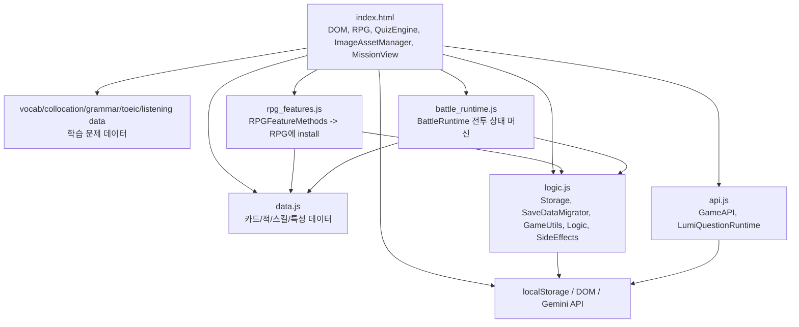
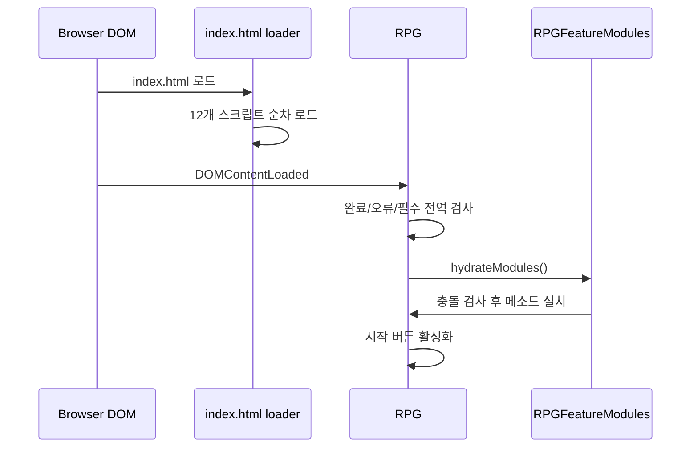
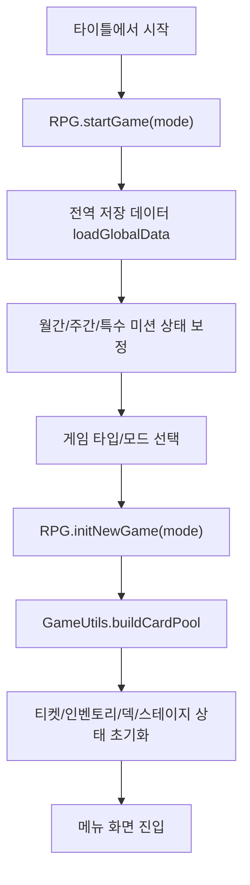
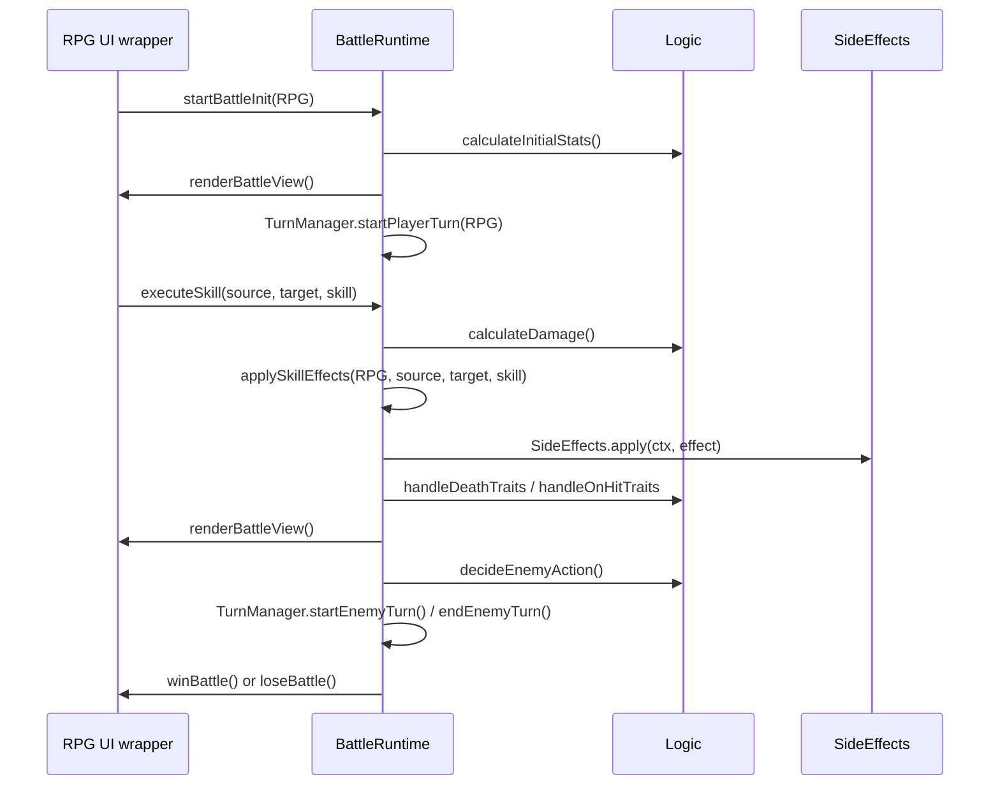
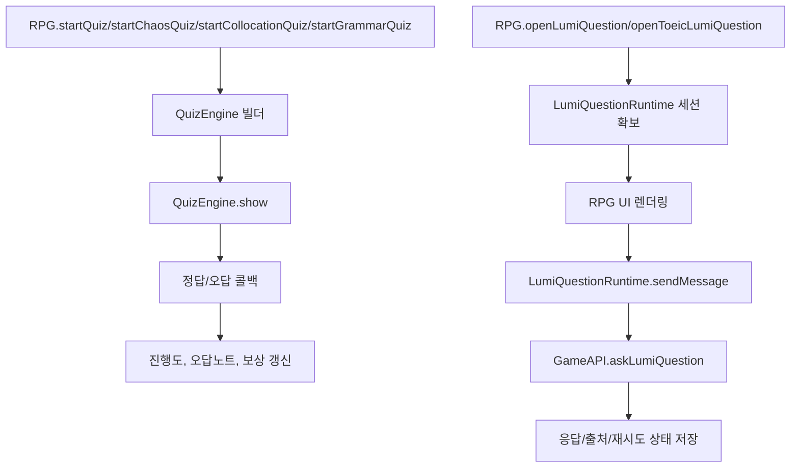

# Card Game Structure Map

이 문서는 `card/` 브라우저 게임의 현재 구조를 빠르게 파악하기 위한 구조 지도입니다.
현재 소스는 소수의 ES `class`와 브라우저 전역 싱글턴 객체를 조합하는 하이브리드 구조입니다. 클래스는 저장 호환성·이미지·미션 화면처럼 경계가 분명한 역할에만 쓰고, 기존 전역 진입점은 모바일 `file://` 호환성을 위해 유지합니다.

시각 자료는 [card_game_structure_visual.html](./card_game_structure_visual.html)에서 볼 수 있습니다.

## 한눈에 보는 의존 관계

```mermaid
flowchart TD
    HTML["index.html\nDOM, RPG, QuizEngine, ImageAssetManager, MissionView"]
    Data["data.js\n카드/적/스킬/특성 데이터"]
    StudyData["vocab/collocation/grammar/toeic/listening data\n학습 문제 데이터"]
    Logic["logic.js\nStorage, SaveDataMigrator, GameUtils, Logic, SideEffects"]
    Battle["battle_runtime.js\nBattleRuntime 전투 상태 머신"]
    Features["rpg_features.js\nRPGFeatureMethods -> RPG에 install"]
    API["api.js\nGameAPI, LumiQuestionRuntime"]
    Browser["localStorage / DOM / Gemini API"]

    HTML --> Data
    HTML --> StudyData
    HTML --> API
    HTML --> Logic
    HTML --> Battle
    HTML --> Features
    Features --> Logic
    Features --> Data
    Battle --> Logic
    Battle --> Data
    HTML --> Browser
    Logic --> Browser
    API --> Browser
```

## 로딩 순서

`index.html`은 모바일 `file://` 환경을 고려해 `<script>`를 순차 로딩합니다.

1. `data.js`
2. `vocab_data.js`
3. `collocation_data.js`
4. `grammar_data.js`
5. `toeic.js`
6. `toeic_explanations.js`
7. `api.js`
8. `logic.js`
9. `battle_runtime.js`
10. `rpg_features.js`
11. `listening_data.js`
12. `fortune_cookie.js`
13. `DOMContentLoaded` 후 `RPG.waitForInitialDataLoad()`

핵심은 `index.html` 안의 `RPG`가 최종 조립점이라는 점입니다. 순차 로더가 완료된 뒤 오류 목록과 필수 전역 19개를 검사하고, 그 다음 `RPG.hydrateModules()`가 `RPGFeatureModules.install(this)`를 호출합니다. 설치 전에는 타이틀 버튼이 활성화되지 않습니다. 새 스크립트 파일을 추가할 때는 로더 배열과 필수 전역 검사를 함께 수정해야 합니다.

## 주요 클래스/모듈 역할

| 모듈 | 위치 | 역할 | 주요 메소드/처리 |
|---|---|---|---|
| `RPG` | `card/index.html` | 모듈 조립점이자 브라우저 UI 진입점입니다. 전역/런/전투 상태, 화면 전환, 이벤트와 호환 래퍼를 보유합니다. | `hydrateModules`, `waitForInitialDataLoad`, `startGame`, `runGacha`, `openDeck`, `startBattleInit`, `renderBattlefield`, `openLumiQuestion`, `startToeicPractice` |
| `QuizEngine` | `card/index.html` | 단어/숙어/문법/튜터링 퀴즈를 같은 UI 렌더러로 처리합니다. | `show`, `buildVocabQuiz`, `buildChaosQuiz`, `buildCollocationQuiz`, `buildGrammarQuiz`, `buildTutoringQuiz` |
| `ImageAssetManager` | `card/index.html` | 이미지 모델입니다. 파일명 결정, 사전 로드, 실패 시 숨김, 동적 이미지 생성을 한 경로로 처리합니다. 이미지 처리는 제약에 따라 메인 코드에 둡니다. | `getEntitySource`, `load`, `createImage`, `createPortrait`, `hydrate` |
| `MissionView` | `card/index.html` | 월간/주간/스페셜 미션 DOM만 그립니다. 저장 데이터는 변경하지 않습니다. | `setReward`, `renderMissionItems`, `renderLockedSpecial`, `render` |
| `Storage` | `card/logic.js` | `localStorage` 저장/로드와 백업/회귀 방지 검사를 담당합니다. | `load`, `loadDetailed`, `save`, `saveBackup`, `remove`, `getRaw`, `setRaw` |
| `SaveDataMigrator` | `card/logic.js` | 기존 필드와 알 수 없는 필드를 보존하면서 런 저장을 정규화하고, UI 전용 상태를 저장 대상에서 제외합니다. | `normalizeRunState`, `serializeRunState` |
| `GameUtils` | `card/logic.js` | 데이터 조회, 카드 풀 생성, 가챠 등급 계산, 덱 컨텍스트, 셔플 같은 순수 유틸에 가깝습니다. | `getAllCards`, `getCardById`, `buildCardPool`, `buildDeckContext`, `drawWeightedCards`, `resolveGachaGrade`, `getInitialTickets`, `getArtifactSelectionPool` |
| `Logic` | `card/logic.js` | 전투 계산의 핵심 규칙 집합입니다. UI 없이 스탯, 회피, 대미지, 초기 스탯, 적 행동, 사망/피격 특성을 계산합니다. | `calculateStats`, `checkEvasion`, `calculateDamage`, `calculateInitialStats`, `decideEnemyAction`, `handleDeathTraits`, `handleOnHitTraits`, `getElementalMultiplier` |
| `SideEffects` | `card/logic.js` | 대미지 공식 밖에서 적용할 버프, 디버프, 필드 버프, 지연·예약 효과 등을 타입별 핸들러로 분배합니다. | `handlers`, `apply` |
| `BattleRuntime` | `card/battle_runtime.js` | 비시각 전투 상태 머신입니다. `RPG` 상태를 인자로 받아 플레이어 턴/적 턴/스킬 실행/버프 만료를 진행합니다. | `startBattleInit`, `TurnManager.startPlayerTurn`, `TurnManager.endPlayerTurn`, `TurnManager.startEnemyTurn`, `TurnManager.endEnemyTurn`, `executeSkill`, `calcDamage`, `applySkillEffects`, `expireFieldBuffs`, `applyFieldBuff` |
| `RPGFeatureModules` | `card/rpg_features.js` | 큰 기능 묶음을 `RPG`에 주입하는 확장 모듈입니다. 세이브, 미션 규칙, 보너스/특수 카드, 드래프트, 승패 처리, TOEIC 보조 기능을 담당합니다. 설치 시 동명 메소드 충돌을 검사합니다. | `install`, `loadGlobalData`, `saveGlobalData`, `startGame`, `initNewGame`, `saveGame`, `applyChaosBlessing`, `startDraft`, `winBattle`, `loseBattle` |
| `GameAPI` | `card/api.js` | Gemini API 호출부입니다. 튜터링, Lumi 질문, 데이트 이벤트 등 외부 모델 응답이 필요한 기능을 처리합니다. | `getTutoringContent`, `askLumiQuestion`, date/tutoring API 호출 |
| `LumiQuestionRuntime` | `card/api.js` | Lumi 채팅 세션 상태와 모델 선택, 검색 토글, 요청 취소/재시도, TOEIC 리뷰용 컨텍스트 구성을 담당합니다. | `ensureGeneralSession`, `ensureToeicReviewSession`, `getActiveSession`, `setSelectedModel`, `cycleSelectedModel`, `cancelPending`, `sendMessage` |
| 데이터 상수 | `card/data.js`, `card/*_data.js`, `card/logic.js` | `data.js`는 카드/적, `*_data.js`는 학습 데이터, `logic.js`는 현재 아티팩트 정의와 규칙 상수를 보유합니다. 대부분 전역 상수로 제공됩니다. | `CARDS`, `BONUS_CARDS`, `SPECIAL_CARDS`, `TRANSCENDENCE_CARDS`, `BONUS_TRANSCENDENCE_CARDS`, `ENEMIES`, `ARTIFACTS`, `VOCAB_DATA`, `COLLOCATION_DATA`, `GRAMMAR_DATA`, `TOEIC_DATA`, `LISTENING_DATA` |

## 주요 처리 흐름

### 1. 앱 시작

```mermaid
sequenceDiagram
    participant DOM as Browser DOM
    participant HTML as index.html loader
    participant RPG as RPG
    participant Features as RPGFeatureModules

    DOM->>HTML: index.html 로드
    HTML->>HTML: 12개 스크립트 순차 로드
    DOM->>RPG: DOMContentLoaded
    RPG->>RPG: 완료/오류/필수 전역 검사
    RPG->>Features: hydrateModules()
    Features->>RPG: 충돌 검사 후 메소드 설치
    RPG->>RPG: 시작 버튼 활성화
```

### 2. 새 게임 시작

```mermaid
flowchart TD
    A["타이틀에서 시작"] --> B["RPG.startGame(mode)"]
    B --> C["전역 저장 데이터 loadGlobalData"]
    C --> D["월간/주간/특수 미션 상태 보정"]
    D --> E["게임 타입/모드 선택"]
    E --> F["RPG.initNewGame(mode)"]
    F --> G["GameUtils.buildCardPool"]
    G --> H["티켓/인벤토리/덱/스테이지 상태 초기화"]
    H --> I["메뉴 화면 진입"]
```

### 3. 전투 진행

```mermaid
sequenceDiagram
    participant RPG as RPG UI wrapper
    participant Battle as BattleRuntime
    participant Logic as Logic
    participant Effects as SideEffects

    RPG->>Battle: startBattleInit(RPG)
    Battle->>Logic: calculateInitialStats()
    Battle->>RPG: renderBattleView()
    Battle->>Battle: TurnManager.startPlayerTurn(RPG)
    RPG->>Battle: executeSkill(source, target, skill)
    Battle->>Logic: calculateDamage()
    Battle->>Battle: applySkillEffects(RPG, source, target, skill)
    Battle->>Effects: SideEffects.apply(ctx, effect)
    Battle->>Logic: handleDeathTraits / handleOnHitTraits
    Battle->>RPG: renderBattleView()
    Battle->>Logic: decideEnemyAction()
    Battle->>Battle: TurnManager.startEnemyTurn() / endEnemyTurn()
    Battle->>RPG: winBattle() or loseBattle()
```

`index.html`의 `RPG`에도 `startPlayerTurn`, `executeSkill`, `calcDamage`, `applySkillEffects`처럼 같은 이름의 래퍼가 있습니다. 실제 처리는 `BattleRuntime.TurnManager` 또는 `BattleRuntime`으로 위임하고, 기존 DOM 진입점과 버튼 이벤트 이름을 유지하기 위한 호환 레이어입니다.

### 4. 학습/퀴즈/Lumi 흐름

```mermaid
flowchart TD
    A["RPG.startQuiz/startChaosQuiz/startCollocationQuiz/startGrammarQuiz"] --> B["QuizEngine 빌더"]
    B --> C["QuizEngine.show"]
    C --> D["정답/오답 콜백"]
    D --> E["진행도, 오답노트, 보상 갱신"]

    F["RPG.openLumiQuestion/openToeicLumiQuestion"] --> G["LumiQuestionRuntime 세션 확보"]
    G --> H["RPG UI 렌더링"]
    H --> I["LumiQuestionRuntime.sendMessage"]
    I --> J["GameAPI.askLumiQuestion"]
    J --> K["응답/출처/재시도 상태 저장"]
```

## 처리 방식 요약

| 영역 | 처리 방식 |
|---|---|
| 상태 | `RPG.global`, `RPG.state`, `RPG.battle` 세 덩어리로 나뉩니다. 전역 해금/미션은 `global`, 런 단위 진행은 `state`, 현재 전투만 필요한 값은 `battle`에 둡니다. |
| 저장 | `Storage`가 `localStorage`를 감싸고, `SaveDataMigrator`가 런 저장 형식을 보정합니다. 전역 저장의 백업/손상 복구는 `rpg_features.js`가 담당합니다. |
| 전투 계산 | `BattleRuntime.TurnManager`가 턴을 진행하고, 스탯/대미지/특성 계산은 `Logic`, 버프/디버프 부가 효과는 `SideEffects`가 담당합니다. |
| UI | 대부분 `index.html`의 `RPG` 메소드가 DOM을 직접 조작하지만, 이미지와 미션 DOM은 각각 `ImageAssetManager`, `MissionView`에 모였습니다. |
| 확장 기능 | `rpg_features.js`가 충돌 검사를 거쳐 `RPG`에 메소드를 주입합니다. 기능은 분리되어 있지만 런타임에서는 하나의 큰 `RPG` 객체가 됩니다. |
| API | `GameAPI`가 외부 호출, `LumiQuestionRuntime`이 세션과 모델 선택/취소/재시도를 관리합니다. |

## 장기 유지보수 관점의 문제점

1. `RPG`가 너무 많은 책임을 가집니다. 화면 전환, DOM 렌더링, 저장, 게임 진행, 전투 래퍼, TOEIC, Lumi UI까지 한 객체에 몰려 있어 작은 수정도 영향 범위를 예측하기 어렵습니다.
2. `Object.assign` 기반 기능 주입은 설치 시 충돌을 막지만, 어떤 메소드가 어느 파일에서 들어오는지는 정적 import보다 찾기 어렵습니다.
3. 전역 상수와 로딩 순서에 강하게 의존합니다. 순서와 준비 검사는 자동 테스트로 보호하지만 ES module의 정적 의존성 검사는 받지 못합니다.
4. UI 문자열, DOM 조작, 게임 규칙, API 프롬프트가 큰 `index.html`의 인접 영역에 남아 있습니다. 이미지/미션 외 화면도 향후 같은 방식으로 한 영역씩 분리해야 합니다.
5. 전투 규칙 일부는 `Logic`, 일부는 `BattleRuntime`, 일부는 `RPGFeatureMethods`에 흩어져 있습니다. 새 효과를 추가할 때 `CODING_GUIDE.md`의 체크리스트를 따라야 합니다.

## 유지보수자가 먼저 보면 좋은 파일 순서

1. `card/index.html`: 화면 구조, `RPG` 객체, 이벤트 진입점 확인
2. `card/rpg_features.js`: 실제 게임 시작/저장/보상/모드별 기능 확인
3. `card/battle_runtime.js`: 전투 턴 진행과 스킬 실행 확인
4. `card/logic.js`: 스탯/대미지/특성/카드 풀 계산 확인
5. `card/data.js`: 카드/적/스킬/특성 데이터 확인
6. `card/api.js`: Lumi/API 관련 문제일 때 확인

구체적인 배치 규칙과 수정 체크리스트는 [CODING_GUIDE.md](./CODING_GUIDE.md), 이번 정리에서 확인한 동등 표기와 계산 규칙은 [REFACTORING_REPORT.md](./REFACTORING_REPORT.md)를 참고하세요.
