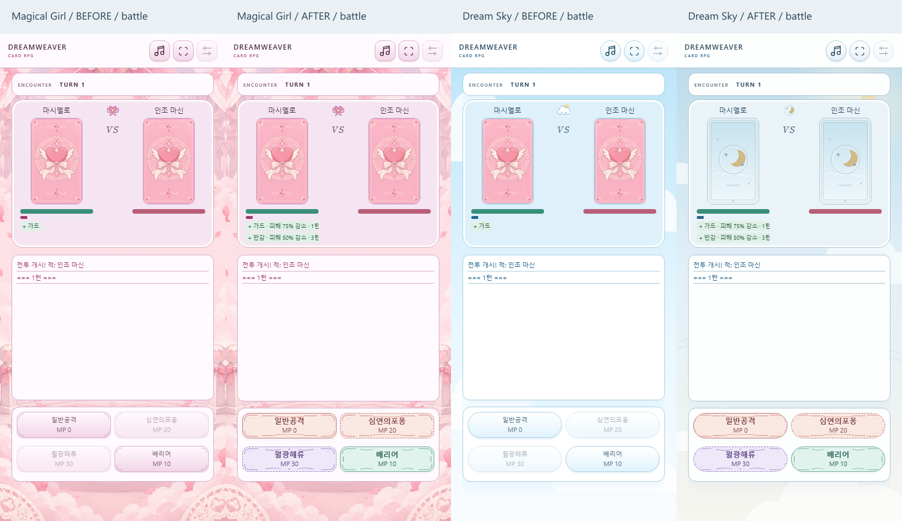

# DREAMWEAVER 2026-09-27 패치 검토 자료

기준: `d28d2a983247b3d45423cbefc55ffceb5ab60e7a` (작업 시작 시 fetch로 확인한 origin/main).
활성 게임은 `card/game`, 표시 어댑터는 `card/src`, 배포본은 `card/dist/DREAMWEAVER.html`이다.

## 요청별 구현

| 요구 | 적용 위치 | 결과 |
|---|---|---|
| U1 | rpg_features.js의 renderCardPoolEditor, card_pool_view.js | 실제 extras와 세트 상세를 공용 등급 우선순위 → 한국어 이름 → ID로 정렬. extras에 등급 구획 표시. 원본 후보/저장 배열과 RNG는 보존. |
| U2 | index.html의 단어·숙어장, polish.css | 정상 단어/오답/뜻/보조 문구에 의미 클래스와 테마 토큰 적용. 오답 배지와 빈 목록 안내. 비활성 스킬의 이름·MP 가독성 유지. |
| U3/U4 | polish.css, magical-lumi-frame.svg | 데이트·과외만 3:5 및 폭 108–140px. 작은/가로 화면은 3:5를 유지하며 축소. 마법소녀 전용 투명 프레임. 강의창은 기존 크기 유지. |
| U5 | Dream Sky SVG 5종, polish.css, astra.js의 ImageAssets 어댑터 | 달·별·구름의 색과 선을 정리하고 패널/보조 모달을 동일 팔레트로 연결. 재렌더링 시 테마 폴백이 이전 색에 고정되던 문제 수정. |
| U6 | index.html의 setupControls/showCardInfo/showBattleStat, SkillTypes, SVG 9종 | 사용자 지시에 따라 버튼에 타입 아이콘·배지·설명 행을 추가하지 않음. 물리=코랄, 마법=보라, 보조=청록 장식. 접근성 이름과 상세에는 실제 실행 객체의 타입명을 표시. 미지원 타입은 검증에서 실패하고 화면에는 타입 미확인 표시. |
| C1 | data.js, logic.js의 StatusRules/대미지, battle_runtime.js | guard와 damage_half 분리. 지속시간 독립, 최대 감쇠율 하나 적용. 가디언은 정확히 가드 스킬만 강화. |
| R1 | logic.js의 ModeRecords, rpg_features.js, astra.js | 모드 ID별 엔드리스 최고 도달 스테이지 및 검증된 백업. 결과창의 선행 enemyScale 증가가 다음 스테이지 기록으로 오인되지 않도록 런에 endlessReachedStage 보존. |
| S1 | september-patch.mjs, 기존 GameUtils 경로 | 시즌 로직을 재작성하지 않고 실제 기본/추가 풀, 제한 풀, 가챠 경로의 1:1 교체를 검증. |

## 에셋

9개의 새 스킬 프레임은 테마별 선/모서리/세부 장식을 사용하며 중앙은 투명하다. 외부 참조·스크립트·별도 폰트가 없다. 버튼의 기존 ::after 장식을 타입별 에셋으로 바꾸며 클릭은 부모 핸들러 하나로 처리한다.

| 테마 | 물리 | 마법 | 보조 |
|---|---|---|---|
| ASTRA | [astra-skill-phy.svg](../../assets/astra-skill-phy.svg) | [astra-skill-mag.svg](../../assets/astra-skill-mag.svg) | [astra-skill-sup.svg](../../assets/astra-skill-sup.svg) |
| 마법소녀 | [magical-skill-phy.svg](../../assets/magical-skill-phy.svg) | [magical-skill-mag.svg](../../assets/magical-skill-mag.svg) | [magical-skill-sup.svg](../../assets/magical-skill-sup.svg) |
| 드림스카이 | [dreamsky-skill-phy.svg](../../assets/dreamsky-skill-phy.svg) | [dreamsky-skill-mag.svg](../../assets/dreamsky-skill-mag.svg) | [dreamsky-skill-sup.svg](../../assets/dreamsky-skill-sup.svg) |

추가: [magical-lumi-frame.svg](../../assets/magical-lumi-frame.svg), viewBox 300×500. 데이트·과외 컨테이너의 pointer-events:none 장식으로 사용한다.
개선: dreamsky-backdrop.svg, dreamsky-frame.svg, dreamsky-button.svg, dreamsky-mark.svg, dreamsky-card.svg.
모두 기존 빌더의 url("../assets/...") 경로로 인라인된다. 16개 런타임 스크립트 순서와 로컬 초상화/음원 경로를 유지한다.

## 전후 비교

각 이미지의 왼쪽부터 **마법소녀 이전 / 이후 / 드림스카이 이전 / 이후**다. 390×844, 동일한 카드·학습 데이터, 긴 본문, MP 부족 조건의 오프라인 배포본이다. 이전은 기준 커밋의 HTML을 사용한다. 전투의 반감 시나리오는 구버전의 공유 guard 상태와 새 버전의 독립 상태로 각각 준비했다.

| 화면 | 비교 |
|---|---|
| 덱 편집 | [deck.png](deck.png) |
| 오답장 | [words.png](words.png) |
| 전투 타입·방어 상태 | [battle.png](battle.png) |
| 데이트 | [date.png](date.png) |
| 개인과외 | [tutoring.png](tutoring.png) |
| 기록 | [records.png](records.png) |

초상화 누락 폴백으로 만든 캡처다. 실제 개인 초상화의 얼굴·의상 구도 검수를 의미하지 않는다.

## 가드·반감 분류 및 처리

활성 데이터의 생성자 48개(카드/시즌 카드/적 포함)를 순회한다. 그중 가드 39개, 반감 9개다. 원본 데이터의 변경은 8곳이며 적 시즌 변주는 원본을 복제해 함께 반영된다.

| 원본/변주 ID | 카드/적 | 스킬 | 상태 | 턴 | 가디언·가드 특성 |
|---|---|---|---|---:|---|
| `gold_dragon` | 골드드래곤 | 가드 | `guard` | 1 | 플레이어 가드에만 75% 강화 / 가드 특성 유지 |
| `world_tree` | 세계수 | 가드 | `guard` | 1 | 플레이어 가드에만 75% 강화 / 가드 특성 유지 |
| `zeke` | 지크 | 가드 | `guard` | 1 | 플레이어 가드에만 75% 강화 / 가드 특성 유지 |
| `behemoth` | 베히모스 | 가드 | `guard` | 1 | 플레이어 가드에만 75% 강화 / 가드 특성 유지 |
| `red_dragon` | 레드드래곤 | 가드 | `guard` | 1 | 플레이어 가드에만 75% 강화 / 가드 특성 유지 |
| `baby_dragon` | 베이비드래곤 | 가드 | `guard` | 1 | 플레이어 가드에만 75% 강화 / 가드 특성 유지 |
| `golem` | 골렘 | 가드 | `guard` | 1 | 플레이어 가드에만 75% 강화 / 가드 특성 유지 |
| `candy_boy` | 캔디보이 | 가드 | `guard` | 1 | 플레이어 가드에만 75% 강화 / 가드 특성 유지 |
| `mimic` | 미믹 | 가드 | `guard` | 1 | 플레이어 가드에만 75% 강화 / 가드 특성 유지 |
| `ancient_dragon` | 에인션트드래곤 | 가드 | `guard` | 1 | 플레이어 가드에만 75% 강화 / 가드 특성 유지 |
| `red_moon` | 레드문 | 가드 | `guard` | 1 | 플레이어 가드에만 75% 강화 / 가드 특성 유지 |
| `mushroom_king` | 머쉬룸킹 | 가드 | `guard` | 1 | 플레이어 가드에만 75% 강화 / 가드 특성 유지 |
| `jellyfish_princess` | 젤리피쉬프린세스 | 가드 | `guard` | 1 | 플레이어 가드에만 75% 강화 / 가드 특성 유지 |
| `hellhound` | 헬하운드 | 가드 | `guard` | 1 | 플레이어 가드에만 75% 강화 / 가드 특성 유지 |
| `time_magician` | 시간의마술사 | 가드 | `guard` | 1 | 플레이어 가드에만 75% 강화 / 가드 특성 유지 |
| `cotton_candy_sheep` | 솜사탕양 | 가드 | `guard` | 1 | 플레이어 가드에만 75% 강화 / 가드 특성 유지 |
| `snow_penguin` | 눈꽃펭귄 | 가드 | `guard` | 1 | 플레이어 가드에만 75% 강화 / 가드 특성 유지 |
| `desert_fox` | 사막여우 | 가드 | `guard` | 1 | 플레이어 가드에만 75% 강화 / 가드 특성 유지 |
| `joker` | 조커 | 가드 | `guard` | 1 | 플레이어 가드에만 75% 강화 / 가드 특성 유지 |
| `cure_master` | 큐어마스터 | 레모네이드 | `damage_half` | 3 | 50% 고정 / 가드 특성 발동 안 함 |
| `cherry_prince` | 체리프린스 | 체리로열가드 | `damage_half` | 3 | 50% 고정 / 가드 특성 발동 안 함 |
| `harmonius` | 하모니어스 | 가드 | `guard` | 1 | 플레이어 가드에만 75% 강화 / 가드 특성 유지 |
| `guardian` | 가디언 | 가드 | `guard` | 1 | 플레이어 가드에만 75% 강화 / 가드 특성 유지 |
| `legendary_captain` | 전설의선장 | 가드 | `guard` | 1 | 플레이어 가드에만 75% 강화 / 가드 특성 유지 |
| `ember_tiger` | 엠버타이거 | 가드 | `guard` | 1 | 플레이어 가드에만 75% 강화 / 가드 특성 유지 |
| `executor` | 처형인 | 가드 | `guard` | 1 | 플레이어 가드에만 75% 강화 / 가드 특성 유지 |
| `underdog` | 언더독 | 퍼펙트머슬 | `damage_half` | 3 | 50% 고정 / 가드 특성 발동 안 함 |
| `sugar_powder` | 슈가파우더 | 가드 | `guard` | 1 | 플레이어 가드에만 75% 강화 / 가드 특성 유지 |
| `skull_dragon` | 스컬드래곤 | 가드 | `guard` | 1 | 플레이어 가드에만 75% 강화 / 가드 특성 유지 |
| `flare_ribbon` | 플레어리본 | 가드 | `guard` | 1 | 플레이어 가드에만 75% 강화 / 가드 특성 유지 |
| `venom` | 베놈 | 가드 | `guard` | 1 | 플레이어 가드에만 75% 강화 / 가드 특성 유지 |
| `dainichi_nyorai` | 대일여래 | 오지관제 | `damage_half` | 1 | 50% 고정 / 가드 특성 발동 안 함 |
| `discipline_captain` | 선도부장 | 가드 | `guard` | 1 | 플레이어 가드에만 75% 강화 / 가드 특성 유지 |
| `supernova` | 초신성 | 가드 | `guard` | 1 | 플레이어 가드에만 75% 강화 / 가드 특성 유지 |
| `victoria` | 빅토리아 | 디바인아머 | `damage_half` | 3 | 50% 고정 / 가드 특성 발동 안 함 |
| `paladin` | 팔라딘 | 디바인아머 | `damage_half` | 3 | 50% 고정 / 가드 특성 발동 안 함 |
| `mad_scientist` | 매드사이언티스트 | 가드 | `guard` | 1 | 플레이어 가드에만 75% 강화 / 가드 특성 유지 |
| `miracle_larva` | 미라클라바 | 가드 | `guard` | 1 | 플레이어 가드에만 75% 강화 / 가드 특성 유지 |
| `toffee_apple` | 토피애플 | 가드 | `guard` | 1 | 플레이어 가드에만 75% 강화 / 가드 특성 유지 |
| `zeke_swimsuit` | 지크(수영복) | 가드 | `guard` | 1 | 플레이어 가드에만 75% 강화 / 가드 특성 유지 |
| `zeke_halloween` | 지크(할로윈) | 가드 | `guard` | 1 | 플레이어 가드에만 75% 강화 / 가드 특성 유지 |
| `trans_chaos_lord` | 카오스로드 | 가드 | `guard` | 1 | 플레이어 가드에만 75% 강화 / 가드 특성 유지 |
| `trans_behemoth` | 베히모스(해방) | 가드 | `guard` | 1 | 플레이어 가드에만 75% 강화 / 가드 특성 유지 |
| `trans_ares` | 투신아레스 | 앱솔루트아머 | `damage_half` | 3 | 50% 고정 / 가드 특성 발동 안 함 |
| `trans_poseidon` | 해신포세이돈 | 가드 | `guard` | 1 | 플레이어 가드에만 75% 강화 / 가드 특성 유지 |
| `trans_flora` | 플로라 | 가드 | `guard` | 1 | 플레이어 가드에만 75% 강화 / 가드 특성 유지 |
| `flora` | 꽃의 여신 플로라 | 제네시스블룸 | `damage_half` | 1 | 50% 고정 / 가드 특성 발동 안 함 |
| `flora_valentine` | 플로라(발렌타인) | 제네시스블룸 | `damage_half` | 1 | 50% 고정 / 가드 특성 발동 안 함 |

새 상태는 기존 가드 감쇠 위치에서 처리된다. 200 피해 기준으로 상태 없음=200, 일반 가드=100, 반감=100, 가디언+반감=100, 강화 가드=50, 일반 가드+반감=100, 강화 가드+반감=50이다. 물리/마법 및 플레이어→적/적→플레이어 경로를 검사한다.

반감3턴+강화 가드1턴은 부여 순서를 바꾸어도 실제 네 번의 공격이 50 → 100 → 100 → 200이다. 반복 부여는 Math.max 지속시간 갱신을 유지한다. 홀수·작은 피해의 기존 정수화 위치를 보존한다. 상태 표시에는 각 감소율과 남은 턴을 표시하며 실제 로그에는 적용된 감소율 하나를 기록한다.

가드 반격 특성의 guardSucceeded 판정은 guard만 사용한다. magic_guard/barrier와 그 특성은 변경하지 않는다. 검사한 상태 개수 소비자는 부정 상태 종류와 필드 버프 수를 사용하므로 두 긍정 방어 상태로 추가 화력·보상이 생기지 않는다. 기존 턴/교대/변신/해제 코드 경로를 유지하며 새 상태를 동일한 턴 감소 목록에 포함한다. 전투 객체는 RPG.battle이며 런 저장은 RPG.state만 직렬화하므로 과거 guard의 출처를 추측하는 세이브 마이그레이션을 만들지 않는다.

## 기록과 백업 정책

새 키는 `cardRpgModeRecords`이며 형식은 `{version:1, metric:'max_reached_stage', modes:{[modeId]:{maxStage:N}}}`다. 스테이지는 1 이상 안전한 정수, 모드는 실제 ID, 지표와 버전은 지원값만 허용한다. 저장된 최고값은 감소하지 않는다. gameType이 endless인 정보만 저장하고 챌린지/하드는 반영하지 않는다.

새 스테이지의 로비 진입에 기록한다. 새 런으로 바뀌기 전에는 이전 런의 실제 진입값을 저장한다. 승리가 enemyScale을 미리 증가시키더라도 결과창에서 종료하면 아직 들어가지 않은 다음 스테이지를 기록하지 않는다. 옛 런 저장은 모드·스테이지가 있으므로 해당 현재 런의 값만 반영할 수 있다.

옛 `cardRpgRecords` 배열은 그대로 보존하며 별도의 '이전 공통 기록 (모드 구분 없음)' 화면에 표시한다. 그 기록을 특정 모드로 추측 이식하지 않는다. 현재 모드가 없는 타이틀은 모드 선택을 안내하며 선택창 조회는 선택된 모드 ID를 사용한다.

잘못된 JSON/상위 버전/알 수 없는 모드/비정수 값은 저장이나 전체 가져오기 전에 거부한다. 읽기 오류가 있는 기록을 빈 객체로 덮어쓰지 않는다. 새 키가 없는 옛 백업은 해당 키를 삭제하지 않으며 확인문에 보존 사실을 알린다. 새 백업은 새 키도 내보내고 가져온다. 기존 원자적 가져오기/쓰기 검증/롤백/5MB 한도/리로드와 API 키 제외를 유지한다. 기록 쓰기 실패는 성공으로 보고하지 않는다.

## 검사 범위와 재현

추가 회귀는 `card/package.json`의 verify에 포함되어 루트 `npm run verify` 및 Card CI에서도 실행된다.

- september-rules.mjs: 두 피해 경로의 표, 독립 보호 턴과 정수화, 48개 생성자, 전체 카드/전투 전용 형태/적의 스킬 타입, 모드 기록 스키마·단조성·오류 보존·쓰기 실패.
- september-patch.mjs: 실제 extras/필터/동명이름/한글 composition 이벤트/포커스 및 RNG·표시용 복사본, 오답 배지·빈 목록·대비, 동적 스킬/자식 요소 중복 클릭 방어, 루미 비율/스크롤/버튼, 실제 전투 승리와 기록 재로드·런 전환·선택 모드 조회·백업 검증.
- 시즌 변주 25종의 기본/추가 슬롯 50사례에서 실제 GameUtils.buildCardPool 1:1 교체와 등급 유지, 원본 부재·미소유·다른 계열 거부, 실제 runGacha 획득, 다음 런 설정과 현재 스냅샷 독립, 등급 제한, factory/perfect_plan 풀을 검사.
- 세 테마 × 320×568, 360×800, 390×844, 412×915, 844×390, 1280×900에서 루미 비율·본문·닫기/응답과 전투 스킬 접근성, 오답장/덱 편집 수평 넘침을 검사. 단어·뜻·오답 배지/보조 문구와 MP 부족 버튼도 합성 배경 대비 4.5:1 이상을 검사.
- 기존 전체 Card 검증은 학습·전투·저장·16개 모드·초상화 선택 파일/폴백·음원·TOEIC·보상·미션·모바일 UI를 포함한다. file:// 신규 패치 검사에서 외부 HTTP 요청과 브라우저 런타임 오류는 없어야 한다.

실행: `npm --prefix card run build`, `npm --prefix card run verify` (루트 검사에 포함), `npm run verify`, `git diff --check`.
로컬 결과: 배포본 빌드, 루트 npm run verify(Card 전체), 추가 패치 회귀와 git diff --check가 모두 통과했다. PR의 최신 커밋 CI 결과는 PR에서 확인한다.

전후 캡처 재현: 기준 커밋의 dist HTML을 test-results/patch-before.html로 저장하고 PATCH_BASELINE=1로 september-patch.mjs를 실행한 뒤 일반 모드로 다시 실행한다. september-review.mjs는 여섯 비교 PNG를 조립한다. 일반 verify는 이전 버전 파일 없이 실행 가능하다.

실제 Android/CX 파일탐색기→Chrome, 기기별 로컬 이미지 권한·주소창·터치·브라우저 확대 설정, 비공개 초상화/음원 전체, 유료 API 응답은 검증하지 않았다. API 대화는 고정 목업이고 자동 모바일 검사는 Chromium 에뮬레이션이다.
