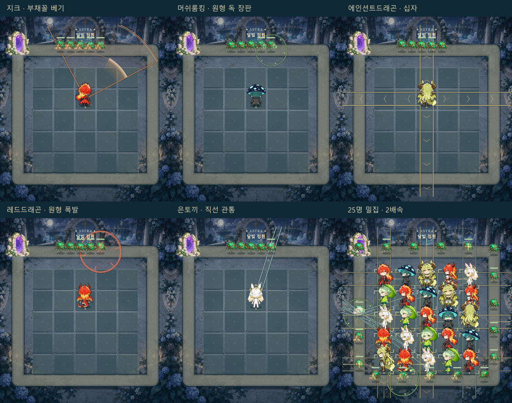
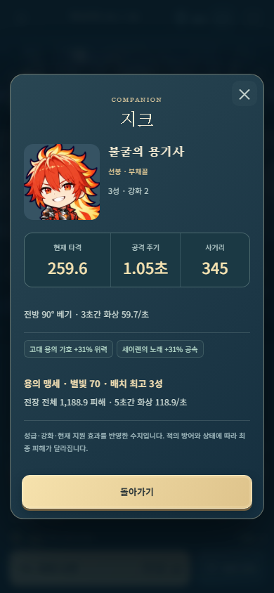

# 일반 공격의 모양과 현재 능력 표시 — 2026-09-28

목표는 **공격하는 순간에 부채꼴·원·십자·관통을 구별하고, 동료의 얼굴과 적의 체력을 계속 읽는 것**이다.
이번 변경은 일반 공격의 위력·공격 주기·사거리·범위를 바꾸지 않는다. 소환의 무작위 추출과 가격 상한 제거는 별도의 요청 사항이다.

## 조사에서 구현으로

공식 개발 글과 공개 강연 소개를 읽고, 화면 정보의 우선순위·판정 일치·시간 변화·저사양 표현을 비교했다.
아래의 적용은 이 게임의 2D Canvas와 작은 화면에 맞춘 설계 판단이다. 원작의 렌더러나 에셋을 가져온 것은 아니다.

| 공개 자료 | 확인한 사례와 특징 | 이 게임에서 적용한 결정 |
| --- | --- | --- |
| [Riot, Clarity in League](https://www.leagueoflegends.com/en-us/news/dev/clarity-in-league/), 2021-03-12 | 시각 효과가 판정과 맞아야 하며 중요한 정보가 먼저 보여야 한다. 진의 궁극기 경계가 너무 빨리 사라지던 사례를 다룬다. | 명중 순간 엔진의 범위 좌표를 저장해 렌더링한다. 강한 잔광만 남기고 경계를 먼저 지우지 않는다. |
| [Riot, Behind the Scenes of VFX Updates](https://www.leagueoflegends.com/en-us/news/dev/dev-behind-the-scenes-of-vfx-updates/), 2022-04-25 | 누락되거나 잘못된 판정 표현을 먼저 고치고, 그다음 시각적 잡음과 테마를 개선한다. | 기존 21종 명중 텍스처는 작은 타격 장식으로 유지한다. 범위 전달은 별도의 정확한 도형이 맡는다. |
| [Riot, VALORANT Shaders and Gameplay Clarity](https://www.riotgames.com/en/news/valorant-shaders-and-gameplay-clarity), 2020-06-30 | 소바 궁극기의 큰 반투명 원통을 얇은 윤곽으로 바꾼 사례. 품질 설정이 낮아져도 게임에 중요한 형태는 유지한다. | 넓은 가산 혼합 면을 추가하지 않는다. 어두운 외곽선과 밝은 가는 선을 겹친다. 효과 간소화에서도 경계는 유지한다. |
| [Blizzard, Diablo IV Quarterly Update — December 2021](https://news.blizzard.com/en-us/article/23746639/diablo-iv-quarterly-updatedecember-2021), 2021-12 | 전투의 중요도에 따른 시각적 위계, 실제 피해 발생과 효과의 연결, 크기·강도·시간의 개별 조절을 설명한다. | 준비 → 명중 → 잔상의 시간을 구분한다. 보통 공격은 바닥에, 캐릭터와 체력은 위에 둔다. 이 변경으로 일반 공격을 궁극기처럼 확대하지 않는다. |
| [Blizzard, Weekly Recall: Tracer’s in Stadium](https://news.blizzard.com/en-gb/article/24230696/weekly-recall-blinkity-blinkity-tracers-in-stadium), 본문 확인 2026-09-28 | 화려한 능력과 명료한 전투 언어의 균형, 짧고 이해하기 쉬운 설명, 숙련자·비숙련자 모두의 반복 검증을 강조한다. | 선택한 개체의 계산된 타격·주기·사거리를 먼저 표시한다. 사용성 검증은 자동 테스트와 구분한다. |
| [Game Accessibility Guidelines, Do not convey essential information by fixed colour alone](https://gameaccessibilityguidelines.com/ensure-no-essential-information-is-conveyed-by-a-fixed-colour-alone/), 확인 2026-09-28 | 색 외에 형태와 표시를 함께 사용한다. | 주황=공격, 초록=독이라는 색 기억에만 의존하지 않는다. 베기 호·포자점·십자 통로·방사형 파편을 조합한다. |
| [GDC 2022, VFX as a Game Design Language](https://www.gdcvault.com/play/1027899/Visual-Effects-Summit-VFX-as), 공개 개요 | 효과가 게임 경험을 전달하는 설계 도구라는 강연 개요를 확인했다. | 연출을 정보 전달 문제로 정의하는 참고 자료다. 강연 전체나 슬라이드를 열람했다고 주장하지 않는다. |

## 공격별 시각 언어

| 형태 | 일반 공격 표현 | 전달하는 정보 |
| --- | --- | --- |
| 지크, 90° 부채꼴 | 두 변과 바깥 호, 내부를 지나가는 짧은 초승달 검흔. 바깥 호가 화면 밖에 있어도 안쪽의 약한 호가 남는다. | 공격의 방향·각도·거리. 검흔은 판정 안쪽만 움직인다. |
| 머쉬룸킹, 독 장판 | 실제 반경에 고정된 완전한 원, 안쪽의 6개 포자점, 느리게 떠오르는 작은 포자 3개. | 지속되는 원형 지역. 0.5초 피해 주기에 밝기만 변하며 반경은 늘었다 줄지 않는다. |
| 에인션트드래곤, 십자 | 실제 폭의 네 통로를 하나의 외곽선으로 표현하고, 각 팔 안으로 흐르는 빛과 방향 표시를 넣는다. 끝은 사거리 원에 맞게 둥글게 자른다. | 가로·세로 네 방향 동시 공격과 통로 폭. 대각선은 범위에 들어가지 않는다. |
| 레드드래곤 및 폭발형 | 명중 지점 중심의 고정 원, 안쪽에서 퍼지는 충격파와 짧은 방사형 파편. | 목표 주변의 즉시 폭발. 지속 장판과 다른 안쪽 움직임을 사용한다. |
| 은토끼·루미·폭풍의현자, 관통 | 실제 폭의 직사각 통로와 그 안을 진행하는 작은 빛. | 단일 목표에서 끝나지 않는 직선 공격. |
| 가디언, 자기 중심 충격 | 캐릭터 중심의 원형 경계와 안쪽 충격파. | 목표 지점 중심 폭발과 구별되는 자기 중심 범위. |

`engine.attackGeometry()`와 `geometryContains()`가 판정의 기준이다.
`applyHit()`의 `impact.geometry`는 **명중 순간** 대상 위치를 포함한 스냅샷이다.
`attack-shapes.js`의 `traceAttackShape()`를 범위 미리보기와 명중 표시에서 함께 쓴다.
발사 후 적이 움직이거나 동료를 옮겨도 과거 명중 영역을 현재 좌표로 다시 계산하지 않는다.

## 시간·밀도·레이어

- 준비: 실제 투사체가 도달하기 전 조용한 점선. 명중 전부터 피해가 난 것처럼 밝게 표시하지 않는다.
- 명중: 정확한 범위를 0.46초 표시하고 뒤쪽 시간에 부드럽게 사라지게 한다. 전투 2배속에서도 이 잔상은 화면 시간 기준이다.
- 기본 외곽선은 논리 좌표 2.8px, 어두운 받침선은 3px 더 두껍다. 390px 화면에서는 밝은 선이 약 1.5px이다.
- 면 채움은 최대 3.5% 정도이며, 범위 정보는 선으로 전달한다. 전체 화면에 밝은 색을 누적하는 혼합을 사용하지 않는다.
- 같은 공격자의 메아리·쌍둥이 추가 타격은 표시 한 개를 갱신한다. 공격 경계와 장식 효과의 보관 공간을 분리해 궁극기 장식이 기본 경계를 밀어내지 않게 했다.
- 겹치는 경계 수가 많으면 선의 강도를 낮추되 식별 가능한 하한을 둔다. 장판은 실제 상태의 수명과 반경을 그대로 쓴다.
- 순서: 배경 → 일반 공격 범위·궁극기 바닥 → 지역 이름 → 선택 표시·위험 칸 → 동료·적 → 작은 투사체/명중 장식 → 적 체력바.
- 가장자리 경로에 있는 장판이 불필요하게 잘리지 않도록 Canvas 안의 표시 영역을 넓혔다. Canvas 밖의 조작부에는 그리지 않는다.
- 효과 간소화는 장식 이동을 생략한다. 경계·장판·피해 상태·체력 정보는 유지한다.

공격 주기를 길게 하고 한 방 피해를 늘리는 방안도 검토했다. 이번에는 위력과 주기를 유지하고 범위 잔상과 레이어를 고쳤다.
나중에 주기를 바꾸려면 타격 DPS뿐 아니라 독·화상·별빛 충전·12회 유성·추가 공격의 빈도도 같이 검증해야 한다.
단순히 `피해 × 주기 배율`만 맞추면 이런 부가 효과의 초당 성능이 달라진다.

## 현재 능력 UI

`combatStats()`가 실제 공격과 정보창의 공통 계산 함수다. 성급·훈련·전역 축복·유물·인접 가호·일시 버프를 반영한다.
공격 주기는 실제 재사용 대기시간에 준비 동작 0.13초를 더한 값이다. 타격 수치에 도트나 연쇄 총합을 더해 DPS처럼 표시하지 않는다.
보스 보너스·처형·얼어 있는 대상 추가 피해는 조건과 계산된 수치를 함께 쓴다. 적의 방어·노출 등은 적마다 다르므로 기본 타격 수치와 구분한다.
필살기는 엔진과 동일하게 배치된 해당 동료의 최고 성급을 사용하고, 그 성급을 표시한다.
지원 동료를 옮기거나 버프가 끝나면 선택창도 갱신된다. 훈련 창은 현재 배치 최고 성급의 현재/다음 수치를 비교한다.

## 재현과 확장

`npm run serve:defense` 후 [`/tools/combat-review.html`](../tools/combat-review.html)을 연다.
게임과 같은 엔진·렌더러·에셋으로 21명을 검토할 수 있다. 적은 위치가 고정되고 체력만 높은 검사 장면이다.
단독 상하좌우, 25명/18마리 밀집, 1배/2배속, 효과 간소화, 선택 범위를 바꾸고 프레임 슬라이더로 반복 확인한다.
이 도구는 저장·배포 HTML·게임 메뉴에 들어가지 않는다.

`node defense/tools/capture-combat-review.mjs OUTPUT_DIRECTORY`는 이 화면에서 실제로 재생되는
지크·머쉬룸킹·에인션트드래곤·레드드래곤의 1배속 공격과 25명 밀집 2배속 영상을 WebM으로 기록한다.
빠른 반복 검사는 `node -e "require('./scripts/defense_browser_suite.cjs').runSuite('clarity').catch(e=>{console.error(e);process.exitCode=1})"`로 실행한다.
이 검사는 일반 Defense 브라우저 검사에도 포함되어 있다.

새 효과를 추가할 때:

1. 먼저 판정의 기준점·길이·폭·피해 시점을 정한다. 이름이나 색보다 모양을 먼저 확인한다.
2. 실제 판정 스냅샷으로 외곽선을 그린다. 안쪽 장식은 그 경계 안으로 클립한다.
3. 1명만 있을 때, 여러 명이 동시에 공격할 때, 화면 가장자리, 간소화 모드에서 본다.
4. 캐릭터 얼굴·성급·적 체력바·위험 칸이 남는지 확인한다. 선택 범위를 켜야만 공격을 이해할 수 있다면 다시 수정한다.
5. 캐릭터 이미지는 두개부·발 기준선·네 방향·원본 정체성을 따로 검수한다. 큰 귀·머리카락·모자를 머리 크기로 측정하지 않는다.

## 이번 검증과 한계

- 단위 검사: 초기 세 번을 포함한 독립 추출, 저장 후 난수 진행, 40G 초과 비용, 실제 공격/표시 수치, 인접 지원 변경, 명중 스냅샷, 효과 보관 한도.
- Chromium의 Canvas 경로 포함 검사와 엔진 판정을 6형태×5각도, 총 **44,400지점**에서 비교했다. 불일치 0.
- 실제 320px·390px의 25명/18마리 장면을 1배/2배속·일반/간소화 8조합으로 캡처했다. 위 그림은 실제 렌더러 출력이며 별도의 합성 콘셉트 아트가 아니다.
- 기본 브라우저 검사는 전체화면 진입/복귀, 정보창·동료 이동 후 수치 갱신, 무작위 소환에서 합성 가능한 쌍 찾기, 조작 연습을 포함한다.
- 21명/84방향 알파·해시·두개부 기록과 유물 20개 투명 여백을 검사한다. 수치 검사는 미술적 승인과 동일하지 않다.
- 이 증거는 데스크톱의 Chromium 검사다. 실제 Android/iOS의 터치·메모리·발열·Safari 전체화면과 사용자의 재미 평가는 별도 확인이 필요하다.
- 특히 완전 랜덤 소환은 첫 합성 쌍을 보장하지 않고, 비용은 계속 오른다. 이 변경을 장기 밸런스나 승률 개선으로 주장하지 않는다.

브라우저 검사 출력: `attack-*.png`, `zeke-frame-*.png`, `area-dense-*.png`, `attack-geometry.json`, `current-unit-stats.png`, `current-unit-dock.png`.
검사 디렉터리는 명령 종료 시 출력된다. 단일 HTML 오프라인 검증과 최종 파일 해시는 PR에 별도로 기록한다.

최종 로컬 검증(2026-09-29): `npm run verify`, `npm run verify -- --only defense` 통과.
후자는 브라우저 화면·빌드·차단 네트워크에서의 단일 파일 실행·42개 단위/아트 검사·정적 검사를 실행했다.
배포 HTML: **9,002,584 bytes / 8.59MiB**, 27개 이미지 내장.
SHA-256: `a1ee37738192aca27a2054409150f138be43f8df65d4658726ecfa6c1124f7bc`.

