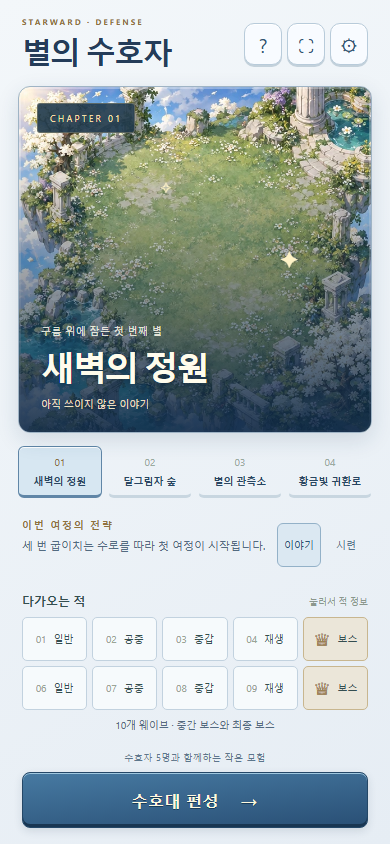
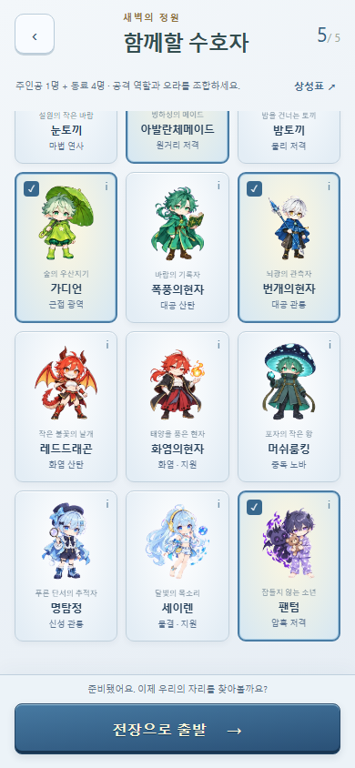
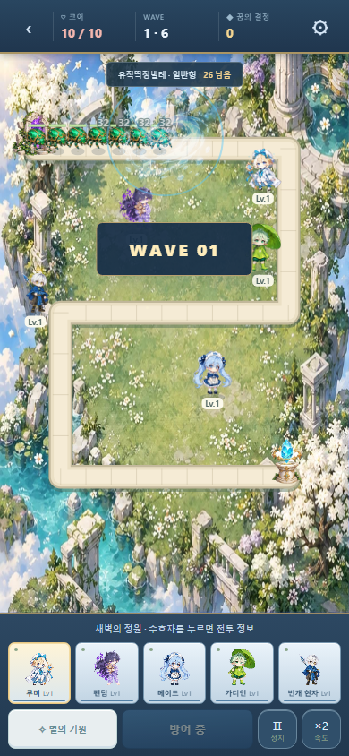
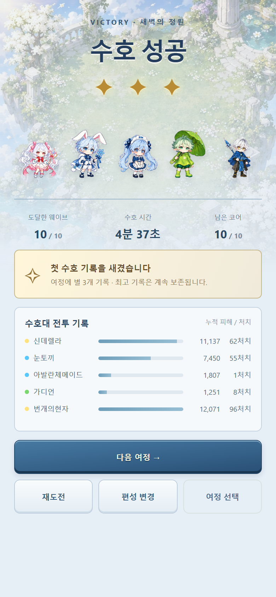

# Tactical revision

This revision builds on the merged release-safety fixes from PR #525. The defects
identified in #522 were valid: rounded rectangle compatibility, missing-media
fallbacks and minute/second rollover were bugs. Runtime background removal was
also a mobile startup risk. Those fixes and the required Defense release gate
remain in place, with Chromium and WebKit failure/hang coverage.

## What changed

- Main + companion roster: 4 + 12 (1,980 legal parties), with four final trait
  builds per character. New companions are normal units, below main-character
  baseline output in comparable roles, with team utility replacing raw strength.
- Targeting, ray collision, effect endpoints and placement preview share effective
  range including aura/trait additions. Nova detection uses its real hit radius.
  Preview recomputes the aura network at the proposed location without changing
  live state. Shotgun trails stay on the actual pellet rays.
- Each map still has 15 cells. Straight endpoints give long piercing opportunities,
  bends keep short-range heroes engaged, crossing cells see separated path sections,
  support cells group allies and late cells guard the core at the cost of early
  coverage. All five internal roles use identical neutral markers. No per-cell
  tactical advice or role symbols are exposed.
- Schema 1 saves are validated against their released map and migrated to schema 2.
  Still-legal placements stay; displaced heroes move to the nearest free legal
  cell. Wave, crystals, levels, traits, core, time, report and RNG stay intact.
- All 16 heroes now have isolated, consistently scaled idle/attack cells. Pale
  hair is repaired, Zeke's attack pose corrected, and fallback portraits rebuilt.
  New elemental FX, chest-level firing origins, hit flashes, brief death fades
  and elemental WebAudio impacts improve feedback. Effects remain capped and
  reduced-motion/effects settings remain available.
- Menu/roster/result chrome uses the same cool blue, ivory and brass language.
  Stage copy has a fixed-height container; a 6×6 matchup menu replaces repeated
  counter instructions. Companion selection supports a direct four-choice swap.
  Victory shows the party, medals, saved record and damage report.
- Fullscreen follows Shooter's standard API/options retry, adds the WebKit prefix,
  and offers home-screen guidance when unavailable. Original procedural WebAudio
  music and effects start only after a gesture; music and sound can be muted
  independently. No external sound API was used.
- Menu decodes terrain only. Formation loads the visible roster's atlases. Battle
  loads only selected-party atlases, terrain/creatures/FX, with fallback files on
  failure. Runtime pixel processing remains absent. The 103-asset offline HTML
  is about 7.51 MiB.

## New companions and CARD lineage

| Companion | Identity / role | Defense interpretation of CARD |
| --- | --- | --- |
| Red Dragon | Female, fire dealer | Fire Breath + burn; flame fan, corrosion branch, Sun Bless synergy |
| Flame Sage | Male, fire buffer | Sun Bless aura, Prominence burn, three-fire critical aura |
| Mushroom King | Male, nature dealer | Spore nova/poison, half-health finisher, Earth Bless synergy |
| Great Detective | Male, water balancer | Holy piercing, fifth-shot critical, curse and debuff investigation |
| Siren | Female, water buffer | Moon Bless, two-water critical aura, tidal control, range-aura branch |
| Phantom | Male, dark dealer | Preserved field-buff immunity, nightmare/darkness, independent curse damage |

Source: active card/game/data.js. Defense changes turn-based conditions into
attack counts, placed-team composition, aura distance and timed effects. Values
are deliberate Defense tuning, not a verbatim port.

## Balance evidence

The CI matrix structurally validates all 1,980 parties, then runs 52 parties per
map: every pair of the 12 companions under each of the four mains. Each run uses
one automatic placement, even level growth, first-listed traits and no Starfall.
It checks termination, finite state, entity caps and every checkpoint boundary;
one run is replayed for exact deterministic equality. Set
DEFENSE_EXHAUSTIVE_BALANCE=1 for all parties in combat.

| Story map | Sample clears | Estimated median play time at 2× |
| --- | --- | --- |
| Ancient Ruins | 42/52 (80.8%) | 3.66 min |
| Chaos Rift | 38/52 (73.1%) | 4.17 min |
| Crossroads | 38/52 (73.1%) | 4.91 min |
| Long Boulevard | 43/52 (82.7%) | 3.68 min |

Time includes an explicitly modeled 69 seconds of input. This is not a human
playtest measurement or a claim about all 1,980 combat outcomes. Demon God's base
HP is 4,400 instead of 6,500 to fit the revised path exposure; the earlier setting
gave only 34.6%/36.5% clears on the two dark maps. Gates remain 80%/65%/65%/80%.
Trial keeps its higher HP/speed. A final-boss breach still loses the run.

## Validation scope

119 unit/integration tests pass, together with dedicated lint, offline bundle,
browser, experience and resilience checks. Root npm run verify passes with no
unrelated active-game changes; Defense remains in its own required CI gate.

Dedicated regression coverage includes buff-only laser/shotgun/nova targets,
trait+aura preview range, companion conditions/statuses, all 64 trait builds,
map tradeoffs, neutral markers, old saves, alpha/frame isolation and Zeke's paired
body bounds. Browser experience covers six new companion swaps, 36 matchup cells,
stable stage geometry, fullscreen entry/exit, a live audio graph and mute, plus
complete Story and Trial UI flows, traits, reload/continue and persisted medals.

Desktop Chromium was tested at 360×800, 390×844, 800×360, 844×390, 768×1024 and
1366×768, including same-page rotation; small-phone layout at 320×568. WebKit and
Chromium run healthy, primary-image failure, all-image failure, hanging loaders,
missing newer APIs and offline-file cases. No physical iOS/Android device, native
Safari 15 installation, WebView or long thermal/memory soak was available.
Commercial launch readiness still needs that device coverage and human playtesting.

## Built offline UI

Captured from the shipped single HTML at 390×844, including real battle/result
state. The full browser evidence is also uploaded by the Defense workflow.

