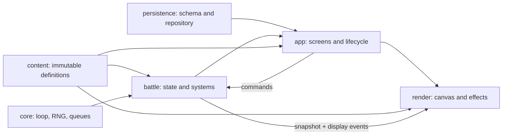

# 아키텍처

Hero Core Defense V2는 콘텐츠 선언, 결정론적 전투, DOM 화면, Canvas 렌더링, 영속 저장을 분리한 고정 스테이지 디펜스 앱이다. 이 문서는 새 기능을 어느 계층에 배치할지와, 바꾸면 안 되는 실행 순서를 설명한다.

## 1. 의존 방향



핵심은 두 개의 단방향 경계다.

- 화면에서 전투로는 command만 내려간다.
- 전투에서 화면과 렌더러로는 snapshot, display event, result만 올라온다.

렌더러나 screen이 runtime entity를 잡고 직접 수정하면 결정론, 체크포인트 복원, 테스트 격리가 동시에 깨진다.

## 2. 시작과 화면 수명주기

[`js/main.js`](../js/main.js)가 콘텐츠를 검증한 뒤 [`GameApp`](../js/app/GameApp.js)을 시작한다. `GameApp`은 저장소, 에셋 관리자, 화면 controller를 조립한다.

화면 전환은 [`SceneController.show(name, options)`](../js/app/SceneController.js) 한 곳에서 처리된다.

```text
stages → formation → battle → result
   ↑          ↑          │       │
   └──────────┴──────────┴───────┘
```

새 화면을 추가할 때는 다음 계약을 지킨다.

1. constructor에서는 전달받은 의존성과 callback을 보관한다.
2. `mount(root)`에서 DOM과 event listener를 만든다.
3. `destroy()`에서 GameLoop, listener, timer, audio와 임시 DOM을 모두 정리한다.
4. 이전 화면은 `SceneController`가 `destroy()`한 뒤 root를 비우므로 전역 listener를 남기지 않는다.

화면별 공개 계약은 [런타임·클래스 API](./RUNTIME_API.md#2-앱과-화면-수명주기)에 정리되어 있다.

## 3. 전투 상태의 소유권

[`BattleState`](../js/battle/BattleState.js)는 한 전투의 mutable state를 만든다. 외부가 이 객체를 직접 소비하지 않도록 [`BattleSession`](../js/battle/BattleSession.js)이 facade 역할을 한다.

| 상태 | 쓰는 주체 | 외부에 보이는 형태 |
| --- | --- | --- |
| 영웅 배치·레벨·타이머 | command와 battle systems | immutable 성격의 snapshot |
| 적 HP·상태·진행도 | Wave/Movement/Damage/Status systems | snapshot |
| RNG | `SeededRng`를 받은 systems | checkpoint의 RNG snapshot |
| visual hit/status event | Damage/Status/Action systems | 한 step 뒤 drain되는 display events |
| checkpoint | `createCheckpointFromState` | schema로 검증된 plain object |

`BattleSession.snapshot()`은 렌더링과 디버깅을 위한 사본이다. snapshot을 바꿔도 전투에 반영되어서는 안 되며, 전투를 바꾸려면 준비·UI 즉시 동작은 `applyNow(type, payload)`, 다음 running tick에 예약할 동작은 `enqueue(type, payload)`를 사용한다.

## 4. 60Hz 고정 틱

[`GameLoop`](../js/core/GameLoop.js)는 1/60초 fixed step을 제공한다. 실제 화면의 1×에서는 callback 한 번에 한 step, 2×에서는 두 step을 실행한다. 전투 내부에 별도의 wall-clock accumulator를 만들지 않는다.

한 [`BattleSession.step()`](../js/battle/BattleSession.js)의 순서는 계약이다.

1. queued command 적용
2. 웨이브 spawn
3. 상태 지속시간과 poison tick
4. 적 이동과 core 도달 처리
5. aura 수신자와 derived stat 갱신
6. 이번 틱의 skill·basic action을 모두 생성하고 target을 잠금
7. action을 `tick → slot → skill/basic 우선순위 → target spawnOrder`로 정렬
8. 정렬된 action을 해결하고 피해·상태·display event 생성
9. 죽거나 core에 도달한 적 정리
10. 웨이브/전투 종료 판정과 checkpoint/result 처리
11. snapshot과 display event를 화면에 제공

### 왜 생성과 해결을 분리하나

앞 영웅이 적을 처치한 결과 때문에 뒤 영웅이 같은 틱에서 다른 적을 골라버리면 slot 순서가 게임 결과를 바꾼다. [`ActionSystem`](../js/battle/systems/ActionSystem.js)은 모든 행동과 대상을 먼저 잠근 다음 해결해서 이 문제를 막는다. AoE와 shotgun의 대상/RNG 순서도 spawnOrder와 pelletIndex로 고정한다.

새로운 공격 유형을 추가할 때도 action descriptor를 생성하는 단계와 피해를 적용하는 단계를 합치지 않는다.

## 5. 시스템 책임

| 계층 | 책임 | 두면 안 되는 것 |
| --- | --- | --- |
| `content/` | immutable 정의, lookup map, validator | DOM, mutable 전투 상태 |
| `core/` | 시간, RNG, event/command 자료구조 | 영웅 ID 또는 스테이지 규칙 |
| `battle/` | 규칙 실행과 상태 변경 | DOM, Canvas, 실제 시간 기반 분기 |
| `render/` | snapshot과 event의 시각화 | 피해 계산, runtime state 변경 |
| `app/` | 화면 조립, 사용자 입력, lifecycle | 영웅별 전투 공식 |
| `persistence/` | schema, 저장·복구, fallback | 전투 진행 계산 |

각 system의 구체적 함수와 입력·출력은 [런타임·클래스 API의 system 레퍼런스](./RUNTIME_API.md#7-battle-system-모듈-레퍼런스)를 참고한다.

## 6. 콘텐츠와 특성 DSL

영웅, 적, stage, buff, status, effect preset은 [`js/content/`](../js/content/)의 불변 데이터다. 파일은 배열 export와 ID lookup map을 제공하며 [`validateContent`](../js/content/validateContent.js)가 교차 참조와 고정 계약을 검사한다.

영웅별 특성은 battle system 안의 조건문이 아니라 다음 흐름으로 실행된다.

```text
hero trait data
  → TraitCompiler
  → ConditionRegistry evaluates generic conditions
  → OperationRegistry applies generic effects
  → derived stats / flags / hooks
```

새 동작이 기존 condition/effect 조합으로 표현되지 않을 때만 registry의 generic operation을 추가한다. 그 뒤 여러 영웅이 같은 operation을 재사용할 수 있어야 한다. 자세한 작성 shape와 allowlist는 [콘텐츠 제작·수정 가이드](./CONTENT_AUTHORING.md)와 [특성 DSL API](./RUNTIME_API.md#8-특성-dsl-conditionregistry-operationregistry-traitcompiler)를 따른다.

## 7. 결정론 계약

같은 seed, formation, command 순서이면 매번 같은 결과가 나와야 한다.

- 난수는 [`SeededRng`](../js/core/SeededRng.js)만 사용한다.
- 컬렉션 순서에 의존하는 동작은 slot, spawnOrder, pelletIndex 같은 명시 키로 정렬한다.
- renderer의 `performance.now()`, requestAnimationFrame, CSS animation은 전투 판정에 관여하지 않는다.
- event listener의 실행 시점으로 전투 상태를 바꾸지 않는다.
- checkpoint 복원 뒤 다음 웨이브 시작 상태는 uninterrupted 실행과 같아야 한다.

결정론을 건드리는 변경은 [`checkpoint-continuity.test.mjs`](../tests/integration/checkpoint-continuity.test.mjs), [`simulation-balance.test.mjs`](../tests/integration/simulation-balance.test.mjs), action 관련 unit test를 함께 실행한다.

## 8. 체크포인트 경계

V2 체크포인트는 진행 중 전투를 직렬화하지 않는다. 저장 시점은 초기 배치와 웨이브 사이이며, 다음 내용을 저장한다.

- schema version, session ID, stage/difficulty
- formation과 다섯 영웅의 legal placement
- 영웅 level과 선택된 Lv4/Lv6 trait
- `nextWave`, core durability, crystals
- RNG snapshot과 다음 웨이브 flag

적 위치, 적 HP, projectile, popup, animation, 공격 중간 action은 저장하지 않는다. 웨이브 시작에서 hero attack/skill timer, last target, direction을 기준값으로 초기화하므로 저장하지 않은 transient가 복원 결과를 바꾸지 않는다.

schema를 바꿀 때는 [`schemas.js`](../js/persistence/schemas.js), [`SaveRepositoryV2`](../js/persistence/SaveRepositoryV2.js), state 생성과 checkpoint 생성 함수를 한 변경으로 묶는다. primary/backup 양쪽과 future version 거부도 테스트한다.

## 9. 렌더링 경계

[`BattleRenderer`](../js/render/BattleRenderer.js)는 `BattleSession.snapshot()`에서 board, 배치, 적, HP와 status를 읽어 그린다. [`EffectRenderer`](../js/render/EffectRenderer.js)는 drain된 display event와 `ViewportLayout`을 받아 수명 제한 visual로 변환한다. 둘 다 전투 entity를 소유하거나 수정하지 않는다. 상태 만료는 `StatusSystem`, visual 수명 만료는 `EffectRenderer.update()`의 책임이다.

논리 좌표와 screen 좌표 변환은 [`ViewportLayout`](../js/render/ViewportLayout.js) 한 곳에서 처리한다. landscape에서 DOM 또는 renderer가 자체 회전 공식을 만들면 pointer와 sprite 방향이 갈라질 수 있다. 구체 공식은 [UI·렌더링·배포](./UI_RENDERING_AND_RELEASE.md#3-논리-보드와-viewportlayout)에 있다.

## 10. 자원 상한과 정리

장시간 전투에서 메모리와 draw cost가 무한히 늘지 않도록 active entity와 visual queue에 상한이 있다.

| 종류 | 상한 |
| --- | ---: |
| enemies | 45 |
| projectiles | 160 |
| area effects | 64 |
| particles | 250 |
| damage popups | 40 |

새 entity/effect 종류를 추가할 때는 생성하는 producer와 저장하는 registry/renderer 양쪽에서 상한을 적용하고, snapshot·destroy 경로를 추가한다. 제거된 pooled object 참조를 외부가 오래 보관하지 않는다.

## 11. 공개 이벤트 계약

전투 시각 이벤트는 [`content/effects.js`](../js/content/effects.js)의 계약을 따른다. 최소 필드는 다음과 같다.

```js
{
  type,
  actionKind,
  attackArchetype,
  effectPreset,
  element,
  sourceId,
  targetId,
  x,
  y,
}
```

`radius`, `critical`, `advantageous`, `statusId`, `pelletIndex`, `sourceX`, `sourceY`, `vectorX`, `vectorY` 등은 프리셋에 따라 추가된다. producer가 새 event shape를 만들면 content validator, EffectRenderer dispatcher, effect tests를 함께 갱신한다.

## 12. 새 기능을 배치하는 기준

- 숫자와 조합만 달라짐: `content/`에 선언한다.
- 여러 영웅이 공유할 trait 동작: condition/operation registry에 generic 기능을 추가한다.
- 매 틱 상태 전이 규칙: 작은 battle system으로 만들고 `BattleSession.step()`의 명시 위치에 연결한다.
- 사용자 입력: screen에서 command로 변환한다.
- 화면 표현만 달라짐: renderer 또는 CSS에서 snapshot/event만 사용한다.
- 웨이브 사이까지 남아야 함: checkpoint schema 변경 필요성을 먼저 검토한다.

기능이 두 계층 이상을 건드리면 한 계층이 다른 계층의 내부 객체를 직접 소유하게 만들지 말고, command·snapshot·event·validated DTO 중 하나로 경계를 명시한다.
