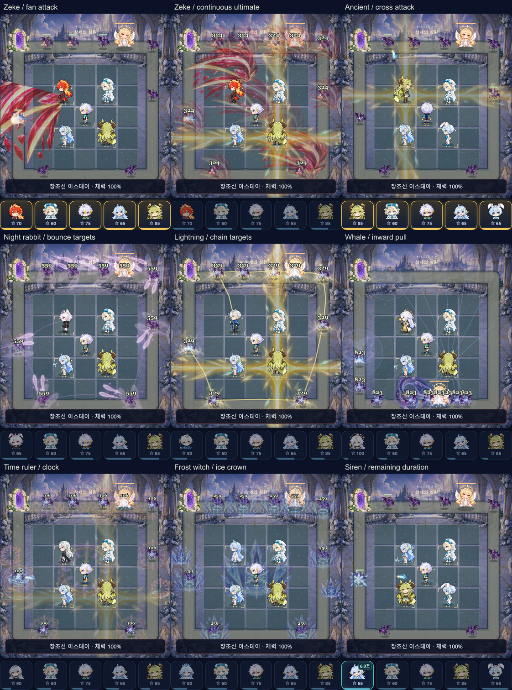

# 실제 전투 화면 검토

2026-10-05, 최종 배포 입력 `753d6a06ee0bbb36e9938903ffd6ee9bde553ad5`. Chromium, 세로 화면 390×844, 기기 배율 2. 실제 배포 HTML과 실제 이어하기/필살기 버튼으로 캡처했다. 전투 fixture는 시작 전에 저장소에 넣었다. 실행 중 게임의 엔진 상태나 DOM을 바꾸지 않았다. 움직이는 적과 전투의 전체 흐름은 별도 필수 브라우저 검사에서 확인한다.

기본 공격은 선택 동료의 공격 횟수가 실제로 증가한 뒤, 필살기는 실제 버튼 발동 후에 캡처했다. 범위 명중은 해당 동료의 피해 기록이 증가한 직후 추가 캡처했다. 지속 상태는 발동 후 1초 이상 지난 화면이며 버튼의 남은 시간을 함께 확인했다. 시간의마술사는 실제 변신 중 투사체가 존재하는 순간을 별도로 확인했다.

| 검토 대상 | 실제 화면 |
|---|---|
| 30명 기본 공격, 실제 화면 크기의 전장 | [1~12](basic-contact-1.png), [13~24](basic-contact-2.png), [25~30](basic-contact-3.png) |
| 30명 필살기 | [1~12](ultimate-contact-1.png), [13~24](ultimate-contact-2.png), [25~30](ultimate-contact-3.png) |
| 8종 지속 상태 | [전장 비교](sustain-contact-1.png), [세이렌 전체 화면/잔여 시간](siren-sustain.png) |
| 긴 십자와 부채꼴, 캐릭터/HP 층 구분 | [에인션트 기본 공격](ancient_dragon-basic.png), [지크 기본 공격](zeke-basic.png), [지크 필살기](zeke-ultimate.png) |
| 전용 문양과 실제 흡인 | [은하고래](galaxy_whale-ultimate.png), [시간의지배자](time_ruler-ultimate.png), [혹한의마녀](frost_witch-ultimate.png) |
| 단일 고정 대상과 추가 피해 | [천만경 대상/3초 진행](aurora-lock.png), [천만경 추가 피해](aurora-ultimate.png) |
| 범위 명중의 폭발 크기 | [레드드래곤](red_dragon-impact.png), [눈토끼](snow_rabbit-impact.png), [산타](santa-impact.png) |
| 변신 기본 공격/남은 시간 | [시간의마술사](time_magician-transformed-shot.png) |
| 월간 최고 기록과 보상 확정 | [최고 기록 결과](monthly-best-result.png), [기록/금액 확인](monthly-confirm.png) |

[30명 캡처 진단값](visual-review.json), [범위 명중/변신 추가 검사](visual-focused.json), [실제 화질 메뉴 변경값](quality-review.json), [Chromium 화면/경계 검사](chromium-verification.json), [WebKit 화면/경계 검사](webkit-verification.json)을 같이 보관한다. 합성 검토표는 원본 게임 화면의 전장 영역을 잘라 실제 CSS 크기로 모은 그림이다. 제목 이외의 UI나 전투 그림을 합성으로 만들어 넣지 않았다.

아우로라의 이 fixture에서는 모든 적의 최대 HP를 같게 둬 가장 먼저 생성된 일반 적이 고정 대상이다. 이미 존재하는 보스를 무조건 선택한다는 별도 주장을 하는 화면이 아니다. 은하고래의 모인 피해 숫자도 실제 9개 대상의 숫자이며 큰 고래 그림은 중심 하나에만 표시된다.

이 캡처는 실제 휴대폰의 화면 밝기·손가락 가림·발열·배터리 검증을 대신하지 않는다. 최종 필수 검증과 성능 측정의 범위는 [전투 검증 보고서](../../COMBAT_POLISH.md), [단발 성능 보고서](../../PERFORMANCE_REVIEW.md)에 기록한다.
