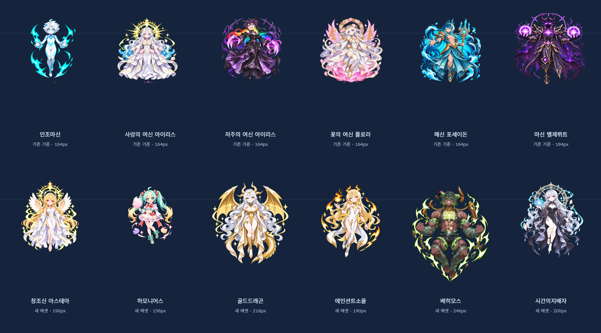
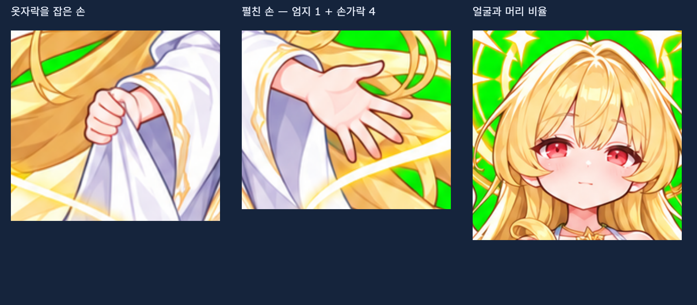

# 보스 일러스트 통일 가이드

최우선 기준은 **원화 한 장의 화려함이 아니라 같은 게임의 보스로 보이는가**이다.
기존 6개 던전의 `assets/bosses.png`, `assets/tides.png`가 기준이며, 신규 원화는 캐릭터 디자인 참고로만 사용한다.

## 비교 기준

- 상반신 클로즈업 원화를 그대로 축소하거나 배경만 제거하지 않는다. 전투용 전신 스프라이트로 다시 구성한다.
- 머리 크기를 먼저 맞춘다. 뿔, 광륜, 귀, 길게 흘러내린 머리카락은 머리 크기에 포함하지 않는다.
- 키가 크거나 근육이 많은 보스는 **머리를 작게 하지 않고 몸 전체를 크게** 표시한다. 날개나 꼬리까지 동일한 외곽 상자에 끼워 넣지 않는다.
- 기존 6종의 표시 크기는 유지한다. 신규 6종은 `render.js`의 `BOSS_PRESENTATION`으로 게임상 머리 폭 약 34px를 기준 삼아 육안 비교한다. 이는 자동 정답 판정값이 아니라 제작용 기준이다.
- 얼굴 위치도 확인한다. 큰 몸을 가진 베히모스는 그만큼 아래쪽으로 배치한다. 머리와 몸을 별도로 비선형 확대하지 않는다.
- 얼굴이 작아 보이면 전체 확대만으로 해결 가능한지 먼저 확인한다. 장식이 화면을 넘거나 몸이 지나치게 길어지면 원본 스프라이트의 비율을 재작화한다.

## 선·명암·광택

- 깨끗하고 얇은 유색 윤곽선. 가는 장식선보다 얼굴, 손, 옷자락의 큰 형태를 우선한다.
- 기존 보스처럼 부드러운 셀 명암과 넓은 색면을 사용한다. 피부를 실사처럼 광택 처리하거나 미세한 재질 노이즈를 넣지 않는다.
- 피부 하이라이트는 절제하고 금속·보석에 광택을 집중한다. 모든 소재를 같은 유광으로 처리하지 않는다.
- 화려함은 컬러와 실루엣에서 얻는다. 고해상도에서만 읽히는 자잘한 문양, 과도한 마법진과 입자로 빈 공간을 채우지 않는다.
- 원래 복장·헤어·주요 장신구·색을 보존한다. 보스마다 같은 옷을 입히거나 성별/체형을 임의로 바꾸지 않는다.

## 이번 캐릭터별 보존 사항

| 보스 | 반드시 보존할 핵심 |
|---|---|
| 아스테아 | 금발·붉은 눈, 흰색/금색 드레이프 의상, 날개, 겹친 황금 광륜, 흰 샌들 |
| 하모니어스 | 민트/노랑 트윈테일, 딸기 리본, 방울 달린 붉은 보타이, 과일 스커트, 솜사탕, 초록 샌들 리본 |
| 골드드래곤 | 흰 곱슬 장발, 금빛 뿔·용 날개·비늘 꼬리, 금색 의상, 청록 보석 |
| 에인션트소울 | 남성의 평평한 가슴과 가느다란 체형, 금발·금안, 엘프 귀, 불꽃 뿔, 흰색/금색 로브, 가슴의 별 |
| 베히모스 | 남성의 넓고 근육질인 체형, 어두운 피부·초록 머리, 부서진 돌뿔·사슬, 가죽 하네스, 초록 태양과 균열 |
| 시간의지배자 | 은발·붉은 눈, 검은 하이넥 드레스와 분리 소매, 파란 보석, 발목 스트랩 구두, 시계와 파란 시간 구체 |

위의 성별 정보는 시각 제작 조건일 뿐 게임 로직의 별도 `gender` 필드가 아니다.

## 해부학과 채택 검사

1. 원본 크기에서 양손을 각각 확대해 확인한다. 손 하나에 엄지 1개와 나머지 손가락 4개가 자연스럽게 연결되는지, 숨은 손가락은 포즈로 설명되는지 본다.
2. 여분의 손가락·손·팔, 붙어버린 손가락, 잘못 연결된 발과 샌들을 확인한다. 필요하면 포즈를 단순화한다.
3. 게임과 동일한 배율로 기존 6종과 신규 6종을 함께 배치한다. 같은 크기의 이미지 썸네일만 비교해서는 안 된다.
4. 실제 배경/HUD/탄막 위에서도 얼굴과 손, 탄이 읽히는지 본다. 색·광택·디테일 밀도가 혼자 튀면 재작화한다.
5. 기존 그림보다 낫지 않으면 새 그림이라는 이유로 채택하지 않는다. 원본은 Git 이력으로 보존한다.

`node shooter/tests/events-flow.mjs`는 실제 배포 파일의 렌더링 배율로 `artifacts/boss-style-comparison.png`를 만든다. 자동 검사는 자산 로드·경계·게임 동작만 증명하며, 화풍과 손가락의 정답을 증명하지 않는다. 비교 화면을 반드시 직접 확인해야 한다.

`node shooter/tests/art-audit.mjs`는 아스테아 원본의 양손과 얼굴을 확대하는 검토 화면 `artifacts/astea-hand-audit.png`를 만든다. 이 도구는 원본 픽셀을 보여주기만 하며 배포 에셋을 편집하지 않는다.

이번 아스테아는 최초의 길쭉한 재시안을 폐기하고 머리/몸 비율을 다시 잡았다. 손가락 문제를 피하려고 한 손은 옷자락을 잡고 다른 손은 단순히 펼치는 포즈로 변경했다. 신규 보스도 최초의 고밀도 원화식 시안을 그대로 사용하지 않고 게임용으로 다시 구성했다.

## 파일과 배포

- 선택된 PNG는 `assets/astea.png`, `harmonious.png`, `gold-dragon.png`, `ancient-soul.png`, `behemoth.png`, `time-ruler.png`이다.
- 이번 내장 생성 도구의 투명 출력 시안에는 체크 무늬가 나타나 최종본은 기존 보스와 같은 단색 그린 키 방식으로 제작했다. 배경색은 게임 로딩 때 한 번 제거하고 가장자리 번짐을 보정한다.
- `loadArt()`는 원본의 종횡비를 보존해 캐시에 적재한다. 실제 전투 배율과 Y 보정은 `BOSS_PRESENTATION` 한 곳에서 관리한다.
- 원본 파일만 바꾸고 끝내지 않는다. `build.mjs` 목록과 오프라인 `dist/AstralBloom.html`도 갱신하고 실제 `file://` 실행을 검사한다.
- 사용한 생성 모드·참조 역할·최종 프롬프트 세트는 [ART_WEEKLY_EVENTS.md](ART_WEEKLY_EVENTS.md)에 기록한다.
