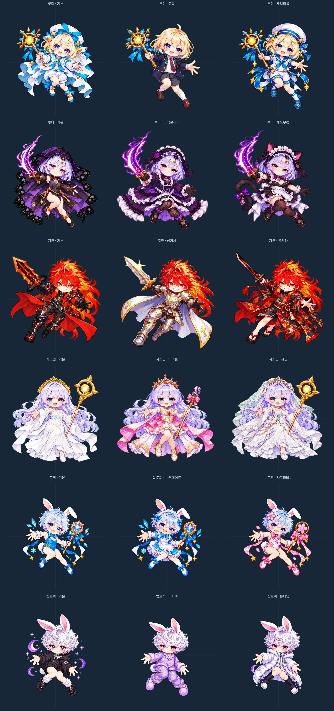
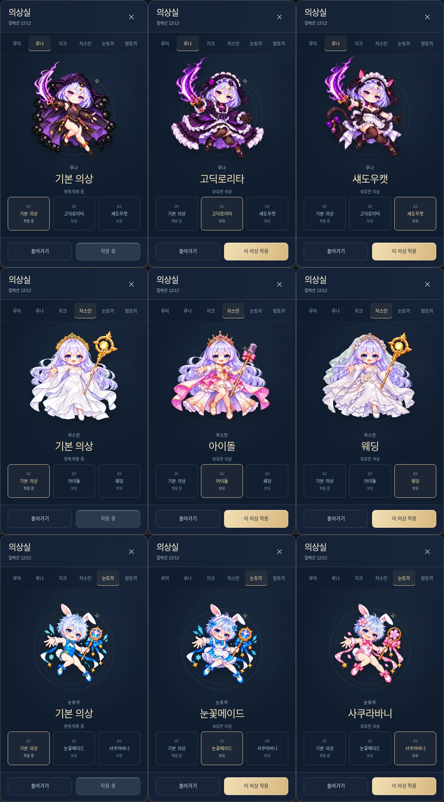

# 코스튬 비율과 피격점 검증

2026-09-30. 기본 의상 6개와 코스튬 12개를 동일 크기로 확대 비교하고, 실제 의상실·타이틀·전투 경로를 검증한다. #556의 눈 간격만 맞추는 처리로는 자스민의 길어진 다리와 커진 얼굴, 눈토끼의 얼굴·몸 크기, 루나의 얼굴 윤곽을 충분히 통일할 수 없었다. 같은 눈 간격이어도 볼·턱의 폭과 눈에서 발까지의 길이는 달라질 수 있다.

## 이번 수정

자스민 아이돌·웨딩, 눈토끼 눈꽃메이드·사쿠라바니, 루나 고딕로리타·섀도우캣의 여섯 원본 PNG를 내장 이미지 생성 도구로 다시 그렸다. 기본 캐릭터와 기존 의상을 함께 참조했다. 의상 색·장식·무기·머리색·눈색과 캐릭터의 표정을 유지하면서 얼굴·상체·다리 비율을 맞췄다. 루나는 다리 길이와 얼굴 크기를 따로 보며 시안을 반복했고 최종 등록 후 다시 비교했다. 단순 비균등 리사이즈로 얼굴이나 몸을 찌그러뜨리지 않았다.

루미·지크·밤토끼의 여섯 원본 PNG와 기본 캐릭터 에셋은 유지한다. 이들도 같은 비교표에서 얼굴·상체·무기·발끝을 확인했다. 루미의 뻗은 다리, 지크의 망토·무기, 루나의 고딕 치마·고양이 귀처럼 포즈와 의상에 따른 실루엣 차이는 남는다. 동일 캐릭터의 얼굴 크기와 중심을 기준으로 맞추며, 옷이나 무기의 가장자리 폭을 강제로 같게 만들지 않는다.

## 등록 기준

1. 모든 게임용 캐릭터 이미지는 512×512 투명 캔버스를 사용한다. 캐릭터마다 기본 의상의 얼굴과 몸 비율을 기준으로 삼는다.
2. 새 여섯 의상은 피부가 보이는 볼·턱 윤곽의 가로 폭을 기준으로 **하나의 배율**을 정한다. 귀·모자·머리카락·목·어깨는 얼굴 폭에서 제외한다. 확대 이미지와 피부 영역 탐색을 함께 사용해 랜드마크를 기록했다. 기본 목표는 루나 76px, 자스민 83px, 눈토끼 89px다. 수동 미술 랜드마크이므로 자동 얼굴 인식의 정밀 측정값을 뜻하지 않는다.
3. 양쪽 눈 중점을 기본 의상의 같은 좌표로 이동한다. 그 결과 얼굴과 캔버스 중심 `(256,256)`의 관계가 유지된다. 표정에 따른 눈 간격 차이를 보상하려고 캐릭터 전체를 다시 키우지 않는다. 기존 여섯 의상은 이전에 승인한 눈 간격 배율을 유지한다.
4. 얼굴 배율을 정한 후 눈에서 발끝까지의 길이도 확인한다. 이번에 다시 그린 여섯 의상은 기본의 발끝에서 15px 이내(전투의 82px 표시에서는 약 2.4 게임 좌표)다. 원본과 포즈·신발이 달라 이 값은 완전한 윤곽 일치가 아닌 크기 회귀 방지 한계다.
5. 시트의 각 캐릭터를 알파 경계로 분리하고 12px 여백을 더한다. `sharp`는 분리·투명 캔버스 배치·가로 기준 균등 리사이즈·WebP 변환에만 사용한다. 그림의 얼굴·다리 수정은 이미지 생성 도구에서 수행했다.
6. `prepare-assets.mjs`의 `REFERENCE_EYES`, `REFERENCE_FACE_WIDTHS`, `COSTUME_REGISTRATION`이 등록 좌표를 보관한다. 캔버스 밖으로 나가면 빌드가 실패한다. `generated-assets/manifest.json`은 원본·전처리기·출력 SHA-256과 배율·배치 정보를 보관한다.

| 수호자 | 의상 | 원본 PNG | 등록 크기 | 배치 x, y | 얼굴 폭 | 발끝 y (기본 대비) |
| --- | --- | ---: | ---: | ---: | ---: | ---: |
| 루미 | rumi-school | 485×550 | 345×391 | 63, 77 | 기존 눈 간격 기준 | 467 (+27px) |
| 루미 | rumi-sailor | 471×554 | 336×395 | 75, 74 | 기존 눈 간격 기준 | 468 (+28px) |
| 루나 | luna-gothic | 735×789 | 436×468 | 18, 17 | 76px | 477 (+11px) |
| 루나 | luna-shadowcat | 640×797 | 371×462 | 42, 14 | 76px | 468 (+2px) |
| 지크 | zeke-paladin | 567×564 | 430×428 | 44, 56 | 기존 눈 간격 기준 | 483 (+29px) |
| 지크 | zeke-yukata | 565×579 | 411×421 | 53, 39 | 기존 눈 간격 기준 | 459 (+5px) |
| 자스민 | jasmine-idol | 826×746 | 460×415 | 19, 45 | 83px | 452 (-6px) |
| 자스민 | jasmine-wedding | 782×728 | 433×403 | 32, 52 | 83px | 448 (-10px) |
| 눈토끼 | snow-snowmaid | 774×867 | 330×370 | 89, 74 | 89px | 438 (+7px) |
| 눈토끼 | snow-sakurabunny | 765×869 | 323×367 | 90, 74 | 89px | 435 (+4px) |
| 밤토끼 | night-pajama | 368×593 | 223×359 | 135, 84 | 기존 눈 간격 기준 | 442 (-1px) |
| 밤토끼 | night-longcoat | 382×584 | 235×359 | 129, 76 | 기존 눈 간격 기준 | 434 (-9px) |

발끝 y는 실제 WebP에서 알파가 30을 넘는 마지막 행이다. 루미의 뻗은 다리처럼 포즈가 다른 기존 의상에는 새 여섯 의상의 15px 한계를 적용하지 않는다. 이 경우에도 얼굴 위치·배율과 상체 비율을 확인한다.

## 비교 이미지

위에서부터 루미·루나·지크·자스민·눈토끼·밤토끼. 각 칸의 이미지 영역은 같은 512×512이고 청록색 점은 `(256,256)`이다. 기준점을 따라 이동·변형하지 않도록 글자와 장식은 비교 이미지에만 더했다.

실제 390×844 화면에서 같은 의상실 이미지 영역으로 전환한 결과도 확인했다. 행 순서는 루나·자스민·눈토끼, 열은 기본·첫 코스튬·두 번째 코스튬이다.

## 실제 게임의 중심과 피격 판정

의상실·타이틀은 정사각형 이미지 영역의 `object-fit: contain`을 사용한다. 전투에서는 모든 코스튬을 기존 82×82 게임 좌표로 그리며 이미지 중심을 `player.x, player.y`에 둔다. 기울기와 반동을 주는 상태에서도 Canvas 변환의 중심이 피격 중심과 일치하는지 검사한다. 코스튬에 따른 추가 오프셋·피격 반경·능력 변경은 없다. 기본 반경은 루미/루나/자스민 5, 지크 6, 눈토끼/밤토끼 4다.

## 조사한 실무 자료와 적용

다음 자료를 직접 읽었다(2026-09-30). 엔진별 API를 도입하는 대신 이 프로젝트의 PNG/WebP·Canvas 흐름에 공통 원칙을 적용했다.

| 자료 | 확인한 내용 | 적용 |
| --- | --- | --- |
| [Unity Sprite Editor tab reference](https://docs.unity3d.com/Manual/sprite/sprite-editor/sprite-editor-window-reference.html) | Pivot은 회전 등 변환의 기준이며 Custom/Pixels로 지정 가능 | 옷의 경계 대신 공통 중심과 얼굴 랜드마크를 유지 |
| [Godot Sprite2D](https://docs.godotengine.org/en/stable/classes/class_sprite2d.html) | centered는 텍스처 중심, offset은 그림의 위치 오프셋 | 같은 캔버스·같은 중심으로 등록한 뒤 렌더링 |
| [Godot 포럼: 커지는 애니메이션 프레임](https://forum.godotengine.org/t/99120) | 통일 캔버스 또는 프레임별 오프셋, 무기 분리 제안 | 큰 치마·무기 때문에 얼굴을 확대/축소하지 않음 |
| [Godot 포럼: 크기가 다른 시트의 pivot](https://forum.godotengine.org/t/81538) | 상태별 pivot을 정의하고 그 차이로 오프셋을 계산 | 원본마다 랜드마크를 측정해 빌드 시 정렬 |
| [Godot 포럼: Sprite Overlay Alignment](https://forum.godotengine.org/t/49892) | 서로 다른 부모의 local 좌표를 섞으면 어긋남 | 이미지 중심과 게임 피격점을 같은 게임 좌표로 검사 |
| [Godot 포럼: offset과 scale](https://forum.godotengine.org/t/133682) | offset도 scale의 영향을 받으므로 함께 계산해야 함 | 크기 반올림 후 실제 배율로 눈 중점 위치를 계산 |
| [Spine Skins](https://esotericsoftware.com/spine-skins) | 같은 skeleton에 의상 attachment를 바꾸며 기준 구조를 공유 | 새 의상 제작에 기본 캐릭터를 고정 참조로 사용 |

추후 의상도 기본·후보를 같은 배율로 나란히 놓고 얼굴 확대와 실제 82px 전투 표시를 둘 다 본다. 알파 경계만 맞추거나 눈 사이 거리 한 항목만 통과시키지 않는다. 머리 크기와 몸 비율을 동시에 맞출 수 없으면 그림을 수정하고, 가로·세로를 따로 늘리지 않는다. 생성 결과는 시안이며 등록·실화면 확인 후 채택한다.

## 검증 경로와 한계

- `tests/costumes.test.mjs`: 실제 12개 WebP와 원본의 균등 배율(축 비율 차이 1.2% 미만), 얼굴 중점 각 축 1.5px 미만, 잘림 없음. 새 여섯 의상은 얼굴 폭 오차 1.2px 미만·발끝 차이 15px 이내와 눈 간격 비율 13% 이내를 추가 검사한다. 기존 여섯 의상은 눈 간격 오차 1.2px 미만을 유지한다. 랜드마크 검사는 수동 좌표를 검증하는 수학적 계약이며 시각 검토를 대체하지 않는다.
- `tests/costumes-flow.mjs`: 실제 의상실에서 12벌 모두 착용해 타이틀과 전투에 적용. Canvas의 82×82 크기·회전/반동 중 공통 중심·캐릭터별 피격 반경을 검사한다. 수정한 여섯 의상의 전투 캡처도 남긴다.
- `tests/menu-manual-flow.mjs`: 320×568, 390×844, 430×932, 844×390 오프라인 Chromium. 기본 포함 18개 의상실 미리보기, 패널·이미지 DOM 유지, 등장 애니메이션 재시작 없음·고정 backdrop 상태·매뉴얼 탭·가로 넘침·초점 복귀를 검사한다. 390px 화면의 미리보기를 모두 캡처한다.
- 다크페어리와 아스테아의 기존 출력 경계도 유지한다. 다른 여섯 코스튬과 기본 캐릭터 WebP의 바이트가 이번 수정에서 바뀌지 않았음을 확인한다.
- 실제 Android/iOS 하드웨어·Safari와 장시간 성능은 별도 확인 대상이다.

생성본·분리 파일의 해시와 참조 관계는 [COSTUME_SOURCE_PROVENANCE.json](COSTUME_SOURCE_PROVENANCE.json)에 있다.
