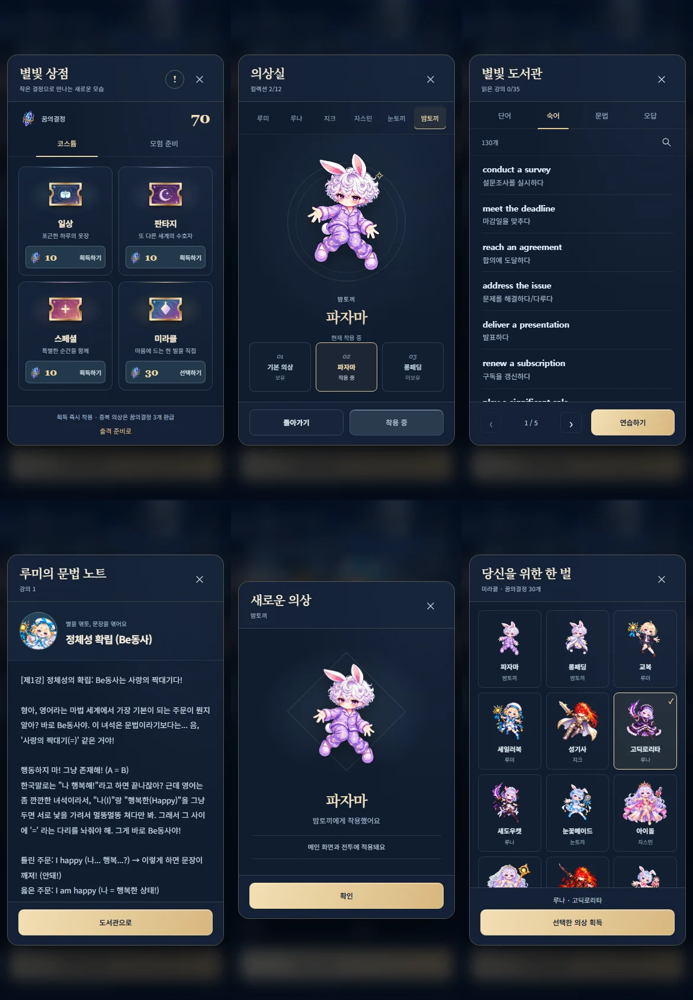

# 메뉴 UI 검토 기록

2026-09-30. 별빛 관측소의 짙은 남색·샴페인색 선·작은 세리프 제목을 공통 문법으로 정했다. 상점, 의상실, 도서관, 강의, 유물함, 획득 팝업은 같은 프레임·닫기 위치·버튼 크기를 사용한다. 목록만 스크롤하고 상단 닫기와 하단 행동은 고정한다. 세로 화면은 최대 440px 폭, 가로 화면은 두 영역 배치를 사용한다.

## 화면과 동작

- 상점: 코스튬 네 종류를 한 화면에 표시한다. 유물·랜덤 리셋권은 별도 `모험 준비` 탭으로 옮겼다. 우측 `!`에서 라인업을 확인한다.
- 코스튬: 일상·판타지·스페셜은 구매 즉시 획득·착용한다. 미라클은 선택 화면에서 의상을 고른 뒤 확정할 때 결제한다. 선택을 취소하면 재화를 사용하지 않는다. 과거 보유 티켓은 재화보다 먼저 사용한다.
- 획득 화면: 그림 영역과 이름·설명 영역을 분리했다. 중복 유물은 `꿈의결정 +N`만 표시한다. 중복 코스튬은 기존대로 3개를 환급한다.
- 의상실: 수호자 이름 탭, 큰 그림 하나, 의상 이름 선택지, 착용 버튼으로 구성한다. 미보유 의상도 미리 볼 수 있다. 타이틀 초상화를 눌러 진입하며 별도의 의상실 버튼 문구는 없다.
- 도서관: 단어 전체가 기본 목록에 있으므로 `전체 단어 보기`를 삭제했다. 검색은 돋보기로 펼치며 닫으면 필터를 해제한다. 숙어는 표현과 뜻만 표시한다. 검색도 표시된 표현·뜻을 기준으로 한다.
- 강의: 작은 루미 초상화와 강의 제목을 상단에 배치하고 본문만 스크롤한다.

## 검토한 자료와 적용 범위

- [Anthropic: Improving frontend design through Skills](https://claude.com/blog/improving-frontend-design-through-skills): 예시와 설명에서 강조한 맥락에 맞는 서체·색·일관된 시각 방향을 검토했다. 이 게임에는 관측소 테마와 기존 캐릭터 아트를 중심으로 적용했다.
- [공개 frontend-design 지침](https://github.com/anthropics/skills/blob/main/skills/frontend-design/SKILL.md): 명확한 디자인 방향과 의도적인 배치, 실제 결과를 보고 개선하는 접근을 참고했다.
- [커뮤니티 제작자와 사용자 후기](https://www.reddit.com/r/ClaudeAI/comments/1qj2lwg/i_figured_out_how_to_get_consistently_great_ui/): 스타일 일관성을 유지하는 접근과, 보기 좋은 정적 화면만으로 실제 사용성을 판단하기 어렵다는 의견을 함께 검토했다.

외부 디자인을 그대로 복사하지 않았으며 외부 폰트나 네트워크 의존성을 추가하지 않았다. 완성도는 모델 이름으로 판정하지 않고 실제 화면의 밀도, 클릭 흐름, 잘림·겹침과 오프라인 동작으로 검토했다.

## 검증 범위

`tests/costumes-flow.mjs`가 배포 HTML의 테스트 복사본을 오프라인으로 실행한다. 320×568, 390×844, 430×932, 844×390에서 프레임·닫기·하단 버튼 경계, 코스튬 상점의 무스크롤 표시, 이미지/글자 겹침을 검사한다. 작은 세로 화면은 숙어 4개 이상, 큰 세로 화면은 6개 이상이 완전히 보인다.

실제 구매·즉시 착용·중복 환급·미라클 취소와 확정·재실행 후 보존·저장 실패 시 복원·중복 클릭 방지·과거 티켓 사용도 검사한다. 기존 단어 381개 페이지 이동과 오답 삭제/초기화는 `patch-flow.mjs`, 기존 유물 및 출격 흐름은 관련 시나리오에서 계속 확인한다.

키보드 초점은 팝업 안에 머무르며, 공통 메뉴에서 Escape는 닫기 동작을 한다. 이 기록은 데스크톱 Chromium의 터치 에뮬레이션 검증이다. 실제 모바일 브라우저나 기기 성능 검증은 포함하지 않는다.
