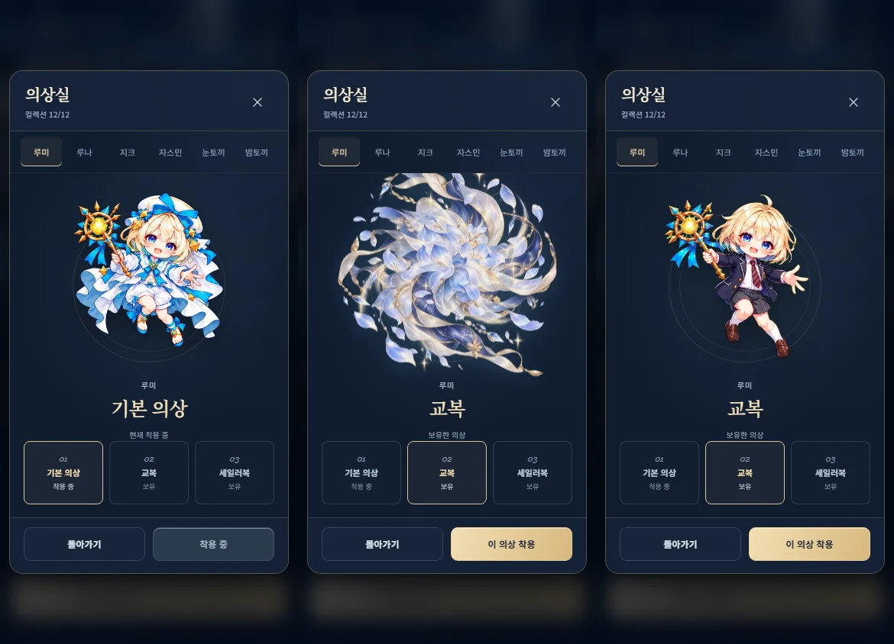
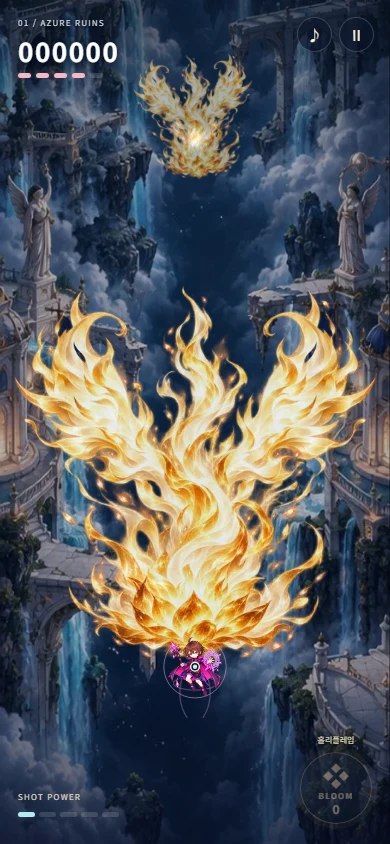

# 의상 전환·유물·심연 패치 검증 기록

기준: 최신 `origin/main`의 `1c5e3c8` (PR #557 포함). 기존 로컬 작업은 보존하고 별도 작업 트리에서 진행했다.

## 의상실

동일한 패널과 초상화 노드를 유지한다. 새로 만든 별빛 꽃잎·비단 빛 에셋이 1.6초 동안 모이고 흩어지는 사이, 시작 후 560ms에 초상화를 교체한다. 이 시점에 초상화의 opacity는 0이다. 화면 전체의 밝기·배경·메뉴 진입 애니메이션은 바꾸지 않는다. 같은 의상 재선택은 연출을 반복하지 않는다. 빠른 선택은 최신 요청을 반영하며 닫기·상점 이동은 대기 타이머와 애니메이션을 취소한다.



## 유물과 전투

- 수집 대상 48종: 기존 42종에 일반 2·레어 2·에픽 2를 추가했다. 전설 2종은 `meta.js`의 예약 데이터이며 저장 복원·장착·유물함·뽑기·챌린지 보상에서 제외한다.
- 황금동전은 점수 아이템의 점수만 두 배로 만든다. 물망초는 두 페어리의 기본 탄 피해를 15 → 30으로 만든다.
- 불사조의깃털은 공격력 −20%, 런 전체의 부활 기회 +1이다. 실패·거절도 기회를 쓰며 다음 구간에서 초기화하지 않는다. 챌린지 중 획득해도 남은 기회에 반영한다.
- 초신성은 봄 공격력 +60%, 실제 피격마다 봄 1 추가 소모다. 보호막으로 막은 피격은 소모하지 않으며 수호방패와 함께 쓰면 방패 소모에 추가된다.
- 성검은 피격 순간의 캐릭터와 적 중심 거리를 사용한다. 전장 대각선을 D, 거리를 d로 두고 `+50% × (1 − (d/D)²)`를 합산한다. 최근접 +50%, 화면 반대 끝 +0%, 대각선 절반 거리 +37.5%다.
- 홀리플레임은 기본 피해 5500, 지속·무적 2초이며 남은 봄 전부와 파워를 소모해 P1·누적 P0으로 돌아간다. 코로나보다 우선하며 모든 캐릭터의 회복·변신·강화·감속을 대체한다. 공격력·봄 공격력 유물의 통상 보너스는 적용한다.
- 회복 아이템은 기존 드랍 후보를 70% 확률로 허용한다. 네 난이도 전체에 적용하고 다른 종류의 아이템 및 아이템 외 회복은 유지한다.
- 기사회생의 원본 crop 하단에 다음 행 유물이 섞이는 문제를 확인했다. 두 번째 셀의 높이를 원본의 45.5%로 제한하고 종횡비를 유지해 출력했다.



## 심연과 문서

요청한 패턴 값은 각 보스의 심연 분기에 직접 적용한다. 하모니어스의 주기 지정은 비어 있어 기존 심연의 1.15 / 1.00 / 0.85초를 유지한다. 포세이돈·벨제뷔트, 예고 시간 및 시간의지배자의 정지·재가동 시점은 유지한다. 상세 수치는 [매뉴얼](MANUAL.md)의 심연 전용 보스 패턴 표에 있다.

매뉴얼·측정 데이터·생성기는 `docs/`에서 관리하며 게임 번들에는 포함하지 않는다. 이전 파일이 이동돼도 검증 선택기가 삭제된 경로를 실행하지 않도록 현재 경로 필터를 보완했다. 이 선택기 변경 자체는 mock 계획·fixture 테스트로 검증한다.

## 검증 근거

- `tests/relics-patch.test.mjs`: 유물 획득·저장·비공개 데이터, 점수·페어리·부활·피격·거리 계산, 9명 전원의 홀리플레임, 전 난이도 회복 드랍, 매뉴얼 분리.
- 쉬움·보통·어려움의 12보스 × 3페이즈 × 3난이도: 수정 전 main에서 채집한 탄막·위험 구역·예고·아스테아 스케줄 해시와 일치.
- `tests/abyss.test.mjs`: 요청 패턴·개별 주기·예고 보존. 대표 심연 구간 20초에서 최대 233 / 360발.
- `tests/relics-wardrobe-flow.mjs`: 320×568, 390×844, 430×932, 844×390에서 교체 시 초상화 opacity 0, 연출 1600ms, 최신 재선택·중간 닫기, 전용 화염 렌더링, 페이지 오류·외부 요청 0.
- 기존 의상·메뉴·유물·21구간 챌린지 회귀 검증과 루트 `npm run verify`를 최종 게이트로 사용한다. 브라우저 검증은 Chromium의 터치 에뮬레이션이며 실제 Android/iOS 기기 테스트는 포함하지 않는다.

## 새 에셋과 생성 프롬프트

기본 제공 `image_gen` 도구로 생성했다. 기존 금속·보석 유물의 일본풍 판타지 RPG 일러스트와 직접 비교하고 투명 배경을 보존했다. 기존 필살기 이미지는 홀리플레임에 사용하지 않는다.

| 원본 | 출력 | 용도 |
| --- | --- | --- |
| `assets/astral-relics.png` | `generated-assets/astral-relics/0..5.webp` | 신규 수집 유물 6종 |
| `assets/holy-flame.png` | `generated-assets/holy-flame/0.webp` | 홀리플레임 전용 화염·빛 |
| `assets/wardrobe-veil.png` | `generated-assets/wardrobe-veil/0.webp` | 의상 전환 꽃잎·비단 빛 |

각 생성의 최종 프롬프트는 다음과 같다. 모두 `transparent_background: true`로 요청했다.

**신규 유물 아틀라스**

```text
Use case: stylized-concept. Asset type: ONE production sprite atlas for a polished Korean mobile fantasy bullet-hell game, Astral Bloom. Create a single transparent PNG sprite sheet with SIX relic illustrations in an EXACT uniform 3-column by 2-row grid, square cells, each object centered with 12% empty margin on all sides and absolutely no cross-cell artwork, no text, no frames, no badges, no UI. Read top row left to right then bottom row. Top left: an ornate golden coin embossed with an eight-point star, warm polished gold. Top center: a delicate blue forget-me-not flower cluster with small gold-accent stems and sapphire centers. Top right: ONE luxurious phoenix feather, ivory-gold vane glowing ember red near its lower tip, graceful natural curved shape. Bottom left: a vivid supernova, exploding star core in ruby gold crystalline filigree, curled orange energy trails confined to its cell. Bottom center: holy sword, elegant slim silver-white blade pointed diagonally down left, ornate gold wing-shaped guard, sky-blue gemstone, no darkness. Bottom right: a holy flame relic, beautiful sculpted white-gold flame suspended above a tiny golden brazier, bright amber interior and faint rose tips. Shared art style: high quality hand-painted Japanese fantasy RPG item illustrations; crisp elegant outlines, polished dimensional metals, faceted sparkling gemstones, ornamental gold details, restrained luminous highlights, rich tasteful colors. Consistent drawing style and scale across all six. No photorealism, no flat vector icons, no emoji or primitive shapes, no background, no lettering, no watermark. This atlas must be usable as six clean independently cropped square sprites.
```

**홀리플레임 전용 효과**

```text
Use case: stylized-concept. Asset type: ONE new dedicated holy fire and light VFX texture for the Holy Flame ultimate in a polished fantasy mobile shooting game. A square transparent RGBA game sprite, isolated with no background. A spectacular white-gold holy conflagration rising upward from a small blazing amber lotus at the bottom center: layered graceful flame tongues, carved luminous feather-like edges, champagne and ivory light interwoven with rich warm golden fire, a few tiny rose-gold embers. The silhouette is a tall flowering flame column that expands into a magnificent pair of curved flame wings near its crown; abstract fire and light ONLY, no bird, no person, no weapon, no magical circle, no glyphs, no existing character or ultimate portrait. Hand-painted Japanese fantasy RPG rendering, crisp controlled edges with soft light bloom at the margins, detailed translucent flame curls, high color depth, tasteful high-end game effect art. Keep the core gold and warm amber with ivory highlights rather than a giant solid white patch. The flame body fills 78% of width and 88% height with clean transparent margin. No text, UI, borders, watermark or opaque rectangle. Genuine transparent background is essential for blending over an active game battlefield. This is an original effect, unrelated to any phoenix or existing ultimate asset.
```

**의상 전환 효과**

```text
Use case: stylized-concept. Asset type: ONE original wardrobe transformation VFX sprite for Astral Bloom, a polished anime fantasy mobile game. Square transparent RGBA image, isolated. A luxurious swirl of flowing pale sapphire and champagne satin-light ribbons, crystalline soft blue flower petals and a few delicate four-point starlights, gathering into a dense layered veil in the central 55% of the image, then fanning outward in graceful organic arcs. Think a magical costume transformation: blue-white silken folds pass across a small character, petals drift and separate. The CENTER MUST contain richly painted overlapping pale blue opaque petals and ribbon folds, so the character behind the center can be gently concealed; no empty donut or empty ring. Painterly luminous Japanese fantasy RPG effect art, dimensional petals, elegant warm-gold details, cool navy-blue shadows in ribbon folds, restrained bright highlights. No flames, no character, no face, no costume, no scenery. No geometric circle, sphere, plain gradient blob, rectangle, neon orb, magic runes or full-white flash. Clean alpha transparency around the outer silhouette, feathered petals at edges, all artwork fits inside with 8% margin. The sprite will slowly gather and dissipate over 1.6 seconds in a small local portrait area, never flash across the screen. No text, border, watermark, opaque background.
```
