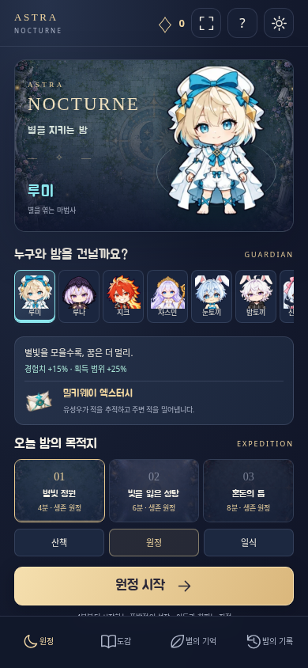

# ASTRA: NOCTURNE — 별을 지키는 밤

Card·Shooter·Defense의 수호자들이 함께하는 모바일 생존 액션입니다. 화면을 드래그해 군세를 피하고, 자동 공격으로 별을 모으고, 성장과 진화의 조합으로 마지막 보스를 쓰러뜨립니다.

**실행 파일:** [`dist/AstraNocturne.html`](dist/AstraNocturne.html). 그림 31개, 한국어 글꼴, 음악과 코드가 모두 들어 있는 약 6.5 MiB의 단일 HTML입니다. 실행 중 외부 요청이나 서버 API를 사용하지 않습니다.



## 플레이

- 모바일: 전장을 드래그해 이동합니다. 이동을 유지한 채 다른 손가락으로 회피·필살기 버튼을 사용할 수 있습니다. 고정 조이스틱도 전용 설정 타일에서 선택할 수 있습니다. 전체화면 버튼은 로비와 전투 화면에 있습니다.
- 데스크톱: WASD / 방향키로 이동, Shift로 회피, Space로 필살기, Escape로 일시정지, F로 전체화면을 전환합니다. 마우스 드래그도 지원합니다.
- 자동 공격은 가장 가까운 적 또는 무기별 우선 목표를 노립니다. 경험치 별을 모으면 전투가 멈추고 세 성장 선택지를 보여줍니다.
- 무기 최대 6개, 유물 최대 4개. 무기 5단계 + 대응 유물 1단계면 레벨 선택이나 상자에서 진화합니다. 로비와 전투 중 조합 지도에서 진화 효과·현재 장비·진행도를 보고 목표를 추적할 수 있습니다.
- 공격 예고의 붉은 원과 돌진선을 피하세요. 회피 중에는 짧은 무적이 있습니다. 필살기는 적 처치와 시간 경과로 충전됩니다.
- 지도에 표시된 제단은 원정당 한 번 사용할 수 있습니다. 가까이 다가가면 `별빛 나누기` 버튼이 나타납니다.
- 제한 시간이 지나면 최종 보스가 등장합니다. **시간만 채워서는 승리하지 않습니다.** 마지막 보스 처치가 필요합니다.

## 구성

| 구성 | 내용 |
| --- | --- |
| 수호자 9명 | 루미, 루나, 지크, 자스민, 눈토끼, 밤토끼, 신데렐라, 은토끼, 시간의지배자 |
| 무기 14종 | 유도 별, 관통 단검, 화염 검격, 꽃빛 연쇄, 얼음창, 꿈 장판, 유리창, 태양 광선, 시계장, 바람 궤도, 번개, 장미, 중력장, 저격 |
| 성장 | 무기별 6단계와 5단계부터 가능한 진화, 유물 10종 각 3단계, 다시 펼치기 3회, 별 접어두기 2회 |
| 지역 3개 | 별빛 정원 4분, 빛을 잃은 성당 6분, 혼돈의 틈 8분 |
| 전투 | 돌진·원거리·중장갑·사후 폭발 적, 엘리트, 군세 이벤트, 4가지 무기 공명, 30연속 처치 폭주, 지역별 보스 패턴과 체력 구간 강화 |
| 난이도 | 산책 / 원정 / 일식. 적 체력·피해·밀도와 보상이 달라집니다. |
| 원정 이후 | 꿈의결정, 영구 성장 6종, 업적 9개, 최근 원정 20개, 지역별 최고 기록 |
| 편의 | 자동 저장·이어가기, 창 전환 시 일시정지, 기록 내보내기·가져오기, 음량·효과·피해 숫자 설정 |

9명 모두 4방향 보행 시트를 사용합니다. 무기·유물·상자·투사체·적·보스·지역 바닥은 일러스트 아틀라스를 사용하며, 자동/선명하게/가볍게 설정은 전투 수치에 영향을 주지 않습니다.

30회 연속 처치하면 8초간 공격속도와 획득 범위가 증가하고 바닥 보상을 끌어옵니다. 폭주 시작 뒤 18초의 재충전 간격이 있습니다. 두 무기 각각 2단계로 발동하는 네 공명은 조합 지도에서 확인하세요.

눈토끼·밤토끼·은토끼 무기를 두 종류 이상 장비하면 토끼 무기의 공격속도가 증가합니다. 루나는 처형, 지크는 화상, 자스민은 회복, 시간의지배자는 시간 제어에 강점이 있습니다. 기술의 이름과 주요 성질은 기존 게임에서 가져오고, 수치와 효과는 실시간 생존 전투에 맞게 조정했습니다.

## 실행과 개발

데스크톱에서는 HTML을 내려받아 브라우저로 직접 열 수 있습니다. 모바일에서는 HTML을 실행하는 브라우저에서 열거나, 정적 웹 서버에 같은 파일을 올리세요. 운영체제의 파일 미리보기 앱은 브라우저와 동작이 다를 수 있습니다.

저장 위치는 실행한 브라우저와 주소에 묶입니다. 기기나 파일 경로를 바꿀 때는 설정의 기록 내보내기를 사용하세요. 내보내기는 영구 성장·업적·지난 원정 기록을 보관하며, 진행 중인 원정 자체는 해당 브라우저에서 이어갑니다. 저장 공간을 사용할 수 없으면 현재 탭의 메모리로 이어가며 실제로 감지된 저장 문제를 안내합니다. 손상된 기존 프로필은 자동으로 덮어쓰지 않습니다.

저장소 루트에서:

```sh
npm ci
npm run build:survivor
npm run test:survivor
npx playwright install --with-deps chromium webkit
npm run test:survivor:browser
npm run verify
```

로컬 미리보기:

```sh
npm run serve --prefix survivor
# http://localhost:4190
```

이미지 준비는 `node survivor/scripts/prepare-assets.mjs`로 수행합니다. 공유 원본이 변경되면 해시 검증이 실패하므로 방향도·발 위치·캐릭터 설정을 검토하고 `assets/cast.json`을 갱신한 뒤 다시 준비하세요. 자스민 원본을 패킹하려면 `node survivor/scripts/pack-jasmine.mjs`를 사용합니다. 한국어 문구에 새 글자가 들어가면 빌드가 누락 글리프를 알려줍니다. 이때만 `fontTools`가 설치된 Python에서 `python3 survivor/scripts/prepare-font.py`를 실행하면 됩니다. 일반 빌드와 CI는 Python 없이 커밋된 글꼴 캐시를 사용합니다.

재현 가능한 자동 플레이:

```sh
node survivor/scripts/simulate.mjs garden 2026
node survivor/scripts/simulate.mjs cathedral 2026
node survivor/scripts/simulate.mjs rift 2026
```

자동 조작은 이동·성장 선택·회피·필살기 입력만 사용하며 체력이나 게임 시간을 바꾸지 않습니다. 모든 조합의 난이도를 보증하는 밸런스 평가와는 별개로, 전체 원정과 마지막 보스에 도달하는 회귀 검증에 사용합니다.

## 구현과 검증 근거

- [`docs/RENEWAL-RESEARCH.md`](docs/RENEWAL-RESEARCH.md): 구현 전에 살펴본 게임·데모 15개, 뱀서의 성장 구조와 그래픽 최적화 근거.
- [`docs/RENEWAL-BALANCE.json`](docs/RENEWAL-BALANCE.json): 9명 × 3개 시드의 실제 전투 자동 조작 결과.

- [`docs/ART.md`](docs/ART.md): 캐릭터 외형·성별·손의 방향, 기존 설명과 기술의 대응, 이미지 출처, 새 자스민 방향도의 제작 근거.
- [`docs/VALIDATION.md`](docs/VALIDATION.md): 실제 단일 HTML의 브라우저 검증, 별도의 드문 상태 테스트, 자동 플레이 결과와 아직 확인하지 않은 실제 기기 조건.
- `src/engine.js`: 고정 시간 간격의 전투, 공간 분할 충돌, 이동 선분 판정, 적·발사체·장판·경험치 수 제한.
- `src/profile.js`: 게임 전용 저장 키, 입력 검증, 보상 중복 방지, 저장 실패 시 세션 유지.
- `src/render.js`: 중립 방향도와 작은 상하 움직임, 발사체·마법 문양·보스 공격 예고. 실행 중 픽셀 가공이나 외부 이미지 생성은 없습니다.

이미지 원본은 기존 저장소 자료와 이 작업에서 생성한 자스민 방향도입니다. 글꼴은 Jua를 `Jua Nocturne Subset`으로 이름 변경한 부분 집합이며 SIL OFL 1.1 라이선스를 단일 HTML에도 포함합니다. 음악은 Web Audio로 연주하는 이 게임용 절차적 선율입니다.
