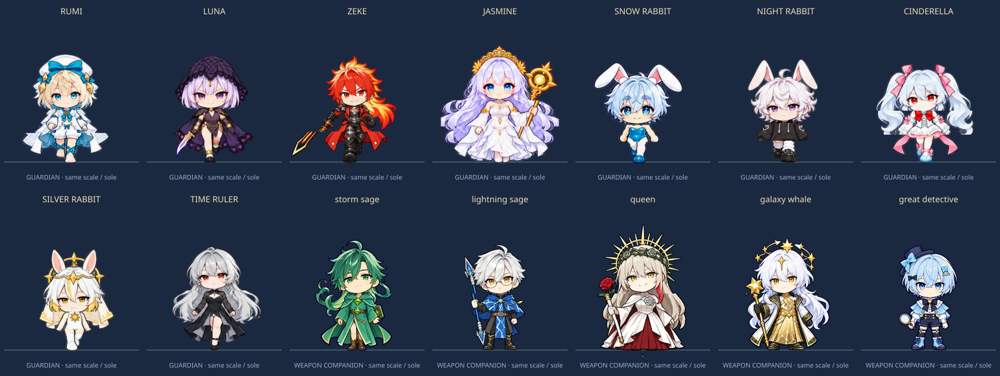
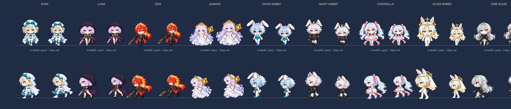

# 공유 수호자와 이미지 근거

검토한 활성 원본은 `defense/merge/content.js`, `shooter/content.js`, `card/game/data.js`입니다. Defense의 방향도와 `CONFLUENCE_ART_PLAYBOOK.md`, `FOUR_DIRECTION_PROMPTS.json`, `HEAD_PROFILE.json`, `ART_ASSETS.md`의 발 위치·투명도·신체 비율 기준을 따릅니다. `defense_legacy/`나 `card_legacy/`를 활성 원본으로 사용하지 않습니다.

## 캐릭터 대응

| 수호자 | 유지한 외형과 구분 | 기술·특성의 근거와 생존 게임 적용 |
| --- | --- | --- |
| 루미 | 남성, 금발 단발·청록 눈, 흰 모자·긴 망토, 맨발과 청록 종아리 리본. 지팡이를 추가하지 않음. | Shooter의 `별의 편지` 유도 공격, Card의 `밀키웨이엑스터시`, 별과 꿈의 마법을 유성우·경험치 특성으로 적용. |
| 루나 | 여성, 은보라 단발·보라 눈, 검은 레이스 후드·망토, 오른손 단검. | Shooter의 `루나틱 위치`·`이클립스`, Defense의 낮은 체력 대상 처형을 관통·치명타·연속 참격으로 적용. |
| 지크 | 남성, 금빛 끝의 붉은 머리·붉은 눈, 붉은 롱코트와 검은 갑옷, 오른손의 호박색 중심 검. | Shooter의 `프로미넌스`·`샤이닝플레임`, Defense의 부채꼴·화상을 근접 검격과 화력 증가로 적용. |
| 자스민 | 여성, 긴 연보라 머리·파란 눈, 금빛 태양 왕관, 긴 흰 드레스·늘어진 소매, 왼손 태양 지팡이. | Shooter의 꽃·원소 역할과 `홀리 플라워`, Card·Shooter의 `더홀리`·성역·여신강림을 연쇄·회복·성역으로 적용. |
| 눈토끼 | 남성, 하늘색 단발·파란 눈, 흰 토끼 귀, 청록 바니 의상과 흰 레그웨어. 지팡이 없음. | Card의 `실버스톰`, Shooter의 `프로즌 월드`, Defense의 감속·토끼 공명을 얼음창·빙결로 적용. Shooter ID `snow`를 공유 ID `snow_rabbit`에 대응. |
| 밤토끼 | 남성, 흰 곱슬 단발·보라 눈, 검은 오버사이즈 후드, 흰 레그워머, 하트 버클 검은 신발. | Shooter의 `슬립리스 나이트`·`굿나잇 허그`, Defense·Card의 토끼 연계를 꿈의 장판과 무기 공명으로 적용. Shooter ID `night`를 `night_rabbit`에 대응. |
| 신데렐라 | 남성, 평평한 가슴, 흰 트윈테일·붉은 눈, 분홍 머리 리본과 흰·분홍 드레스. 앞면의 붉은 목 리본을 뒤에 만들지 않음. | Shooter의 `크리스탈 킥`·`미드나잇 미라클`, Defense의 경제 역할을 유리 관통·여섯 갈래 필살기·결정 보너스로 적용. |
| 은토끼 | 남성, 은백색 머리와 금빛 하단, 금빛 눈, 태양 후광·베일·하이넥·금빛 메달. | Card의 `헤븐리루어`, Defense의 관통광·충전·`은빛 행진`을 광선·필살기 충전·속도 증가로 적용. |
| 시간의지배자 | 은빛 긴 머리·붉은 눈·검은 드레스·시계 장식. Shooter의 분홍 계열 `시간의마술사`와 별도 인물로 유지. | Defense의 시간장·되감기, Card의 어둠과 시간 제어 이미지를 감속 장판·적 정지·최근 피해 회복으로 적용. `타임 리와인드`는 이 생존 게임의 각색 기술명. |

추가 무기 주인인 폭풍의현자·번개의현자·여왕·은하고래·명탐정은 Defense 원본의 방향도를 도감에 표시합니다. 바람길·연쇄 번개·장미·중력·보스 우선 추리 역할을 가져왔습니다. 플레이 가능한 수호자는 위의 9명이며 추가 5명은 동행 무기의 출처입니다.

## 기존 이미지 재사용

- 수호자 8명과 추가 무기 주인 5명: `defense/assets/merge/units/*.webp`의 기존 중립 4방향도. 앞·뒤·왼쪽·오른쪽 순서와 512 셀의 `(256,480)` 발 기준을 그대로 사용합니다.
- 지역·적·보스는 이번 리뉴얼에서 새 전용 그림으로 교체했습니다. 이전 Shooter 그림은 배포 파일에서 제외했습니다.
- Jua: `card/assets/Jua-Regular.ttf`. 사용 글자 부분 집합과 새 글꼴명을 적용하고 원본 라이선스를 유지합니다.

공유 원본 파일은 변경하지 않았습니다. 모바일 캐시는 계측한 768px 중립 방향도, 832px 보행 시트와 1024px 지역 그림을 만들어 `assets/prepared/`에 보관합니다. 원본·캐시 SHA-256, 준비 도구 해시와 용량은 `prepared-manifest.json`에 기록하고 빌드에서 대조합니다. 흰 의상과 머리카락은 불투명도를 유지하며, 빈 영역에는 원래의 알파를 사용합니다.

## 후속 패치의 신체 기준과 검토

`assets/body-profile.json` v2에 정수리·턱·몸 루트·골반·발의 추정값과 기본/보행 원본 해시를 보관합니다. `prepared-manifest.json`에는 프레임별 배율·루트·반전 원본·이웃 조각 제거량을 기록합니다. 머리 목표는 512px 기준 144px, 턱 아래는 토끼 세 명 140px, 루미·신데렐라 196px, 루나 204px, 지크·자스민·시간의지배자 212px입니다. 이는 이 게임의 아트 지시이며 업계 합격선이 아닙니다. 귀·왕관·머리카락·무기를 포함한 alpha bbox로 신체 배율이나 중심을 정하지 않습니다.

머리/몸통/다리의 세 영역에 다른 세로 배율을 적용합니다. 각 방향의 기준점을 별도로 검토하고 네 위상에 같은 배율을 유지하며, 발 픽셀은 접지 이동만 보정합니다. 이전의 자동 목 alpha run과 발 높이에 따라 턱을 이동하는 방법은 폐기했습니다. 밤토끼의 불균등 열은 위상별 몸 루트로 처리합니다. 시간의지배자는 측면의 잘못된 턱/중심 분리를 고쳐 얼굴이 잘린 듯한 경계를 줄였습니다. 가려진 두개골·골반·발은 수동 추정이므로 의미상 정확도를 픽셀 검사만으로 보증하지 않습니다.

루미·눈토끼·밤토끼·신데렐라·은토끼·시간의지배자는 왼쪽 네 위상을 정확히 반전해 오른쪽 보행을 만듭니다. 발축 `(104,195)`를 유지하도록 래스터 반전 후 1px 보정합니다. 루나 오른손 단검·지크 오른손 검·자스민 왼손 지팡이는 별도 좌우를 유지합니다. 로비·일시정지·결과의 384px 전신 캐시는 전투와 같은 앞 통과 포즈를 같은 신체 기준으로 처리합니다. 추가 무기 주인 5명도 Defense의 `packedSkull`과 수동 몸 기준으로 Survivor 캐시에서만 정규화했습니다.

`node survivor/scripts/review-art.mjs`는 원본 기준선·정규화 전신·보행 4프레임을 비교하는 독립 HTML을 만듭니다. 네 방향, 64/96/100/150px 게임 셀 크기, 남색/회색/자홍색 바닥과 재생을 선택할 수 있습니다. 배포 게임에는 이 검토기나 계측 UI를 포함하지 않습니다.

[144칸 어두운 바닥](ordeal/walking-dark.png) · [밝은 바닥](ordeal/walking-light.png) · [64px 왼쪽](ordeal/cast-64-dark-left.png) · [96px 오른쪽](ordeal/cast-96-light-right.png) · [겹침 검사](ordeal/onion-96.png). `node survivor/scripts/review-art.mjs <출력 디렉터리> 614e099`로 비교본과 독립 HTML을 다시 만들 수 있습니다. [보관된 검토기](ordeal/index.html)는 내려받아 브라우저로 여세요.

고정 단신/성인 마네킹을 제작하고 정체성·마네킹·루미 화풍 참조를 분리해 자스민·은토끼·시간의지배자 보행을 세 번 생성했습니다. 내부 체형과 좌우 안정성이 충분하지 않아 **세 후보 모두 거부**하고 기존 그림의 기준점 보정을 채택했습니다. 후보 원본은 `assets/ordeal/trials/`, 원본·후보 해시는 [candidate-hashes.json](ordeal/candidate-hashes.json), 실패와 재시도는 [trials.txt](ordeal/trials.txt)에 보존합니다. MediaPipe/OpenPose/ControlNet을 실제 실행하거나 SD 얼굴을 정확히 고정했다고 주장하지 않습니다.

## 이번 메뉴와 보스 원화

`assets/ordeal/sources/menu.png`는 4×2의 실제 일러스트로 원정·도감·별의 기억·밤의 기록과 재개·저장·설정·마치기를 표현합니다. 출력 식별자는 `exec-22ab9e69-3c06-4853-9f4c-7dd5d5521c2c.png`입니다. 기존 무기/유물의 아이보리·남색·금속 채색을 참고했습니다. 유틸리티 화살표·전체화면 등은 작은 SVG를 유지합니다.

`assets/ordeal/sources/bosses.png`는 기존 보스 원화의 화풍을 참고한 2×3 시트입니다. 출력 식별자는 `exec-84fe1c5b-cc18-4603-8a01-0423ee35988e.png`입니다. 백골 장미사슴은 가시 울타리와 돌진, 열두 번째 종은 교차 시침과 안전 고리, 새벽을 삼키는 고래는 어둠의 통로와 추적 장판에 대응합니다. 각 보스는 정상/발동 **두 포즈**이며 기존 장미/심판관/군주의 네 포즈와 구분합니다. native alpha를 유지하고 흰색 키 제거를 사용하지 않습니다. 새로운 그림은 공유 원화의 공식 승인으로 분류하지 않습니다.

실제 전투 검토: [장미사슴](ordeal/ordeal-thorn.png) · [열두 번째 종](ordeal/ordeal-clock.png) · [밤고래](ordeal/ordeal-eclipse.png). 배포 HTML을 실제로 부팅한 재현 fixture이며 자연 플레이 사진과 구별합니다.

## 이전 온실 아트의 출처

이번 새 생성 원본은 `assets/reverie/sources/lobby.png`와 `secrets.png`입니다. 달빛 온실의 제목 여백·캐릭터 위치, 네 히든 유물과 네 이벤트 소품을 별도 그림으로 만들었습니다. 생성 출력 식별자는 `exec-0a0f3d88-5f60-4897-973b-4806695f66bb.png`, `exec-9d63e76c-c4b0-4231-b5a6-f807d00087e3.png`입니다. 기본 이미지 도구로 생성했고 공유 승인 아트로 분류하지 않습니다. 무기·유물·캐릭터의 이웃 조각 정리는 RGB 흰색을 보존하는 연결 성분 처리로 수행합니다.

## 새 자스민 방향도

Defense의 재사용 목록에 자스민 4방향도가 없어 새로 생성했습니다. 스타일 기준은 Defense 루미 방향도, 인물 기준은 Shooter `generated-assets/heroes/3.webp`입니다. **기존 Defense 승인 그림으로 분류하지 않습니다.** 현재 상태는 구현 작성자의 시각 검토를 거친 새 그림입니다.

생성 지침에는 두 기준 그림의 둥근 치비 얼굴·채색·선 두께, 자스민의 성별·연보라 장발·파란 눈·태양 왕관·흰 긴 드레스·왼손 지팡이, 동일 비율의 중립 앞/뒤/왼쪽/오른쪽, 투명 배경을 포함했습니다. 공격 포즈나 임의의 변형을 이동 애니메이션으로 사용하지 않습니다.

| 보관 항목 | 값 |
| --- | --- |
| 원본 | `assets/source/jasmine-generated.png`, 1254 × 1254 |
| 생성 출력 식별자 | `exec-c3abb866-ef20-4464-a769-1e8c1c8ac254.png` |
| 원본 SHA-256 | `42dfe0dde53be302aa6ab09aa629efb799149de86a2893b978ad0c87bc72aef8` |
| 사분면별 발 좌표 | `(328,610)`, `(985,610)`, `(323,1210)`, `(940,1210)` |
| 공통 배율 | `0.66`, 4방향 모두 동일 |
| 결과 | `assets/jasmine.webp`, 1024 × 1024, 셀 512, 발 기준 `(256,480)` |

발 좌표는 수작업 추정이며 기존 Defense의 해부학적 두개골 계측과 동일한 수준의 측정 증거로 주장하지 않습니다. 원본·좌표·배율·검토 상태를 `cast.json`에 남겼고 `scripts/pack-jasmine.mjs`로 다시 패킹할 수 있습니다. 새로운 그림을 교체한다면 머리 크기·얼굴·의상·왼손 지팡이·4방향 발 위치를 다시 검토해야 합니다.

## 리뉴얼의 전용 에셋과 보행

`assets/renewal/sources.json`은 17개 생성 원본의 종류, 참조 이미지, 검수 내용, 패킹 크기와 셀 선택을 기록합니다. 원본 PNG는 `assets/renewal/sources/`에 보관하고, 원본·참조·준비 도구·결과 WebP의 SHA-256은 `prepared-manifest.json`을 통해 빌드에서 대조합니다. 이는 구현 작성자의 검수이며 기존 공유 아트의 공식 승인으로 표시하지 않습니다.

| 시트 | 내용과 준비 규격 |
| --- | --- |
| 보행 9장 | 수호자별 4방향 × 4단계, 208px 셀. 계측한 머리·몸 높이와 목 루트·발 기준으로 정규화. 발 기준 `(104,195)`, 화면 배율 1.3으로 여백 증가를 보정. 시뮬레이션 이동 거리 16마다 다음 프레임, 정지하면 passing 포즈. |
| 무기 1장 | 14종 무기·진화 프리즘·경험치 별. 160px 셀. 메뉴·선택·장비창에서 같은 그림을 사용. |
| 유물·소품 1장 | 유물 10종, 닫힌/열린 상자, 회복약, 자석 나침반, 금화 주머니, 제단. |
| 적 1장 | 망령·딱정벌레·나방·사냥개·불씨 정령·정예 기사, 각 4단계. 128px 셀, 종별 고정 배율. |
| 보스 1장 | 장미 파수꾼·성당 심판관·밤의 군주, 각 4단계. 224px 셀. |
| 효과 1장 | 무기별 투사체·폭발·광선 14종, 피격 섬광과 적 탄. 긴 탄두가 잘리지 않게 행마다 다른 영역을 추출. |
| 지역 3장 | 정원·성당·혼돈의 틈의 위에서 본 열린 바닥. 외곽 장식과 낮은 대비의 중앙 공간. |

보행 생성 지침은 참조 인물의 성별·의상·손 방향·머리 비율 유지, 방향별 앞발/통과/뒷발/통과, 팔과 옷자락의 작은 후행, 같은 발 기준, 투명한 칸 사이 여백을 요구했습니다. 전체 시트를 실제 표시 크기로 펼쳐 검토했습니다. 루미와 밤토끼의 왼쪽 행 마지막 칸은 오른쪽을 향해 제외했고, 루나 앞 행 마지막 칸은 단검 손이 바뀌어 제외했습니다. 이 세 칸은 해당 방향의 통과 포즈로 대체하므로 144칸 모두를 서로 다른 검증된 그림이라고 주장하지 않습니다. 눈토끼의 다음 행 귀 끝, 소품의 다음 행 꼭지와 적의 옆 칸 망토가 섞이지 않도록 추출 경계를 별도로 기록했습니다.

걷기를 캐릭터 전체의 상하 흔들기로 대체하지 않습니다. 도감 초상은 기존 공유 중립 시트이며, 전투의 정지와 걷기는 새 시트의 동일 인물을 사용합니다. 이동 애니메이션을 끄는 설정도 제공합니다. 불투명한 흰 머리·의상을 밝기 기준으로 지우지 않으며 런타임 픽셀 처리는 없습니다. 생성 원본에 투명 픽셀의 RGB가 남을 수 있어 실제 알파 합성도 색상 바닥 위에서 확인했습니다.

일러스트 장판 위의 원형 문양·위험 예고는 판정 안내입니다. 이번 그림 메뉴와 작은 유틸리티 SVG를 함께 사용합니다. 전투마다 큰 그림자를 필터로 계산하지 않고 광원·문양·배경·피해 숫자를 캐시합니다. 보스 그림과 플레이어가 발 기준으로 겹칠 때는 보간한 y 좌표로 정렬하며, 선·고리·장판의 실제 판정과 경고를 같은 기하로 처리하고 적 예고는 아군 효과 뒤에 숨기지 않습니다.

아트 계약 테스트는 중립 시트의 14명, 보행 9명의 각 방향과 서로 다른 프레임, 빈 여백·발 기준·원본 해시, 필수 전투 셀과 디코딩 메모리 예산을 확인합니다. 표정·해부학·정체성의 의미는 수치 검사만으로 보증하지 않습니다.

아래 마지막 이미지는 이전 160px 패킹의 보관본입니다. 현재 계측 결과는 위의 새 비교본과 검토기를 사용하세요.

