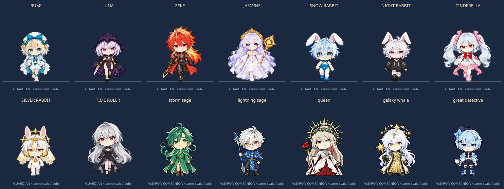
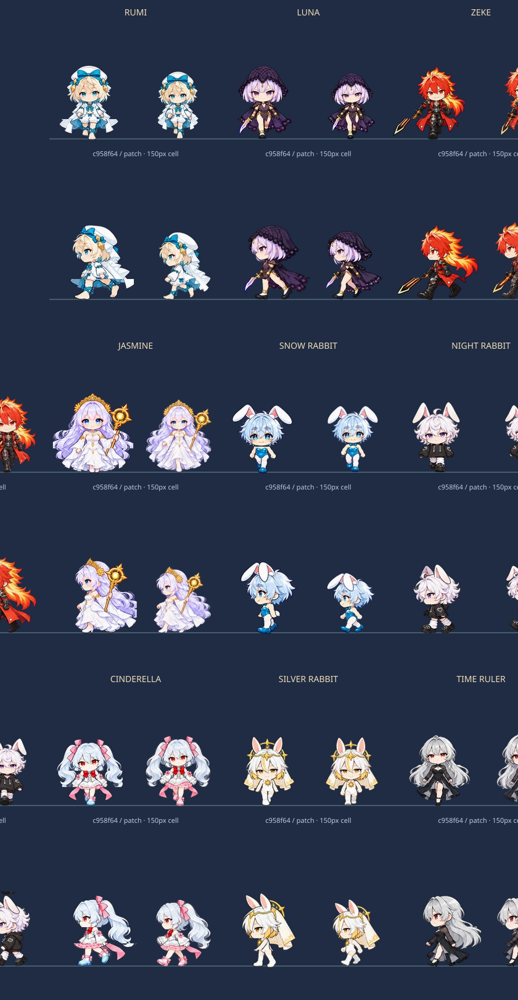
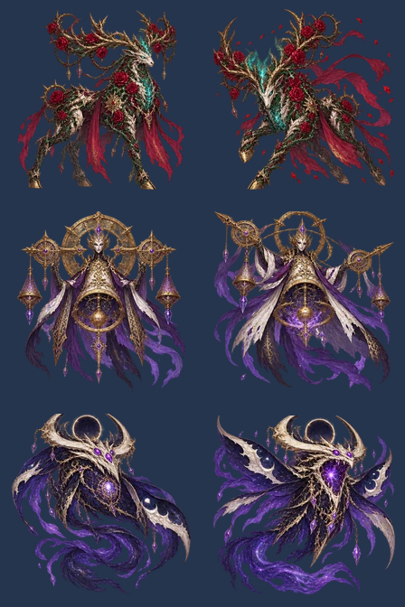
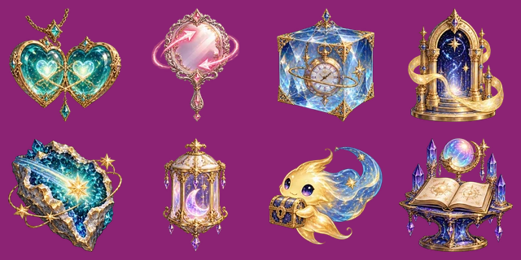
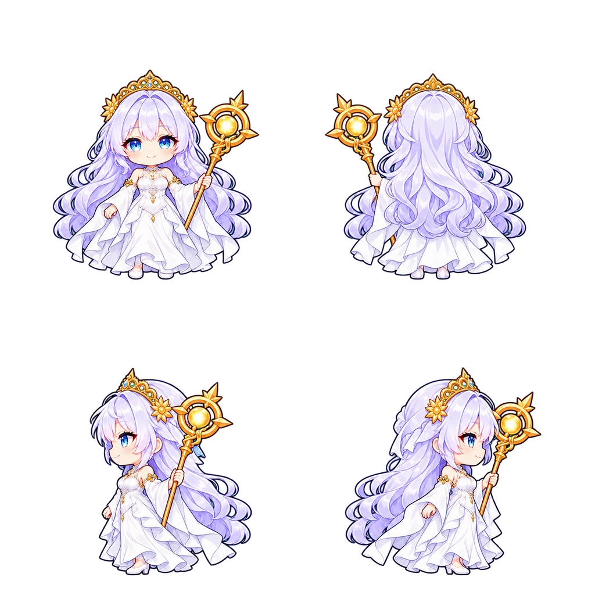
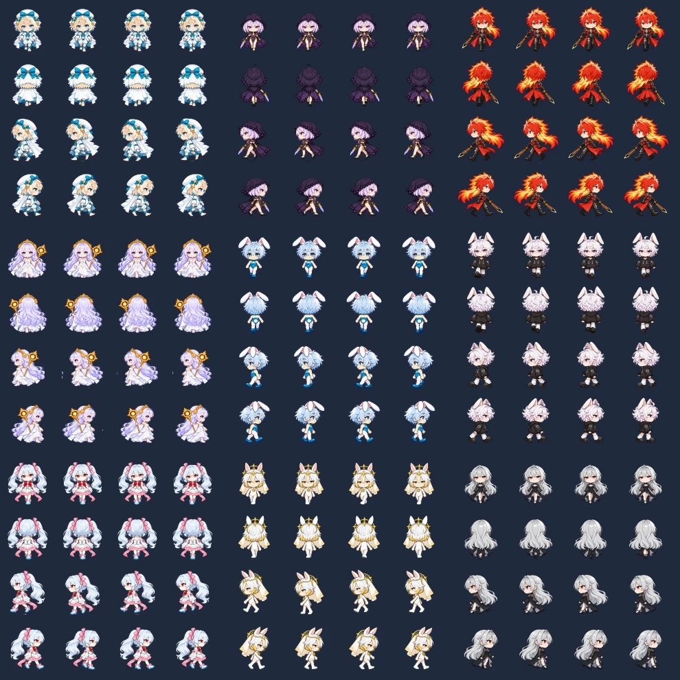

# 공유 수호자와 이미지 근거

현재 Nightfall 후속 변경의 지크/루나는 최신 Nocturne 보행 그림을 직접 수정했습니다. 지크는 양손 대검 가드, 루나는 단검 가드이며 두 인물의 온전한 측면 주기를 반전해 좌우 단계가 대응합니다. [현재 작업 규칙·비교 자료·반전과 수동 계측의 한계](nightfall/README.md)를 먼저 확인하세요. 아래 기존 제작 기록의 독립 측면 지크/루나 설명은 후속 변경 이전의 상태입니다.

검토한 활성 원본은 `defense/merge/content.js`, `shooter/content.js`, `card/game/data.js`입니다. Defense의 방향도와 `CONFLUENCE_ART_PLAYBOOK.md`, `FOUR_DIRECTION_PROMPTS.json`, `HEAD_PROFILE.json`, `ART_ASSETS.md`의 발 위치·투명도·신체 비율 기준을 따릅니다. `defense_legacy/`나 `card_legacy/`를 활성 원본으로 사용하지 않습니다.

## 캐릭터 대응

| 수호자 | 유지한 외형과 구분 | 기술·특성의 근거와 생존 게임 적용 |
| --- | --- | --- |
| 루미 | 남성, 금발 단발·청록 눈, 흰 모자·긴 망토, 맨발과 청록 종아리 리본. 지팡이를 추가하지 않음. | Shooter의 `별의 편지` 유도 공격, Card의 `밀키웨이엑스터시`, 별과 꿈의 마법을 유성우·경험치 특성으로 적용. |
| 루나 | 여성, 은보라 단발·보라 눈, 검은 레이스 후드·망토, 오른손 단검. | Shooter의 `루나틱 위치`·`이클립스`, Defense의 낮은 체력 대상 처형을 관통·치명타·연속 참격으로 적용. |
| 지크 | 남성, 금빛 끝의 붉은 머리·붉은 눈, 붉은 롱코트와 검은 갑옷, 오른손의 호박색 중심 검. | Shooter의 `프로미넌스`·`샤이닝플레임`, Defense의 부채꼴·화상을 근접 검격과 화력 증가로 적용. |
| 자스민 | 여성, 긴 연보라 머리·파란 눈, 금빛 태양 왕관, 긴 흰 드레스·늘어진 소매, 왼손 태양 지팡이. | Shooter의 꽃·원소 역할과 `홀리 플라워`, Card·Shooter의 `더홀리`·성역·여신강림을 연쇄·회복·성역으로 적용. |
| 눈토끼 | 남성, 하늘색 단발·파란 눈, 흰 토끼 귀, 청록 바니 의상과 흰 레그웨어. 지팡이 없음. | Card의 `실버스톰`, Shooter의 `프로즌 월드`, Defense의 감속·토끼 공명을 얼음창·빙결로 적용. Shooter ID `snow`를 공유 ID `snow_rabbit`에 대응. |
| 밤토끼 | 남성, 흰 곱슬 단발·보라 눈, 검은 오버사이즈 후드, 흰 레그워머, 하트 버클 검은 신발. | Shooter의 `슬립리스 나이트`·`굿나잇 허그`, Defense·Card의 토끼 연계를 꿈의 장판과 무기 공명으로 적용. Shooter ID `night`를 `night_rabbit`에 대응. |
| 신데렐라 | 남성, 평평한 가슴, 흰 트윈테일·붉은 눈, 분홍 머리 리본과 흰·분홍 드레스. 앞면의 붉은 목 리본을 뒤에 만들지 않음. | Shooter의 `크리스탈 킥`·`미드나잇 미라클`, Defense의 경제 역할을 유리 관통·여섯 갈래 필살기·결정 보너스로 적용. |
| 은토끼 | 남성, 은백색 머리와 금빛 하단, 금빛 눈, 태양 후광·베일·하이넥·금빛 메달. | Card의 `헤븐리루어`, Defense의 관통광·충전·`은빛 행진`을 광선·필살기 충전·속도 증가로 적용. |
| 시간의지배자 | 은빛 긴 머리·붉은 눈·검은 드레스·시계 장식. Shooter의 분홍 계열 `시간의마술사`와 별도 인물로 유지. | Defense의 시간장·되감기, Card의 어둠과 시간 제어 이미지를 감속 장판·적 정지·최근 피해 회복으로 적용. `타임 리와인드`는 이 생존 게임의 각색 기술명. |

추가 무기 주인인 폭풍의현자·번개의현자·여왕·은하고래·명탐정은 Defense 원본의 방향도를 도감에 표시합니다. 바람길·연쇄 번개·장미·중력·보스 우선 추리 역할을 가져왔습니다. 플레이 가능한 수호자는 위의 9명이며 추가 5명은 동행 무기의 출처입니다.

## 기존 이미지 재사용

- 수호자 8명과 추가 무기 주인 5명: `defense/assets/merge/units/*.webp`의 기존 중립 4방향도. 앞·뒤·왼쪽·오른쪽 순서와 512 셀의 `(256,480)` 발 기준을 그대로 사용합니다.
- 지역·적·보스는 이번 리뉴얼에서 새 전용 그림으로 교체했습니다. 이전 Shooter 그림은 배포 파일에서 제외했습니다.
- Jua: `card/assets/Jua-Regular.ttf`. 사용 글자 부분 집합과 새 글꼴명을 적용하고 원본 라이선스를 유지합니다.

공유 원본 파일은 변경하지 않았습니다. 모바일 캐시는 계측한 768px 중립 방향도, 832px 보행 시트와 1024px 지역 그림을 만들어 `assets/prepared/`에 보관합니다. 원본·캐시 SHA-256, 준비 도구 해시와 용량은 `prepared-manifest.json`에 기록하고 빌드에서 대조합니다. 흰 의상과 머리카락은 불투명도를 유지하며, 빈 영역에는 원래의 알파를 사용합니다.

## 전신 재생성 후속 패치 — BODY_PROFILE v3

PR #570이 병합된 최신 main `c958f64`의 그림을 다시 검토했습니다. 게시 직전 Defense PR #571이 병합된 최신 main `b674af6`에 재배치했고, 이 사이 Survivor의 원본/코드는 동일했습니다. 머리/몸통/다리에 서로 다른 배율을 적용하던 방법은 목·얼굴·옷 주름의 연속성을 깨뜨려 제거했습니다. **플레이 가능한 아홉 명의 전신 보행을 다시 생성**하고, 체형 가이드와 정체성 원화·루미 화풍 참조를 분리했습니다. 귀·베일·왕관·옷이 alpha bbox를 넓히더라도 신체 배율에 사용하지 않습니다.

새 캐스트 공통 원화 1장, 직접 보행 9장, 국소 지시를 준 전체 시트 수정 2장, 비율 가이드 보행 6장으로 총 **18개 이미지 생성 결과**를 실제 검토했습니다. 공통 원화는 은토끼 의상과 성인 비율이 달라 거부했습니다. 직접 생성의 루미·루나, 신데렐라의 수정본과 체형 가이드의 성인/토끼 여섯 명을 채택했습니다. 신데렐라 수정본도 왼쪽 마지막 칸은 방향 오류가 남아 온전한 오른쪽 주기를 전신 반전했습니다. 잘못된 방향 칸을 그대로 사용하거나 몸의 일부를 교체하지 않습니다.

`assets/body-profile.json` v3는 정수리·턱·골반·몸 중심·발의 수동 기준, 정체성 원화 해시, 새 보행 해시, 144개 포즈의 전체 이동값을 기록합니다. 머리 목표는 명목 144/512px이며 원본의 내부 체형을 유지하는 **균등 전체 배율과 위치 이동만** 허용합니다. 토끼/표준/성인 몸 목표와 실제 그림의 턱 아래 높이는 다른 값이며 `prepared-manifest.json`에 실제 높이를 별도로 기록합니다. 뼈대가 가려진 위치는 수동 추정으로, 업계 오차 기준이나 포즈 검출 정확도로 표시하지 않습니다.

`review-art.mjs --measure`는 검토한 머리 영역을 통과 포즈에 영상 정합해 각 전신의 위치를 추정합니다. 정합은 신체 검출이나 머리 교체가 아닙니다. 검토한 신발 범위의 발 픽셀은 접지 이동에만 사용합니다. 초기 좁은 탐색과 단순 4등분 추출은 실패해 더 넓은 위치 탐색과 투명 추출 여백으로 수정했습니다. bbox는 빈 영역·잘림 검사에만 사용합니다. 밤토끼 주변의 다른 행 조각은 연결 성분 검사로 제거하고 RGB 흰색 키는 쓰지 않습니다.

루미·눈토끼·밤토끼·신데렐라·은토끼·시간의지배자는 동일한 측면 주기를 전신 반전합니다. 루나 오른손 단검·지크 오른손 검·자스민 왼손 지팡이는 별도 좌우 원화를 유지합니다. 로비·일시정지·결과·도감은 전투와 같은 통과 포즈에서 만든 캐시를 사용해 얼굴과 의상이 바뀌지 않습니다. 추가 무기 주인 다섯 명도 공유 원본을 유지하고 Survivor 캐시에서 전체 균등 배율만 적용합니다.

[144칸 어두운 바닥](atelier/walking-dark.png) · [밝은 바닥](atelier/walking-light.png) · [64px 왼쪽](atelier/cast-64-dark-left.png) · [96px 오른쪽](atelier/cast-96-light-right.png) · [좌우 주기 GIF](atelier/walking-dark.gif). GIF는 160ms 위상 간격의 작성 검토이며 실제 실행 속도 측정이 아닙니다.

독립 검토기: `node survivor/scripts/review-art.mjs <출력 디렉터리> c958f64`. 네 방향과 64/96/100/150px, 밝고 어두운 바닥·겹침·재생을 지원합니다. 게임에는 검토기나 신체 계측을 포함하지 않습니다. [검토기 HTML](atelier/index.html)을 내려받아 브라우저로 열 수 있습니다.

[모든 새 프롬프트](atelier/prompts.json) · [채택/탈락 및 시도 기록](atelier/trials.txt) · [원본/후보 해시](atelier/candidate-hashes.json) · [기존 48개 방법과 11개 게임 조사](ordeal/research-games.md). 기존 연구·후보·25개 시도는 `ordeal/`의 과거 기록으로 남깁니다. 이번에도 OpenPose·MediaPipe·ControlNet 실행이나 이미지 도구의 공개되지 않은 모델 이름을 주장하지 않습니다.

## 이번 메뉴와 보스 원화

`assets/ordeal/sources/menu.png`는 4×2의 실제 일러스트로 원정·도감·별의 기억·밤의 기록과 재개·저장·설정·마치기를 표현합니다. 출력 식별자는 `exec-22ab9e69-3c06-4853-9f4c-7dd5d5521c2c.png`입니다. 기존 무기/유물의 아이보리·남색·금속 채색을 참고했습니다. 유틸리티 화살표·전체화면 등은 작은 SVG를 유지합니다.

`assets/ordeal/sources/bosses.png`는 기존 보스 원화의 화풍을 참고한 2×3 시트입니다. 출력 식별자는 `exec-84fe1c5b-cc18-4603-8a01-0423ee35988e.png`입니다. 백골 장미사슴은 가시 울타리와 돌진, 열두 번째 종은 교차 시침과 안전 고리, 새벽을 삼키는 고래는 어둠의 통로와 추적 장판에 대응합니다. 각 보스는 정상/발동 **두 포즈**이며 기존 장미/심판관/군주의 네 포즈와 구분합니다. native alpha를 유지하고 흰색 키 제거를 사용하지 않습니다. 새로운 그림은 공유 원화의 공식 승인으로 분류하지 않습니다.

실제 전투 검토: [장미사슴](ordeal/ordeal-thorn.png) · [열두 번째 종](ordeal/ordeal-clock.png) · [밤고래](ordeal/ordeal-eclipse.png). 배포 HTML을 실제로 부팅한 재현 fixture이며 자연 플레이 사진과 구별합니다.

## 이전 온실 아트의 출처

이전 온실 패치의 생성 원본은 `assets/reverie/sources/lobby.png`와 `secrets.png`입니다. 달빛 온실의 제목 여백·캐릭터 위치, 네 히든 유물과 네 이벤트 소품을 별도 그림으로 만들었습니다. 생성 출력 식별자는 `exec-0a0f3d88-5f60-4897-973b-4806695f66bb.png`, `exec-9d63e76c-c4b0-4231-b5a6-f807d00087e3.png`입니다. 기본 이미지 도구로 생성했고 공유 승인 아트로 분류하지 않습니다. 무기·유물·캐릭터의 이웃 조각 정리는 RGB 흰색을 보존하는 연결 성분 처리로 수행합니다.

## 새 자스민 방향도

Defense의 재사용 목록에 자스민 4방향도가 없어 새로 생성했습니다. 스타일 기준은 Defense 루미 방향도, 인물 기준은 Shooter `generated-assets/heroes/3.webp`입니다. **기존 Defense 승인 그림으로 분류하지 않습니다.** 현재 상태는 구현 작성자의 시각 검토를 거친 새 그림입니다.

생성 지침에는 두 기준 그림의 둥근 치비 얼굴·채색·선 두께, 자스민의 성별·연보라 장발·파란 눈·태양 왕관·흰 긴 드레스·왼손 지팡이, 동일 비율의 중립 앞/뒤/왼쪽/오른쪽, 투명 배경을 포함했습니다. 공격 포즈나 임의의 변형을 이동 애니메이션으로 사용하지 않습니다.

| 보관 항목 | 값 |
| --- | --- |
| 원본 | `assets/source/jasmine-generated.png`, 1254 × 1254 |
| 생성 출력 식별자 | `exec-c3abb866-ef20-4464-a769-1e8c1c8ac254.png` |
| 원본 SHA-256 | `42dfe0dde53be302aa6ab09aa629efb799149de86a2893b978ad0c87bc72aef8` |
| 사분면별 발 좌표 | `(328,610)`, `(985,610)`, `(323,1210)`, `(940,1210)` |
| 공통 배율 | `0.66`, 4방향 모두 동일 |
| 결과 | `assets/jasmine.webp`, 1024 × 1024, 셀 512, 발 기준 `(256,480)` |

발 좌표는 수작업 추정이며 기존 Defense의 해부학적 두개골 계측과 동일한 수준의 측정 증거로 주장하지 않습니다. 원본·좌표·배율·검토 상태를 `cast.json`에 남겼고 `scripts/pack-jasmine.mjs`로 다시 패킹할 수 있습니다. 새로운 그림을 교체한다면 머리 크기·얼굴·의상·왼손 지팡이·4방향 발 위치를 다시 검토해야 합니다.

## 리뉴얼의 전용 에셋과 보행

`assets/renewal/sources.json`은 전용 17개 시트의 원본 종류, 참조 이미지, 검수 내용, 패킹 크기와 셀 선택을 기록합니다. 전투 PNG는 `assets/renewal/sources/`, 현재 보행 PNG는 `assets/atelier/sources/`에 보관하고, 원본·참조·준비 도구·결과 WebP의 SHA-256은 `prepared-manifest.json`을 통해 빌드에서 대조합니다. 이는 구현 작성자의 검수이며 기존 공유 아트의 공식 승인으로 표시하지 않습니다.

| 시트 | 내용과 준비 규격 |
| --- | --- |
| 보행 9장 | 수호자별 4방향 × 4단계, 208px 셀. 수동 신체 기준으로 전신 전체의 균등 배율과 발 위치만 보정. 발 기준 `(104,195)`, 화면 배율 1.3으로 여백 증가를 보정. 시뮬레이션 이동 거리 16마다 다음 프레임, 정지하면 passing 포즈. |
| 무기 1장 | 14종 무기·진화 프리즘·경험치 별. 160px 셀. 메뉴·선택·장비창에서 같은 그림을 사용. |
| 유물·소품 1장 | 유물 10종, 닫힌/열린 상자, 회복약, 자석 나침반, 금화 주머니, 제단. |
| 적 1장 | 망령·딱정벌레·나방·사냥개·불씨 정령·정예 기사, 각 4단계. 128px 셀, 종별 고정 배율. |
| 보스 1장 | 장미 파수꾼·성당 심판관·밤의 군주, 각 4단계. 224px 셀. |
| 효과 1장 | 무기별 투사체·폭발·광선 14종, 피격 섬광과 적 탄. 긴 탄두가 잘리지 않게 행마다 다른 영역을 추출. |
| 지역 3장 | 정원·성당·혼돈의 틈의 위에서 본 열린 바닥. 외곽 장식과 낮은 대비의 중앙 공간. |

현재 보행의 원본과 선택·반전·추출 여백은 `sources.json`, 신체 기준과 정합 값은 `BODY_PROFILE` v3에 명시합니다. 이전 `renewal/`에서 사용했던 잘못된 방향/손 프레임 대체 규칙은 현재 보행에 사용하지 않습니다. 비무장 측면은 반전된 주기로 동일하므로 144칸 모두가 독립적으로 생성된 유효 그림이라고 주장하지 않습니다.

걷기는 전신 상하 흔들기만으로 대체하지 않고 실제 무릎·발·팔·옷자락 포즈를 사용합니다. 이동 애니메이션을 끄는 설정도 유지합니다. 흰 머리와 의상은 불투명도를 보존하고 준비 단계 외에 런타임 픽셀 처리를 추가하지 않습니다.

일러스트 장판 위의 원형 문양·위험 예고는 판정 안내입니다. 이번 그림 메뉴와 작은 유틸리티 SVG를 함께 사용합니다. 전투마다 큰 그림자를 필터로 계산하지 않고 광원·문양·배경·피해 숫자를 캐시합니다. 보스 그림과 플레이어가 발 기준으로 겹칠 때는 보간한 y 좌표로 정렬하며, 선·고리·장판의 실제 판정과 경고를 같은 기하로 처리하고 적 예고는 아군 효과 뒤에 숨기지 않습니다.

아트 계약 테스트는 중립 시트의 14명, 보행 9명의 각 방향과 서로 다른 프레임, 빈 여백·발 기준·원본 해시, 필수 전투 셀과 디코딩 메모리 예산을 확인합니다. 표정·해부학·정체성의 의미는 수치 검사만으로 보증하지 않습니다.

아래 마지막 이미지는 이전 160px 패킹의 보관본입니다. 현재 계측 결과는 위의 새 비교본과 검토기를 사용하세요.

