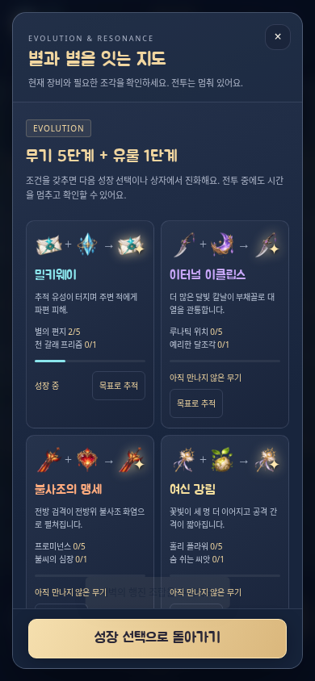
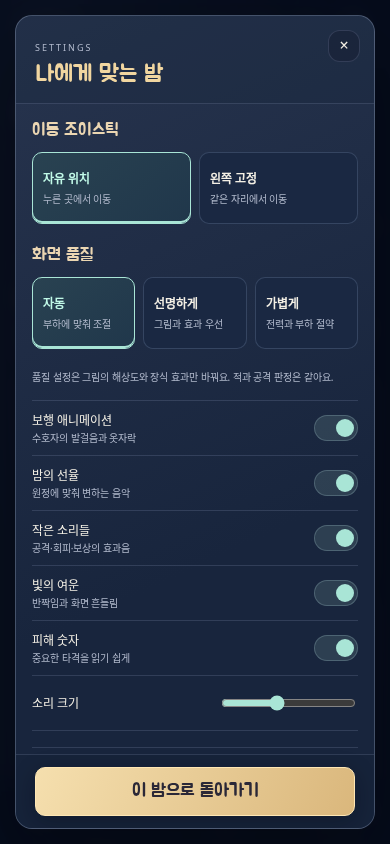

# NOCTURNE 리뉴얼 검증

대상은 `survivor/dist/AstraNocturne.html`: 일러스트/보행/지역 아틀라스 31개와 한국어 글꼴을 포함한 약 6.50 MiB 단일 HTML입니다. 최신 `main`의 `82da18a`에서 시작했습니다. 런타임 외부 HTTP 요청은 없습니다.

## 저장소 필수 검증

최종 로컬 `npm run verify`: **PASS**, 32개 계약 테스트와 8개 화면 크기의 브라우저 흐름, 필수 빌드·구문 검사를 모두 통과했습니다.

`npm run verify`는 Survivor의 32개 전투·저장·아트 계약 테스트, 변경 JavaScript 구문 검사, 한 번의 배포 빌드, 실제 단일 파일의 Chromium와 WebKit 검사를 선택합니다. 다른 게임의 실행 테스트와 Defense는 선택하지 않습니다. 검증 선택 규칙은 변경하지 않았습니다.

Node 24, Chromium 147·WebKit 26.4를 사용합니다. 이 클라우드의 WebKit 공유 라이브러리는 사용자 캐시에 설치되어 시스템 패키지 목록 검사를 로컬에서만 `PLAYWRIGHT_SKIP_VALIDATE_HOST_REQUIREMENTS=1`로 생략합니다. 브라우저 실행과 테스트는 생략하지 않습니다. CI는 기존 `playwright install --with-deps`를 사용합니다.

## 실제 배포 파일과 UI

| 브라우저 | 화면 크기 | 확인한 흐름 |
| --- | --- | --- |
| Chromium | 390×844, 360×640, 320×568, 844×390, 1280×900 | 오프라인 file 실행, 수호자 선택, 한글 글꼴, 장비 그림·14진화·4공명 도감, 기본 select 없는 설정, 라디오 키보드 선택과 저장, 터치·두 번째 손가락의 회피·손 떼기, 키보드 이동, 창 전환·새로고침·이어가기 |
| Chromium | 390×844 | 실제 Fullscreen API 진입/해제와 F 키, 버튼 상태 동기화 |
| WebKit | 390×844, 844×390, 1280×900 | 오프라인 실행, 터치 버튼·키보드 이동, 일시정지·이어가기, 실제 파일 입력을 통한 기록 복원, 활성 원정의 출발 능력 보존, 화면 회전·회피 |

가로 넘침·외부 HTTP 요청·실행 오류를 검사합니다. WebKit의 로컬 파일 최초 읽기와 사용자 백업 파일 읽기는 HTTP 차단을 유지한 상태로 진행하고, 그 뒤 오프라인 모드로 전환합니다. 전체화면 API가 없는 iPhone 브라우저에는 실제 미지원 안내가 표시됩니다. 해당 기기의 홈 화면 실행을 이번 클라우드 검사로 보증하지 않습니다.

조합 지도는 전투를 멈추고 현재 장비 단계와 목표를 보여줍니다. 성장 선택 중 지도를 열고 목표를 바꾼 뒤 돌아와도 시간과 선택지가 보존되는지 검사했습니다. 자동 품질을 강제로 낮췄다 복구해도 전투 snapshot은 변하지 않는지 확인했습니다.

| 모바일 로비 | 조합 지도 | 전용 설정 |
| --- | --- | --- |
|  |  |  |

## 전투·보행·지속성

- 모든 수호자·4방향의 실제 시전 좌표가 발보다 30~42 위에 있고, 빠른 투사체가 적 몸통을 통과하며 충돌하는지 확인합니다.
- 무기 5 + 유물 1의 진화, 발전 가능한 성장 선택, 네 무기 공명의 추가 번개·폭발·회복·수면을 검사합니다. 태양의 세 광선과 시계의 정지, 연속 30처치 폭주·재충전도 포함합니다.
- 9명의 시작 무기와 필살기, 14무기의 기본/진화 피해, 해시 경계·치명타·회피·보스 생성 공간·보상 포화·제단 단일 사용을 검사합니다.
- 보행 9장 각 16칸의 여백·발 기준·방향별 다른 포즈와 출처 해시를 확인하고 실제 크기의 합성 시트로 방향·비율·잘림을 검토합니다. 세 잘못된 원본 프레임의 대체는 [ART.md](ART.md)에 공개합니다.
- 이전 버전 원정은 원래 6/8/10분 길이를 유지합니다. 새 상태·목표·공명·폭주가 저장 후 같고 손상된 입력은 거절되는지 확인합니다.
- 기존 정산 실패 회귀를 유지합니다. 보상 저장 실패 후 재시도로 복구 가능한 원정을 덮어쓰지 않고, 중복 정산·나중 패배에 의한 승리 기록 소실도 막습니다.

드문 상황은 동일 소스·CSS·그림을 묶은 임시 테스트 복사본에서 만들며 배포 파일에는 테스트 전역 참조가 없습니다. 군세 시연은 높은 경험치 한도로 다른 성장 팝업이 기술/상자 검사를 방해하지 않게 분리한 재현 상태입니다. 자연 플레이 결과로 표시하지 않습니다.

| 군세·일러스트 효과 재현 | 성장 선택 | 보물상자·진화 |
| --- | --- | --- |
|  |  |  |

## 진행 속도와 전체 원정

[RENEWAL-BALANCE.json](RENEWAL-BALANCE.json)은 원정 난이도·영구 성장 없이 9명 × 시드 1/78/2026의 결과입니다. 27회 모두 세 보스를 처치하고 승리했고, 첫 진화는 23.28~31.25초, 최종 보스 처치까지 241.65~286.85초였습니다. 자동 조작은 이동·회피·필살기·성장 선택만 입력하고 체력·시간·보상은 바꾸지 않습니다. 시작부터 준비된 필살기를 사용하는 조작이므로 수동 플레이의 첫 성장 시간을 이 결과와 동일하다고 주장하지 않습니다. 첫 타격/성장/상자/진화, 피해, 처치, 최대 개체 수는 JSON에 있습니다.

완주 회귀에는 루나의 성당과 루미의 혼돈의 틈도 포함됩니다. 모든 난이도·조합의 재미나 승률을 보증하는 표본은 아닙니다. 최종 보스 이후에는 지원 병력을 2마리씩 더 긴 간격으로 보내 끝없는 추가 적 때문에 마지막 전투가 늘어지지 않도록 했습니다.

아래는 루미 시드 2026의 정상 자동 원정에서 마지막 유효 타격 직전 상태를 보관하고, 수정하지 않은 배포 HTML에서 실제 마지막 타격과 보상 정산을 실행한 화면입니다.

## 그림 품질과 프레임 비용

[RENEWAL-PERFORMANCE.json](RENEWAL-PERFORMANCE.json)에 전후 원자료를 보관합니다. `node survivor/tests/performance.mjs review high` 또는 `node survivor/tests/performance.mjs review auto`로 같은 독립 캔버스 부하를 재현할 수 있습니다. 원래 배포와 같은 390×680 화면, device DPR 2, 적 260마리, 진화 무기 6종, 30프레임 예열 뒤 rAF마다 300프레임을 측정했습니다. 이전/새 선명 모드는 내부 DPR 1.75, 새 기본 자동 모드는 1.5입니다.

| 항목 | 이전 선명 | 새 선명 | 새 기본 자동 |
| --- | ---: | ---: | ---: |
| 전투+그리기 평균 작업 | 1.93ms | 2.48ms | 2.31ms |
| 작업 시간 95백분위 | 2.8ms | 3.9ms | 3.1ms |
| 관측 프레임 간격 중앙값 | 21.5ms | 23.6ms | 19.0ms |
| 프레임 간격 95백분위 | 27.9ms | 28.5ms | 23.8ms |
| 원본 텍스처 디코딩 계산값 | 45.89MiB | 66.05MiB | 66.05MiB |

더 많은 그림을 써도 같은 선명 설정에서 프레임 간격의 95백분위 증가는 이 표본에서 0.6ms였습니다. 기본 자동 설정의 별도 캔버스/그림/숫자 캐시는 약 9.56MiB입니다. 디코딩 계산은 전체 브라우저 메모리 측정이 아닙니다. HTML 예산은 새 9개 보행 시트와 전투 그림을 반영해 6MiB에서 8MiB로 명시적으로 조정했고, 실제 파일은 약 6.50MiB, 원본 텍스처 계약 상한은 80MiB입니다.

적 그림의 화면 밖 생략, 재사용하는 표시 목록·효과 객체, 효과 수 상한, 배경/광원/문양/숫자 캐시, 고정 시간 간격, 0.1초 HUD 갱신, 내부 해상도 상한을 적용했습니다. 자동 품질은 나쁜 프레임이 90회 누적될 때 낮추고 안정된 360회 뒤 회복하며, 적·피해·보상에는 영향을 주지 않습니다. 필수 적 공격 예고는 장식 효과를 줄여도 유지합니다.

별도의 필수 브라우저 회귀는 90프레임을 연속 제출해 개체 예산과 실행 오류를 검사합니다. 이 연속 제출 작업 시간은 위 rAF 표본이나 휴대폰 FPS와 비교하지 않습니다. 실제 Android/iPhone의 장시간 발열·배터리·60fps, 노치와 주소 표시줄 변화, 실제 스피커 음색은 확인하지 않았습니다.
