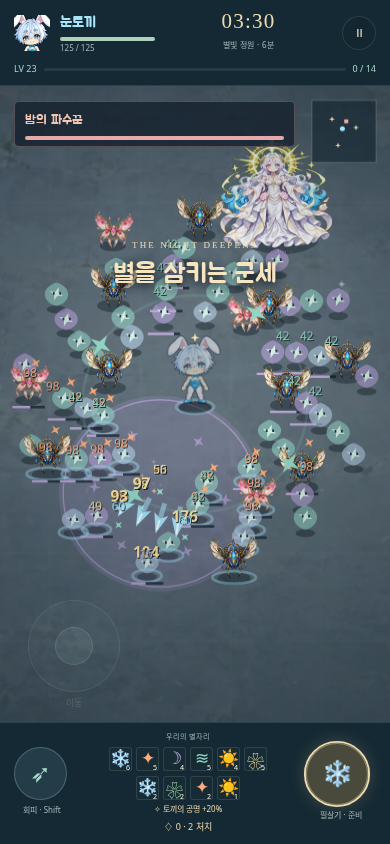
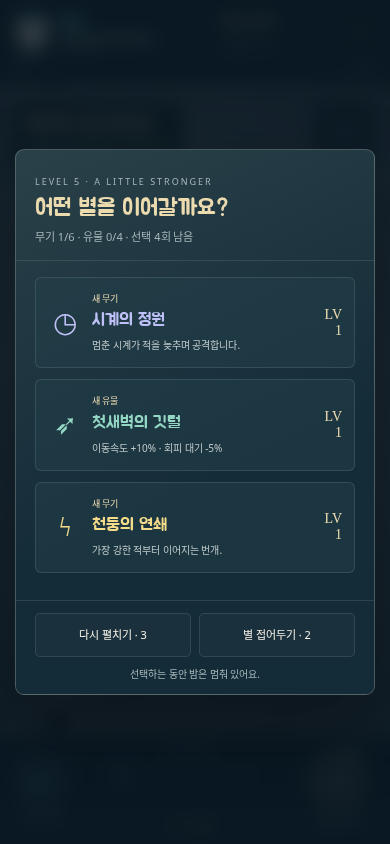
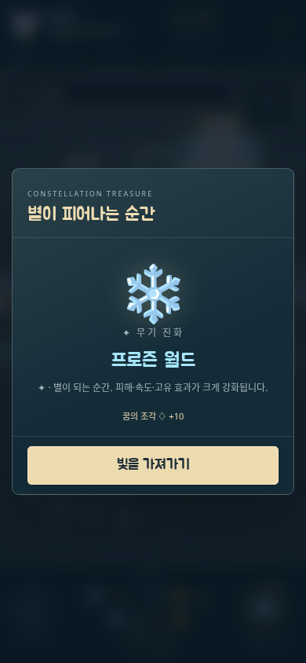
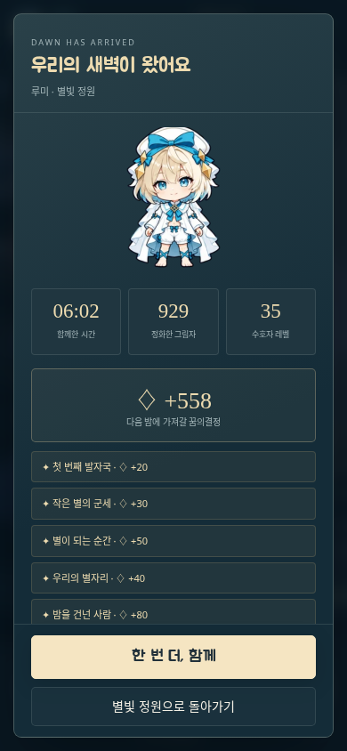
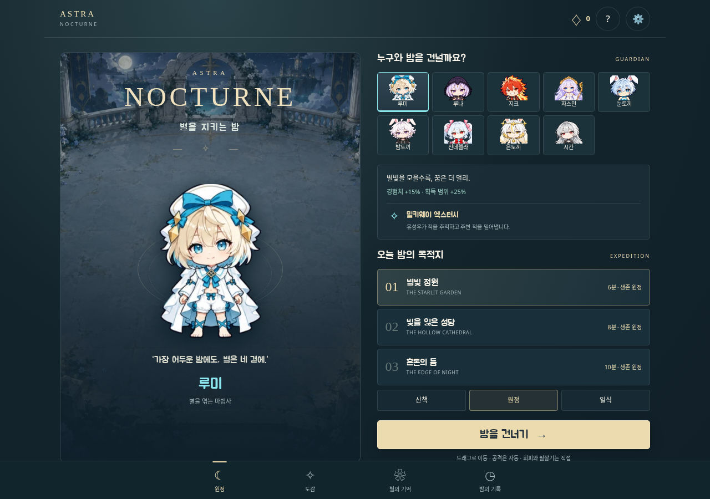
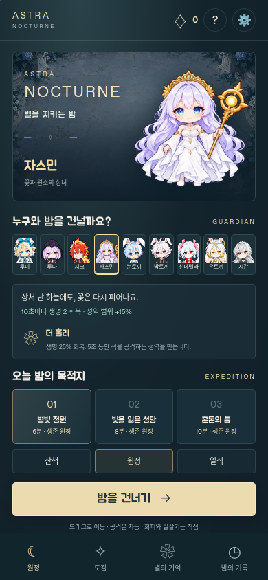

# NOCTURNE 검증과 플레이 미리보기

검증 대상은 `survivor/dist/AstraNocturne.html`입니다. 그림 29개와 글꼴을 포함한 약 3.49 MiB의 실제 배포 파일을 사용했습니다. Node 24와 Playwright의 Chromium 147·WebKit 26.4로 검사했습니다.

## 필수 저장소 검증

`npm run verify`의 변경 범위에는 새 게임과 검증 선택 규칙만 들어갑니다. 게임의 전투·저장·아트 테스트 23개, 선택 규칙 테스트 23개, 변경 JavaScript 구문 검사, 단일 HTML 빌드와 두 브라우저의 플레이 검사를 통과했습니다. 기존 Card·Shooter·Defense·Idle의 실행 검증은 선택하지 않습니다.

CI는 기존 `.github/workflows/verify.yml`의 Chromium·WebKit 설치 분기를 그대로 사용합니다. 이 클라우드 세션에서는 시스템 패키지 설치 권한 대신 사용자 디렉터리에 WebKit 보조 라이브러리를 준비했습니다. 라이브러리 경로를 인식하지 못하는 Playwright의 시스템 캐시 검사를 이 세션에서만 생략했으며, 브라우저 실행이나 게임 테스트를 생략하지 않았습니다. CI는 `playwright install --with-deps`로 일반 의존성 검사를 사용합니다.

## 실제 배포 파일의 UI 검사

| 브라우저 | 화면 크기 | 확인한 흐름 |
| --- | --- | --- |
| Chromium | 390 × 844, 360 × 640, 320 × 568, 844 × 390, 1280 × 900 | 외부 연결을 끊은 `file://` 실행, 9명 선택, 한국어 글꼴, 도감과 진화 설명, 실제 터치 드래그, 이동 중 두 번째 손가락의 회피, 손 떼기, 키보드 이동, 창 전환 일시정지, 저장·새로고침·이어가기 |
| WebKit | 390 × 844, 844 × 390, 1280 × 900 | 같은 단일 HTML, 터치 버튼, 키보드 이동, 창 전환, 새로고침·이어가기, 실제 파일 입력을 통한 기록 가져오기, 원정 중 성장 수치 보존, 화면 회전과 회피 |

모든 크기에서 가로 넘침과 실행 오류를 검사합니다. 외부 HTTP 요청은 차단하고 요청이 없었는지 별도로 검사합니다. WebKit의 DevTools 오프라인 설정은 로컬 파일의 최초 로드와 `File.text()` 읽기까지 차단하므로 이 두 작업에서는 HTTP 차단을 유지하고, 이후 전투·조작 검사에서 다시 오프라인 설정을 적용합니다.

기록 가져오기는 영구 성장과 설정을 바꾸고 진행 중 원정의 출발 당시 능력은 유지하는지 검사합니다. 저장 거부와 손상된 데이터는 저장·복원 테스트에서 별도로 다룹니다.

## 전투·성장·결과 검사

일반 배포 파일에는 테스트용 전역 참조나 조작 메뉴가 없습니다. 드문 상황은 같은 소스·그림·CSS로 만든 임시 테스트 복사본에서 재현합니다.

- 경험치 증가 → 전투 중단 → 성장 선택 → 다시 펼치기·별 접기 → 전투 복귀.
- 많은 적과 6개 무기를 표시하고 눈토끼 필살기·빙결 효과를 확인.
- 실제 진화 조건의 보물상자 → 진화 → 일시정지·효과 설정 → 회피.
- 최종 보스에 실제 피해를 주어 승리 → 보상 정산 → 영구 성장 구매 → 기록 확인.
- 9명 모두의 시작 무기·필살기와 4방향 렌더링.
- 14종 무기가 기본 단계와 진화 후 모두 실제 피해를 주는지 확인.
- 해시 셀 경계의 큰 적과 빠른 발사체의 충돌, 보스 생성 용량 확보, 치명적 피격과 같은 프레임의 성장·상자 충돌.
- 경험치와 겹친 상자의 보상 보존, 회피 무적, 제단 단일 사용, 복원 후 난수·전투 상태 일치.
- 현재 원정의 보상 중복 방지, 나중 패배 후에도 기존 지역 승리 기록 유지, 저장 공간 부족 시 최신 세션 상태 유지.

군세·성장·진화 화면의 미리보기는 이 재현용 상태에서 촬영했습니다. 이 상태를 처음부터 플레이한 밸런스 결과로 제시하지 않습니다.

| 군세와 자동 공격 | 성장 선택 | 무기 진화 |
| --- | --- | --- |
|  |  |  |

## 전체 원정 검사

`scripts/simulate.mjs`의 자동 조작은 게임 시간을 건너뛰거나 체력·능력을 바꾸지 않습니다. 이동·성장 선택·회피·필살기 입력만 주고 실제 1/60초 전투를 진행합니다.

고정 시드 `2026`, 원정 난이도, 영구 성장 없이 9명 모두 별빛 정원의 세 보스를 처치하고 승리했습니다. 루나의 성당과 루미의 혼돈의 틈 완주도 기본 회귀 테스트에 포함합니다. 별도 지역별 검토에서도 성당 9명과 마지막 지역의 여러 수호자가 완주하는 것을 확인했습니다. 모든 시드·조합·난이도의 균형을 보증하는 결과는 아닙니다.

아래 결과 화면은 루미의 실제 자동 원정에서 최종 처치 직전의 저장 상태를 가져와 **수정하지 않은 배포 HTML**에서 마지막 보스를 처치한 화면입니다. 그 원정은 약 362초, 929 처치, 35레벨, 보스 3회 처치를 기록했습니다.

## 렌더링과 확인 범위

260개체와 강화된 무기 6종을 넣은 90프레임 전투·렌더 작업을 별도로 수행했습니다. 배열 상한과 실행 오류를 검사하고 `test-results/render-work.json`에 해당 실행의 평균 작업 시간을 기록합니다. 이는 클라우드 CPU에서의 작업 표본이며 브라우저 합성·실제 휴대폰 GPU·입력 지연을 포함한 FPS 측정은 아닙니다.

실제 Android·iPhone의 장시간 발열·배터리·프레임률, iOS 파일 미리보기 앱의 실행 정책, 실제 노치·주소 표시줄 변화, 스피커·헤드폰에서의 음량과 음색은 확인하지 않았습니다. 테스트한 크기의 화면 배치·게임 조작·저장 복원과 브라우저 실행은 위 검사로 확인했습니다.

| 데스크톱 배포 파일 | WebKit의 모바일 화면 |
| --- | --- |
|  |  |
