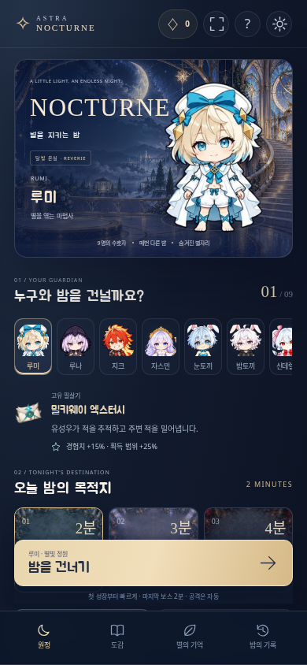
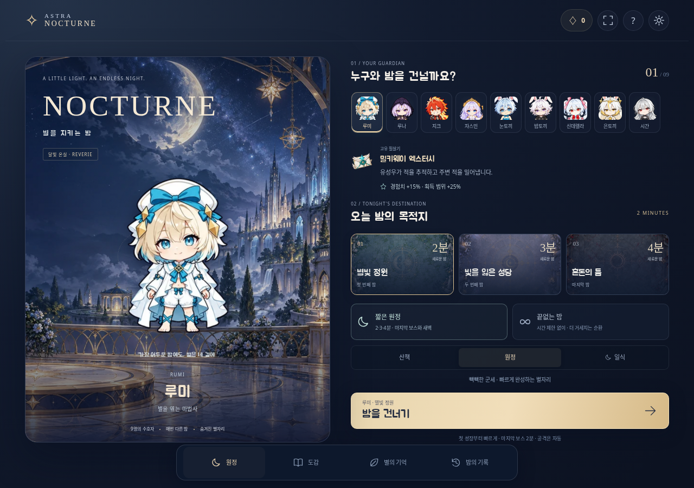
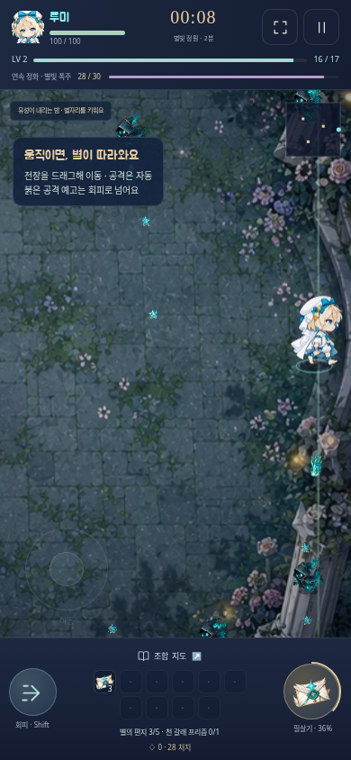
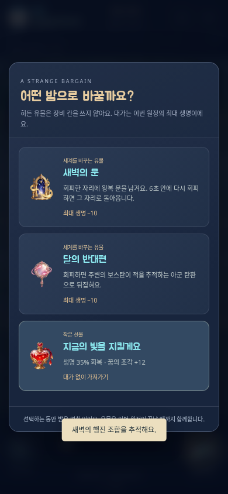
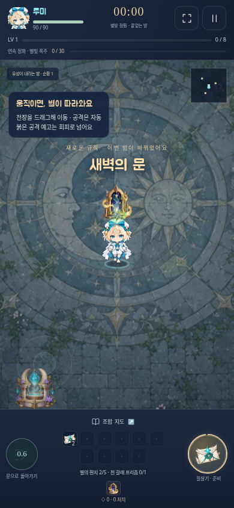

# NOCTURNE 달빛 온실 검증

검토일: 2026-10-02 (Asia/Tokyo). 작업 출발점은 `ee22302`이며 커밋 직전 최신 `main`은 `861ba48`로 다시 확인했다. 그 사이 변경은 Card·Shooter였고 Survivor 및 공유 캐릭터 원본은 바뀌지 않았다.

대상은 커밋하는 `survivor/dist/AstraNocturne.html`: 그림 33개·한국어 글꼴·음악·코드를 포함한 **7.26MiB 단일 HTML**이다. 실행 중 외부 HTTP 요청이 없고 배포 파일에 테스트 전역 참조가 없다. [파일 해시와 측정 원자료](REVERIE-VALIDATION.json)를 함께 보관한다.

## 필수 검증

`PLAYWRIGHT_SKIP_VALIDATE_HOST_REQUIREMENTS=1 npm run verify`: **PASS**, 56.90초. 전투·저장·에셋 44개, 검증 선택 규칙 25개, 한 번의 배포 빌드와 변경 JavaScript 구문 검사, Chromium·WebKit의 8개 화면 크기를 통과했다. Card·Shooter·Defense 실행 검사는 선택하지 않았다.

새 정규화 도구를 배포 입력으로 매핑했다. 아트 검토기만 바뀌면 아트 계약·구문 검사만 실행하며, 배포 HTML을 재생성하거나 다른 게임을 실행하지 않는 선택 규칙 테스트를 추가했다. 알 수 없는 실행 경로와 배포 파일만의 변경을 거절하는 규칙은 유지한다.

이 클라우드의 WebKit 라이브러리는 사용자 캐시에 있어 로컬 시스템 패키지 목록 검사만 위 환경변수로 생략했다. WebKit 실행·터치·저장 검사는 모두 수행했다. CI는 기존 브라우저 의존성 설치를 사용한다.

| 브라우저 | 화면 | 확인한 실제 배포 흐름 |
| --- | --- | --- |
| Chromium | 390×844, 360×640, 320×568, 844×390, 1280×900 | 오프라인 file 실행·한글 글꼴·9명 선택·짧은/무한 모드 저장·2분 표시·14진화/4공명/4비밀/3각성 도감·설계한 설정 타일·품질 저장·터치/두 번째 손가락 회피·키보드·창 전환·정지·새로고침·이어가기 |
| Chromium | 390×844 | 실제 Fullscreen API 진입/해제와 F 키·버튼 상태 동기화 |
| WebKit | 390×844, 844×390, 1280×900 | 실제 터치 버튼·키보드 이동·창 전환·정지·새로고침·이어가기·파일 입력으로 백업 복원·진행 중 원정의 능력 보존·회전·회피 |

성장이 먼저 열리면 WebKit 검사는 실제 성장 선택을 완료한 뒤 이동과 정지를 검사한다. CI의 초기 이동 검사 실패를 계기로, 350ms 대기만으로 이동량을 가정하던 검사를 수정했다. 성장창이 먼저 열려도 실제 UI를 거쳐 재개하고 관측한 위치 변화로 확인한다. 팝업을 제거하거나 전투 상태를 강제로 조작하지 않는다. 가로 넘침·외부 HTTP 요청·브라우저 실행 오류도 검사했다.

| 모바일 로비 | PC 로비 |
| --- | --- |
|  |  |

## 이동과 보행

엔진·실제 App 루프·Renderer 모두 **60/90/120/144Hz 및 불규칙한 프레임 간격**을 검사했다. 이동을 계속 누를 때 화면상의 정지 프레임·뒤로 밀림·걷기 상태 끊김이 각각 0이었다. 테스트는 합성 시간 간격을 실제 앱의 프레임 함수에 공급하므로 실제 144Hz 디스플레이 측정으로 표시하지 않는다.

전투 60Hz의 이전/현재 좌표와 남은 누적 시간으로 렌더링하며 카메라도 동일 좌표를 사용한다. 걷기 거리는 실제 시뮬레이션 이동량이다. 렌더 후 snapshot이 바뀌지 않고, 보행 거리·위치가 저장 후 유지되는 것을 확인했다. 순간이동은 이전 좌표까지 이동하여 화면을 가로지르는 보간을 방지한다.

[144칸 비교본](reverie/walking-all.png)과 [원본/정규화/측면 검토](reverie/direction-2.png)를 확인했다. `body-profile.json`의 수동 추정과 처리 결과·원본 해시를 검사한다. 머리의 의미나 인물 정체성을 픽셀 검사만으로 보증하지 않는다. 이전 보행의 잘못된 세 포즈를 통과 포즈로 대체한 이력은 [ART.md](ART.md)에 유지한다.

## 전투와 드문 상태

44개 계약 검사에는 9명의 시작 무기·필살기, 14무기의 기본/진화 실제 피해, 빠른 탄환의 선분 충돌, 모든 지역·단계 보스의 몸통 조준, 장비 한도·진화·4공명·폭주, 마지막 보스의 생성 공간·보상 포화·치명 피해 우선순위, 이전 저장 이관·손상 입력 거절·중복 정산·저장 실패 복구가 포함된다.

이전 저장의 `legacy` 별자리가 첫 이벤트 종류를 비워 재저장을 거절하던 경우도 수정했다. 실제로 19초를 진행해 새 이벤트가 발생한 뒤 다시 저장·복원하는 검사를 추가하고, 이관 전 누적 피해가 첫 10초 피해량에 섞이지 않도록 기준값을 맞췄다.

새 검사에서는 지연 공격이 실제로 다시 발사되는지, 적 탄환이 실제 아군 피해를 주는지, 정지 시간장이 적을 멈추고 이동하면 풀리는지, 귀환 문이 실제 출발점으로 돌아가는지, 각성의 벽 반사·스킬 시간 정지·회피 공격, 무한 보스 순환과 장비 완성 뒤 실제 피해 증가·100레벨 성장·저장 복원을 확인했다.

동일 소스·CSS·그림을 묶은 별도의 임시 테스트 HTML에서는 등불이 거래로 바뀌는 흐름, 거래 중 전투 정지·새로고침·선택 복원, 생명 비용·발견 도감 저장, 귀환 문과 무한 모드 이어가기를 검사했다. 이런 드문 상태의 그림은 **재현 fixture**이며 자연 플레이 사진과 구별한다.

| 자연스러운 초기 조작 | 숨겨진 거래 재현 | 귀환 문 재현 |
| --- | --- | --- |
|  |  |  |

## 진행과 성장

[REVERIE-GROWTH.json](REVERIE-GROWTH.json)은 현재 원정 난이도·영구 성장 없이 시드 2026으로 9명, 루미 무한 모드, 시드 35의 루미 일식 1회 결과다. 정해진 자동 조작으로 정원의 최종 보스를 **120.58~132.28초**에 처치했고, 첫 진화는 **9.12~14.52초**였다. 출발 직후 준비된 필살기를 쓰고 선택 시간을 쓰지 않는 조작이므로 수동 플레이의 실제 소요 시간과 동일하다고 주장하지 않는다. 선택·정지 화면은 전투 시계에 포함되지 않는다.

무한 모드는 270초에서 2순환·143레벨·한계 돌파를 진행하며 계속 플레이 상태였다. 일식 1회는 유성우를 포함한 실제 전투를 마쳤다. 최고 난이도나 모든 무기 조합의 승률을 맞추는 반복 조정은 하지 않았다. 필수 완주 회귀에는 루나 성당과 루미 혼돈의 틈도 포함된다.

성장 기록은 10초마다 실제 적 피해·처치·레벨·진화를 저장한다. 정지 및 결과 화면에서 변화와 첫 진화 시점을 표시한다. 대미지 수치가 큰 조합과 압력이 큰 웨이브가 서로 다른 곡선을 만드는 데이터를 원자료에서 확인할 수 있다.

## 실행 비용

보행 시트는 최근 두 명만 디코딩한다. 실제 9명 전환 검사에서도 2장을 초과하지 않았다. 전체 이미지의 `width × height × 4` 합은 80.19MiB, 보행 두 장까지 같은 합은 61.71MiB이다. 이 값은 브라우저 총 메모리나 GPU 측정이 아니다.

260적·6진화 무기의 군세에서 시뮬레이션+렌더링 90프레임 동기 작업 평균은 10.42ms였다. 아래는 별도로 브라우저 rAF를 기다리고 30프레임 예열 뒤 300프레임을 측정한 **클라우드 CPU 작업**이다. 휴대폰 FPS로 변환하지 않는다.

| 설정 | DPR | 작업 평균 / p95 / 최대 | rAF 간격 p50 / p95 | 캐시 계산 |
| --- | --- | --- | --- | --- |
| 선명 | 1.75 | 2.65 / 3.90 / 25.20ms | 24.30 / 29.60ms | 10.56MiB |
| 가벼움 | 1.0 | 2.43 / 4.30 / 11.40ms | 16.70 / 17.50ms | 8.43MiB |

입력 개체 수와 전투 판정은 품질 설정에 영향을 받지 않는다. 캐시·화면 밖 그리기 생략·효과 풀·품질 적응과 개체 한도를 유지한다. 실제 iOS/Android 기기의 열·장시간 FPS·터치 지연은 측정하지 않았다. WebKit 브라우저 호환 검사는 실제 기기의 성능 검사를 대신하지 않는다.
