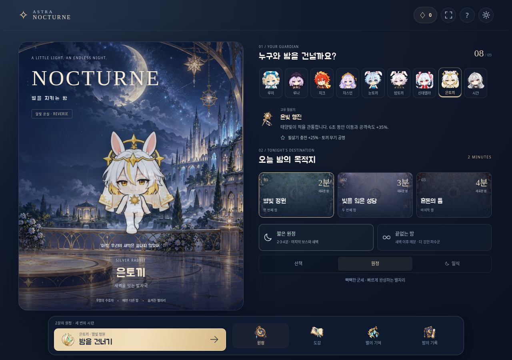
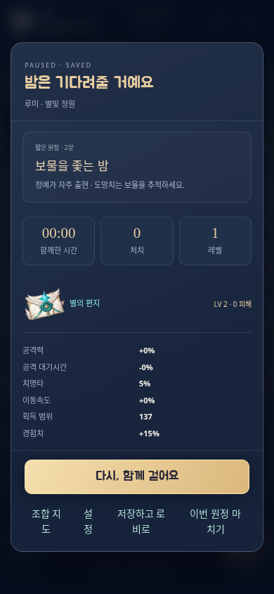
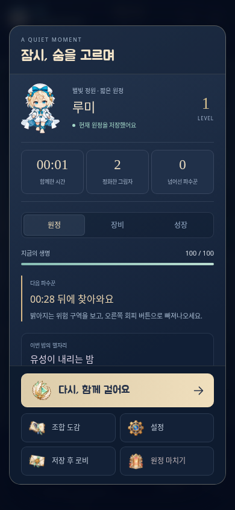

# Survivor 후속 리뉴얼 결과

실행 시 최신 main `614e099`을 확인했습니다. PR #568은 병합되었고 뒤의 #569도 포함되어 있었습니다. 공유 게임의 외형·기술 설명과 실제 아트 지침을 읽고 Survivor 안에서만 수정했습니다.

일시정지는 캐릭터·실제 저장 상태·원정/장비/성장 탭과 항상 접근할 수 있는 그림 행동으로 바꿨습니다. 메인의 출발과 네 메뉴는 하나의 viewport 하단 도크에 놓았습니다. 원정·도감·별의 기억·밤의 기록과 재개·저장·설정·마치기8개를 실제 그림으로 제작했습니다. 회피는 우측 끝으로 이동했고 두 손가락 조작을 검사했습니다.

| 이전 일시정지 | 새 일시정지 |
| --- | --- |
|  |  |

신체 기준점은 BODY_PROFILE 하나에서 관리합니다. 머리/몸통/다리 분리, 방향별 수동 기준, 위상별 고정 배율과 발 접지로 수정했습니다. 토끼 세 명은 작은 체형, 지크·자스민·시간의지배자는 성인 체형입니다. 귀·왕관·무기 bbox로 몸 배율을 정하지 않았습니다. 비무장6명은 같은 왼쪽 위상을 반전했고, 무장3명은 손을 보존했습니다. 메인·정지·결과의 전신도 전투와 같은 포즈의 고해상도 캐시입니다.

[main과 이번 결과의 앞/왼쪽 비교](before-after.png) · [밝은 바닥 전체144칸](walking-light.png) · [어두운 바닥](walking-dark.png) · [64px](cast-64-dark-left.png) · [96px](cast-96-light-right.png) · [겹침 검사](onion-96.png). 재생/배경/방향/크기를 바꾸는 [독립 검토기](index.html)는 내려받아 브라우저로 열 수 있습니다.

기존3보스에 장미사슴·종 천사·밤고래 그림과 패턴을 추가했습니다. 지역마다 두 중간 보스와 최종 보스가 등장하고, 끝없는 밤은 클리어 시각 이후60초마다 더 강한 보스를 추가합니다. 선·돌진·안전 고리·지속 장판과 실제 회피 판정이 일치합니다. 후반 보스의 체력·피해·속도·공격 밀도와 정지 저항은 계속 증가합니다. 즉시 접촉을 막는 등장 준비1.35초도 있습니다. 종료 타이머는 넣지 않았습니다.

필수 `npm run verify`는53개 계약/회귀, 단일 HTML 빌드, Chromium5개 화면과 WebKit3개 화면에서 모두 통과했습니다. WebKit의 사용자 캐시 라이브러리를 사용한 환경 설정과 초기 실패도 [검증 문서](../VALIDATION.md)에 공개합니다. 실제 결과/아트 SHA는 [ORDEAL-VALIDATION.json](../ORDEAL-VALIDATION.json), 명령 출력은 [verify-local.txt](verify-local.txt)입니다. 실행 파일은7.89MiB이고 외부 HTTP 요청은0입니다.

정상 난도 자동 조작18회에서 짧은 원정3/9승리, 끝없는 밤9/9는132.28~358.18초에 패배했습니다. 산책9명 완주 검사는 따로 통과했습니다. 이 결과를 사람의 승률이나 모든 빌드의 생존 상한으로 주장하지 않습니다. 클라우드 군세 렌더링300프레임 표본의 작업 평균은 선명2.85ms/가볍게2.13ms이며 실제 휴대폰 FPS는 측정하지 않았습니다.

공식 자료와 영어·한국어·일본어·중국어 실무 자료를 조사했습니다. [11개 게임과 확인 범위](research-games.md), [48개 방법의 선택/미채택](methods.txt), [전체 시도와 실패 기록](trials.txt), [66개 요청의 URL/HTTP/본문 해시](sources.json)를 보관합니다. 특정 'Opus5.5 원샷' 게임의 모델 귀속은 확인하지 못해 실제 웹게임 UI 대안을 활용했습니다. 새 마네킹+인물+화풍 참조로 생성한3보행 후보는 모두 거부했고 원본을 `assets/ordeal/trials/`에 남겼습니다. 개별 모델의 결과를 무조건 채택하지 않았습니다.
